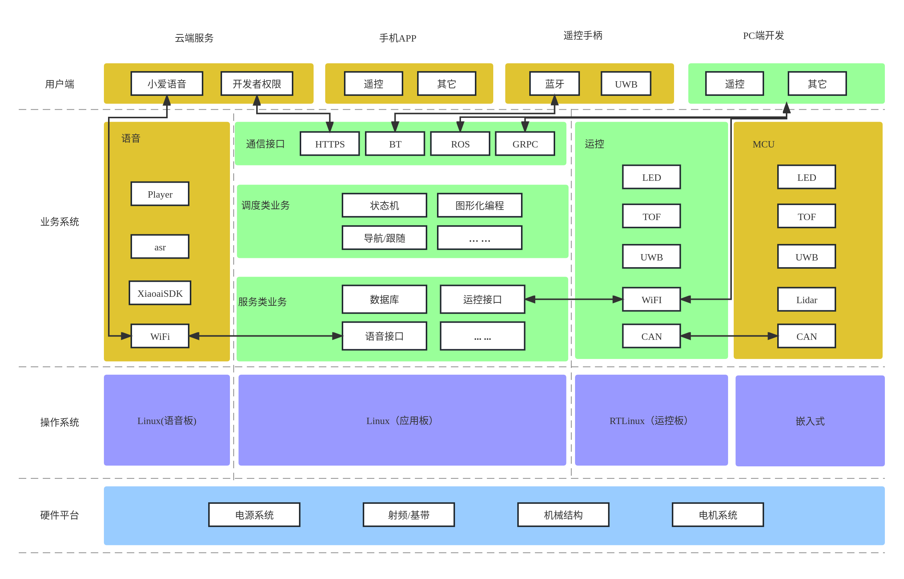
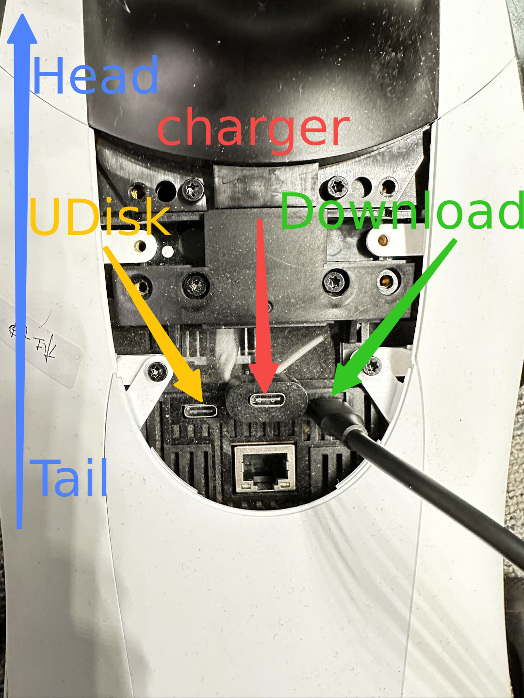

<h1 align="center">
  四足机器人开发指南
</h1>

## 简介

本文基于小米四足开发平台做软件开发指导。

## 框架

**开发整体框架图**

**开发方式**

1. 基于PC端编写程序，通过grpc或ros对机器人进行调度
2. 基于NX端编写调度程序，对现有的服务类ros接口进行调用（推荐）
3. 基于NX端改写程序，对现有的调度类或服务类业务进行二次开发

**开发流程**

1. 通过手机APP申请开发者权限

2. 与机器人建立连接（无线有线均可）

   - 有线登录方式，USB-Type数据线连接PC与机器人Download口：

     `ssh mi@192.168.55.1`

     `passwd: "123"`

   - 无线方式，通过app给机器人连网，使用无线网IP（app内可查看）登录

   

3. 按照你想要的方式开始即可

## 资源

- 核心代码开源：[Github地址](https://github.com/MiRoboticsLab/cyberdog_ws)
- 开发者手册（API，上述第1、2种开发方式）：[博客地址](https://miroboticslab.github.io/blogs/#/cn/developer_guide)
- 程序设计（源码，上述第3种开发方式）：应用文档，运控文档，slam文档以及感知文档；
- 刷机：[博客地址](https://miroboticslab.github.io/blogs/#/cn/cyberdog_flash)
- 运营咨询：[mi-cyberdog@xiaomi.com](mailto:mi-cyber@xiaomi.com) 
