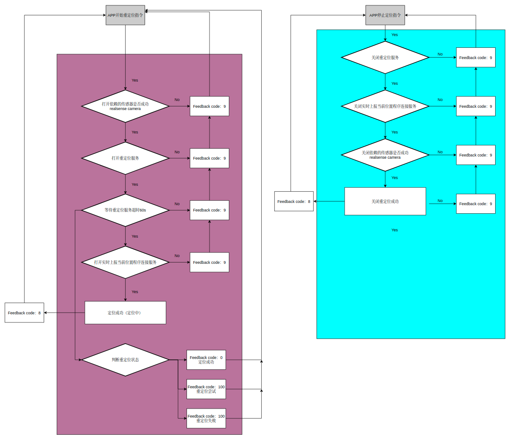

# 算法任务管理设计文档

## 模块架构

### 架构说明

- 接口以ros action的形式提供。

- 任务状态以独占形式进行管理，即当前如果有任务在执行时，新的任务指令将返回reject状态。同时停止任务指令也必须当前的任务状态对应，否则将返回停止失败，例如在执行建图任务时，调用方如果下发了停止导航的指令，将返回失败状态。 

- 算法任务包含了视觉建图、视觉定位、激光建图、激光定位、AB点导航、视觉跟随、UWB跟随任务。算法管理层负责启动相关的依赖节点、请求相关的服务，在停止任务时同时关闭相关的依赖节点和关闭相关的服务。

## 任务管理流程

### 1 激光建图

步骤：

- step 1： 判断建图模式

- step 2： 打开realsense传感器

- step 3： 通知建图服务程开始建图

- step 4： 判断是否实时上报机器人当前位置

- step 5： 开始建图

### 2 视觉建图

步骤：

- step 1： 判断建图模式

- step 2： 打开realsense传感器、双目传感器

- step 3： 通知建图服务程开始建图

- step 4： 判断是否实时上报机器人当前位置

- step 5： 开始建图

### 3 激光重定位

步骤：

- step 1： 判断打开realsense传感器

- step 2： 通知重定位服务程开始重定位功能

- step 3： 等待结果是否超时，超时直接退出定位，否者等待定位结果

- step 4： 判断重定位状态， 0成功， 100重试和1200失败

- step 5： 定位成功

### 4 视觉重定位

步骤：

- step 1： 判断打开realsense传感器、双目传感器

- step 2： 通知重定位服务程开始重定位功能

- step 3： 等待结果是否超时，超时直接退出定位，否者等待定位结果

- step 4： 判断重定位状态， 0成功， 100重试和1200失败

- step 5： 定位成功

### 5 AB点导航

步骤：

- step 1： 判断打开bt_navigator

- step 2： 接受导航点B点位置，判断导航点有效性

- step 3： 发送开始AB导航

- step 4： 实时上报导航状态

- step 5： 导航成功

### 6 视觉跟随

视觉跟流程图

- 视觉跟随功能由两个阶段组成：第一个阶段是启动视觉跟随功能，开始人体识别；第二阶段由用户选择需要跟随的目标，机器人开始自动跟随；

- 第一阶段的对上接口是一个action server，由GRPC下发视觉跟随启动命令；当收到启动视觉跟随的请求时，管理模块会对realsense和cyberdog_vision模块进行lifecycle管理，配置并激活相应模块；然后启动人体识别算法（由一个service client请求启动）；

- 之后等待用户选择需要跟随的目标；

- 第二阶段的对上接口是一个service server，通过GRPC下发跟随目标的roi；service server对roi信息进行透传，直接转发给视觉跟随模块（通过一个service client请求启动服务）；之后分别对cyberdog_tracking和cyberdog_tracking_base模块进行lifecycle管理，配置并激活相应模块；实现自动跟随。

### 7 UWB跟随

uwb跟随流程图

- uwb跟随功能中，首先需要用户在APP中实现了蓝牙遥控器（发送uwb数据）的配对，否则在启动时会提示uwb数据异常。

- 启动流程与视觉跟随相似，包含了启动相关的资源开启、依赖节点的激活等过程，区别在于不需要用户点选跟随的目标。

- uwb跟随中，在跟随目标静止时，狗可以表现出自主行为，相关的行为表现包含了执行指定的动作、播报语音、灯带效果的变化。

- 跟随中可以检测跟随路径上的台阶，在检测到台阶后，狗可以实现跳台阶的动作，跳上台阶后恢复跟随的步态。