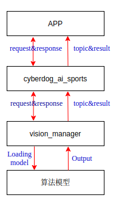
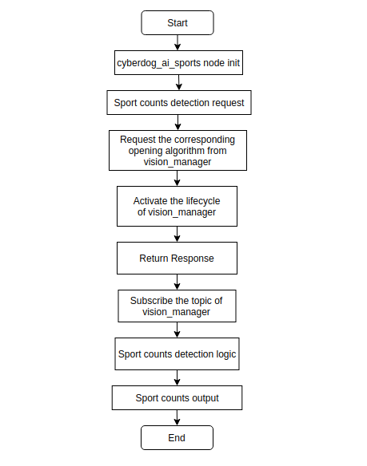
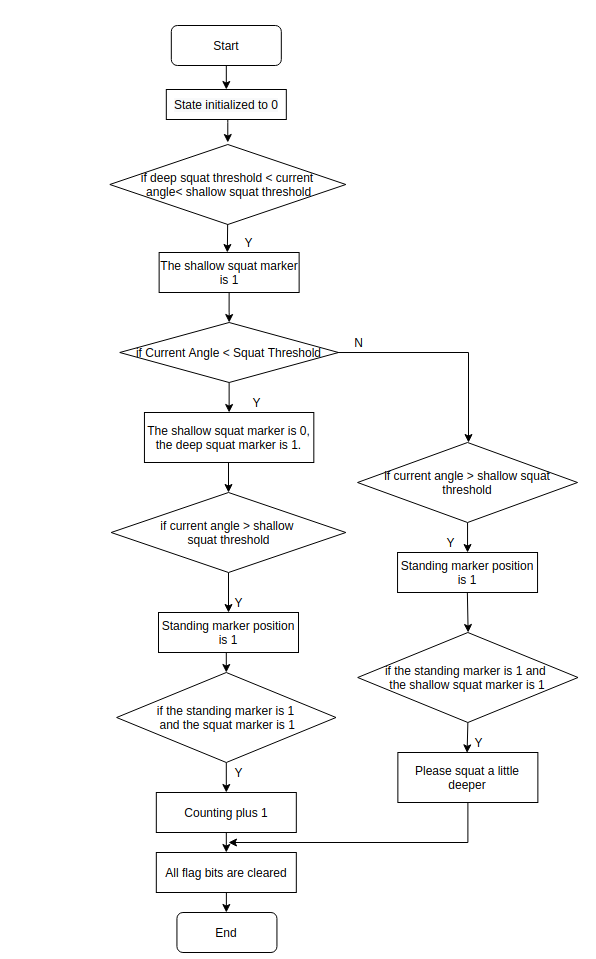

# Cyberdog_ai_sports 设计文档

## 1. Cyberdog_ai_sports功能概述

 - ``cyberdog_ai_sports``是基于骨骼点的运动计数识别功能。``cyberdog_ai_sports``中包含一个ROS2的service和一个ROS2的topic，service用来请求打开底层vision_manager的骨骼点识别算法和人体识别算法，topic用来监听vision_manager识别的Keypoints和人体Bounding Box。借助底层vision_manager识别的Keypoints，``cyberdog_ai_sports``根据相邻骨骼点的位置，提取关节角度、骨骼点间的相对位置变化等特征，作为动作识别依据，来实现运动计数功能。

## 2. 运动计数识别设计流程

### 2.1 软件框架

<center>

 

</center>

### 2.2 整体设计流程

<center>

 

</center>

### 2.3 检测计数流程(深蹲)

<center>

 

</center>

## 3. 运动计数功能
  ``cyberdog_ai_sports``统计一定时间段内出现目标动作的次数或者持续的时间，包括**俯卧撑**、**开合跳**、**深蹲**、**高抬腿**、**仰卧起坐**、**平板支撑**。
### 3.1 ROS 协议

- 源码路径：``bridges/protocol/ros``
- 运动计数协议文件
  - ``protocol/srv/SportManager.srv``：运动计数Service协议，客户端发送运动计数请求。
  - ``sport_manager``：运动计数Service名称。
  - ``protocol/msg/SportCountsResult.msg``：运动计数Topic协议，客户端接受运动计数结果。
  - ``sport_counts_msg``：运动计数Topic名称。

### 3.2 配置文件

  - ``cyberdog_ai_sports``对每一帧处理的骨骼点角度进行数据融合、滤波处理，其中配置参数的路径：``/opt/ros2/cyberdog/share/params/toml_config/interaction/sports.toml``。
    - ``DataFusionNumber``: 数据融合大小。
    - ``DataFilterNumber``: 数据滤波大小。
    - ``ThreMinAngle、ThreMaxAngle、ThreMidAngle1等``: 计数判断的阈值角。

## 4. 运行cyberdog_ai_sports模块

- 运行cyberdog_ai_sports模块
```
ros2 run cyberdog_ai_sports cyberdog_ai_sports --ros-args -r __ns:=/`ros2 node list | grep "mi_" | head -n 1 | cut -f 2 -d "/"`
```

- 请求30s内深蹲计数10个
```
ros2 service call /`ros2 node list | grep "mi_" | head -n 1 | cut -f 2 -d "/"`/sport_manager protocol/srv/SportManager "{sport_type: 1,command: true,counts: 10,timeout: 30}"
```
- 关闭运动计数算法
```
ros2 service call /`ros2 node list | grep "mi_" | head -n 1 | cut -f 2 -d "/"`/sport_manager protocol/srv/SportManager "{sport_type: ,command: false,counts: ,timeout: }"
```

## 5. API接口
  - ``Get_Angle_Point(std::vector<XMPoint> & keypoint, const std::string & pos)``: 从17个骨骼点中获取关节角的三个骨骼点。
  - ``Angle_Between_Points(XMPoint p0, XMPoint p1, XMPoint p2)``: 获取三点之间的夹角。
  - ``Length_Between_Points(XMPoint p0, XMPoint p1)``: 获取两点之间的距离。
  - ``Angle_Nose(std::vector<XMPoint> & keypoint)``: 计算鼻子和左右脚踝之间的夹角。
  - ``Angle_Left_Elbow(std::vector<XMPoint> & keypoint)``: 计算左肩-左肘-左手腕的夹角。
  - ``Angle_Left_Knee(std::vector<XMPoint> & keypoint)``: 计算左胯-左膝盖-左脚踝的夹角。
  - ``Angle_Left_Ankle(std::vector<XMPoint> & keypoint)``: 计算左肩-左胯-左脚踝的夹角。
  - ``Angle_Left_Shoulder(std::vector<XMPoint> & keypoint)``: 计算左肘-左肩-左胯的夹角。
  - ``Angle_Left_Hip(std::vector<XMPoint> & keypoint)``: 计算左肩-左跨-左膝的夹角。
  - ``Angle_Left_PushUps(std::vector<XMPoint> & keypoint)``: 计算bounding box左下点-左肩-bounding box右下点的夹角。
  - ``Angle_Right_Elbow(std::vector<XMPoint> & keypoint)``: 计算右肩-右肘-右手腕的夹角。
  - ``Angle_Right_Knee(std::vector<XMPoint> & keypoint)``: 计算右胯-右膝盖-右脚踝的夹角。
  - ``Angle_Right_Ankle(std::vector<XMPoint> & keypoint)``: 计算右肩-右胯-右脚踝的夹角。
  - ``Angle_Right_Shoulder(std::vector<XMPoint> & keypoint)``: 计算右肘-右肩-右胯的夹角。
  - ``Angle_Right_Hip(std::vector<XMPoint> & keypoint)``: 计算右肩-右跨-右膝的夹角。
  - ``Angle_Right_PushUps(std::vector<XMPoint> & keypoint)``: 计算bounding box左下点-右肩-bounding box右下点的夹角。
  - ``MedianFilter(std::vector<float> & n, int & size)`: 中值滤波。
  - ``DataFusion(std::vector<float> & num, int size)``: 数据融合。
  - ``SquatCounts(std::vector<std::vector<int>> & num, Squart & sports)``: 深蹲计数。
  - ``SitUpCounts(std::vector<std::vector<int>> & num, SitUp & sports)``: 仰卧起坐计数。
  - ``HighKneesCounts(std::vector<std::vector<int>> & num, HighKnees & sports)``: 高抬腿计数。
  - ``PlankTime(std::vector<std::vector<int>> & num, Plank & sports)``: 平板支撑时长。
  - ``PushUpCounts(std::vector<std::vector<int>> & num, PushUp & sports)``: 俯卧撑计数。
  - ``JumpJackCounts(std::vector<std::vector<int>> & num, JumpJack & sports)``: 开合跳计数。
  - ``Init()``: cyberdog_ai_sports节点初始化。
  - ``Run()``: cyberdog_ai_sports节点spin。
  - ``ResetAlgo()``: 重置cyberdog_ai_sports条件。
  - ``ReadTomlConfig()``: 读取配置文件中参数。
  - ``Is_Configure()``: vision_manager的lifecycle进行configure。
  - ``Is_Active()``: vision_manager的lifecycle进行activate。
  - ``Is_Deactive()``: vision_manager的lifecycle进行deactivate。
  - ``UpdateStatus()``: 判断cyberdog_ai_sports计数时长是否超时。
  - ``ProcessKeypoint(std::vector<std::vector<XMPoint>> & multHuman,uint32_t & height, uint32_t & width)``: cyberdog_ai_sports处理骨骼点数据。
  - ``Ai_Sport_Process_Fun(const std::shared_ptr<SportSrv::Request> request,std::shared_ptr<SportSrv::Response> response)``: cyberdog_ai_sports处理接受运动请求的service回调函数。
  - ``Ai_Sport_Result_Callback(VisionMsg msg)``: cyberdog_ai_sports处理接受骨骼点的topic回调函数。
  - ``Ai_Sport_Request_Load(AlgoManagerRequest sport_counts_request)``: cyberdog_ai_sports算法加载请求配置。
  
