# 蓝牙模块功能设计

## 概述

cyberdog_bluetooth是一个通过ROS操作BLE从设备的节点。它通过bluepy库创建BLE主设备，进行扫描、连接BLE从设备、对指定特征值读写等操作。作为ROS节点，它提供扫描、连接蓝牙手柄、获取设备信息、发布摇杆数据、启动UWB跟随等业务功能的接口。

## 系统结构

### 总体结构

1. 蓝牙节点cyberdog_bluetooth：负责连接蓝牙外设，发送和接收相关指令对UWB设备进行连接和断开
2. UWB功能包cyberdog_uwb：由device_manager调用，负责产生UWB的session_id和主从设备的mac，通过UWB硬件获取数据并计算距离角度等信息
3. grpc通信节点：负责转发app下发的相关扫描、连接、停止等指令
4. app端：下发指令来控制蓝牙UWB设备
5. 手环：用于UWB定位和遥控
6. 充电桩UWB设备：用于UWB定位

### cyberdog_bluetooth结构

1. 蓝牙核心模块：使用bluepy库实现BLE的基本功能
2. 固件升级模块：调用蓝牙核心模块实现BLE从设备的固件升级业务
3. UWB跟随模块：负责用ROS action调用UWB跟随任务，提供启动、停止和查询接口函数
4. ROS接口：根据ROS调用请求，调用蓝牙核心模块对BLE进行操作，实现相关业务功能

## 运行流程

### 扫描外设流程

1. APP下发扫描指令
2. grpc节点收到扫描指令，调用蓝牙节点提供的扫描服务
3. 蓝牙节点收到扫描服务请求，开始扫描蓝牙外设，完成扫描后将结果返回给调用方
4. grpc节点收到蓝牙外设列表，上发给APP
5. APP收到后显示设备列表

### 连接外设流程

1. APP下发选中的蓝牙外设信息
2. grpc节点收到选择的蓝牙外设信息，调用蓝牙节点提供的连接服务，并传入外设信息
3. 蓝牙节点收到连接服务请求，根据蓝牙外设信息开始连接蓝牙外设
4. 蓝牙连接成功后读取蓝牙外设固件版本、设备类型（手环或充电桩）
5. 根据设备类型，开启一些数据通知并注册相应的回调函数，比如：串口、电量、摇杆
6. 蓝牙节点调用UWB功能包提供的session id和mac生成服务
7. UWB功能包收到请求后生成session id和mac，返回给请求方
8. 蓝牙节点将新生成的session id和mac通过蓝牙发送给蓝牙外设，等待UWB连接确认
9. 蓝牙外设成功与UWB功能包通信上后通过蓝牙发送成功连接的消息给蓝牙节点
10. 蓝牙节点完成连接流程，将结果返回给调用方
11. grpc将结果上发给APP
12. APP显示连接结果

### 断开连接流程

1. APP下发断开连接指令
2. grpc节点收到指令，调用蓝牙节点提供的连接服务，并传入空连接信息
3. 蓝牙节点收到连接服务请求，通过蓝牙给外设发送断开UWB连接指令
4. 蓝牙外设断开UWB连接并用蓝牙发送断开连接成功的消息给蓝牙节点
5. 蓝牙节点注销回调函数并断开与外设的连接
6. 蓝牙节点完成断开连接流程，将结果返回给调用方
7. grpc将结果上发给APP
8. APP显示断开连接结果