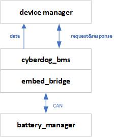
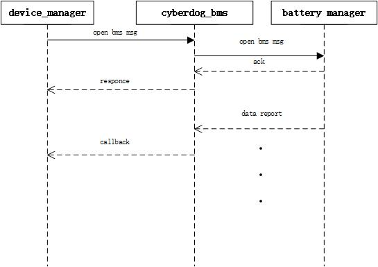

# cyberdog_bms设计文档

## 1 概述

``cyberdog_bms`` 以ros2 plugin形式向客户端提供bms数据服务，此插件为控制bms提供必要的API接口，并把采集到的电源板数据转换成ros消息格式通过device_manager向外发布。

## 2 软件设计

#### 2.1 软件框架

<!--
#### 2.2 数据流开启

#### 2.3 数据流关闭

-->
## 3 功能设计

 - 通过配置文件可灵活配置消息源、指令id等
 - 提供使能、关闭、自检等基本能力接口

## 4 配置文件

- 源码路径：``bridges/params/toml_config/device``
- 安装路径：``/opt/ros2/cyberdog/share/params/toml_config/device``
- 配置文件：
  - ``battery_config.toml``:用于配置bms模块
- 主要配置说明：
  - ``protocol``:通信协议，默认为CAN。
  - ``can_interface``:CAN通信的消息通道，可配置``can0``、``can1``
  - ``array``:数据包消息接收配置
    - ``array_name``:数据包名称
    - ``can_package_num``:数据包中，CAN数据帧的个数
    - ``can_id``:数据包中，CAN数据帧的``CAN_id``

  - ``cmd``:指令包消息发送配置
    - ``cmd_name``:指令包名称
    - ``can_id``:指令包中，CAN数据帧的``CAN_id``
    - ``ctrl_len``:指令包中，CAN数据帧的数据长度
    - ``ctrl_data``:指令包中，CAN数据帧的数据默认值

## ROS 协议
- 源码路径：``bridges/protocol/ros``
- Ros topic：``bms_status``
- 协议介绍：
  - ``protocol::msg::BmsStatus``：电源管理模块数据格式
    - 协议路径：``bridges/protocol/ros/msg/BmsStatus.msg``

## 5 API接口
  - ``bool Init(std::function<void(BmsStatusMsg)>function_callback, bool simulation)``：初始化配置
    - ``simulator = true``:配置为仿真模式
    - ``function_callback``:消息发布回调函数
  - ``Open()``：打开BMS消息上报
  - ``Close()``：停止BMS消息上报
  - ``SelfCheck()``：BMS自检
  - ``LowPower()``：进入低功耗模式
  - ``SetConnectedState(bool connected)``：设置uwb连接状态
  - ``void ServiceCommand(const std::shared_ptr<protocol::srv::BmsCmd::Request> request,std::shared_ptr<protocol::srv::BmsCmd::Response> response)``：ros2 service控制bms服务接口

## 调试命令
  - 获取bms topic：``ros2 topic list | grep bms_status``