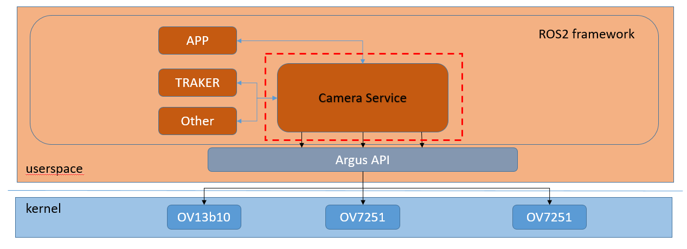

# 简介
运行于小米CyberDog，基于Nvidia [Argus](https://docs.nvidia.com/jetson/l4t-multimedia/group__LibargusAPI.html)和[Ros2](https://www.ros.org/)的相机程序。

该程序使用Argus API提供的接口来操控MIPI相机硬件并实时捕获图像，使用ROS2提供的接口来管理相机节点，为外部模块提供交互接口。

模块整体架构图如下：


模块内部描述图如下：


# 编译
编译本模块需要依赖若干外部软件包，编译前需按照下列命令安装：

## 依赖项
### 1.nvidia-l4t-jetson-multimedia-api
```console
sudo apt-get install nvidia-l4t-jetson-multimedia-api
```
### 2.cuda-toolkit
```console
sudo apt-get install cuda-toolkit-10-2
```
### 3.libavformat-dev
```console
sudo apt-get install libavformat-dev
```
# 测试程序
基于相机api的相机测试程序，可以用来测试相机是否正常，亦可以作为camera api使用方式参考。

## 编译
```console
colcon build --merge-install --packages-up-to camera_test
```

## 运行

### 测试程序，用来测试相机出图是否正常
```console
./build/camera_test/camera_test cam_id width height rgb/bgr
```
例如，测试camera 0，640x480分辨率RGB出图的话，使用如下命令：
./build/camera_test/camera_test 0 640 480 rgb

### 主摄相机服务程序，可以进行拍照录像等命令
```console
ros2 run camera_test camera_server
```
拍照命令：
```console
ros2 service call /camera_service protocol/srv/CameraService "{command: 1, args: ''}"
```

录像命令：
```console
//开始
$ ros2 service call /camera_service protocol/srv/CameraService "{command: 2, args: ''}"
//停止
$ ros2 service call /camera_service protocol/srv/CameraService "{command: 3, args: ''}"
```

### 双目/RGB相机ros2程序
```console
//启动stereo_camera
ros2 run camera_test stereo_camera

//如果使用开机自启的stereo_camera，注意topic前加上命名空间
ros2 lifecycle set /stereo_camera configure

ros2 lifecycle set /stereo_camera activate

ros2 lifecycle set /stereo_camera deactivate

ros2 lifecycle set /camera/camera cleanup


```
运行之后，双目相机和RGB相机将通过/image_left、/image_right、/image_rgb三个topic发布图像。
