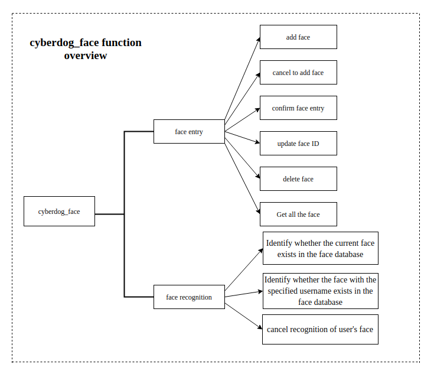
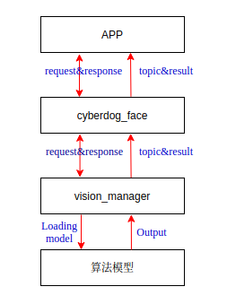
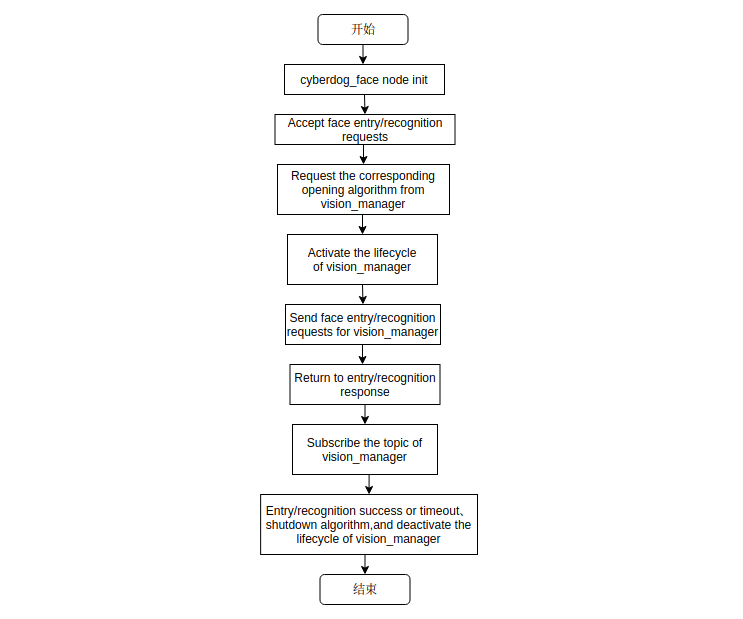

# Cyberdog_face 设计文档

## 1. Cyberdog_face功能概述

 - __cyberdog_face__：是APP端和机器狗交互AI能力的模块之一，主要包含人脸录入、人脸识别两大功能。
 - __人脸录入__：cyberdog_face接受上层请求实现人脸录入、删除人脸、更新人脸等功能。
 - __人脸识别__：cyberdog_face接受上层请求实现人脸识别功能。

 

## 2. 人脸录入/识别软件设计

### 2.1 软件框架

 

### 2.2 设计流程图

## 3. 人脸录入功能
``cyberdog_face``通过service接受到人脸录入请求，返回应答请求并向底层发送人脸录入算法请求，通过监听底层发送的topic，将人脸录入的结果通过topic向上层发送。

### 3.1 添加人脸
``cyberdog_face``向底层人脸数据库添加人脸。

### 3.2 取消添加人脸
``cyberdog_face``正在人脸录入中，向底层发送取消添加录入人脸。

### 3.3 确认录入人脸
``cyberdog_face``在添加录入人脸成功后，再次发送确认添加录入人脸，成功则底层数据库添加人脸成功。

### 3.4 更新录入人脸
``cyberdog_face``更新底层人脸数据库中用户名字。

### 3.5 删除人脸信息
``cyberdog_face``接受到删除人脸的id请求，向底层数据库中删除指定id的人脸，成功返回true,失败返回false。

### 3.6 获取所有人脸信息
``cyberdog_face``获取底层数据库中所有人脸的信息。

## 4. 人脸识别功能
``cyberdog_face``通过service接受到人脸识别请求，返回应答请求并向底层发送人脸识别算法请求，通过监听底层发送的topic，将人脸识别的结果通过topic向上层发送。

### 4.1 识别人脸数据库中当前人脸是否存在
``cyberdog_face``判断当前识别的人脸是否在底层数据库中存在；如存在将识别到人脸的昵称发送出去。

### 4.2 识别人脸数据库中指定username的人脸是否存在
``cyberdog_face``判断识别指定昵称的人脸是否存在在与之昵称对应的底层数据库中；识别成功发送该用户昵称；否则，未识别到人脸。

### 4.3 取消识别用户的人脸
``cyberdog_face``正在进行人脸识别中，发送request取消当前的人脸识别。
