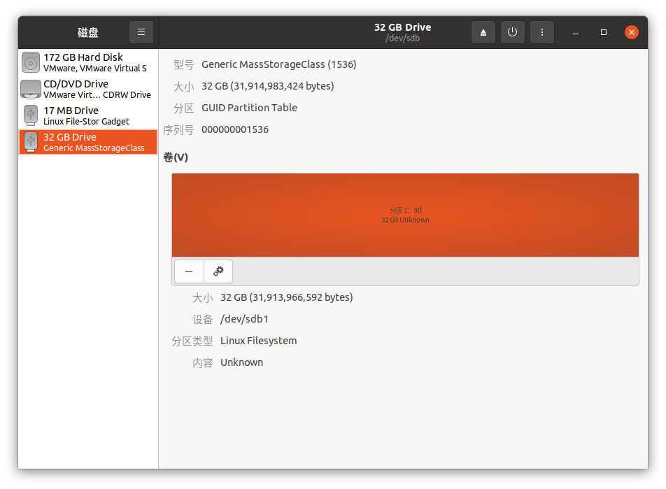
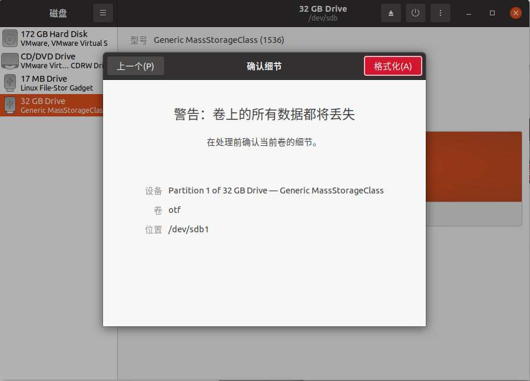
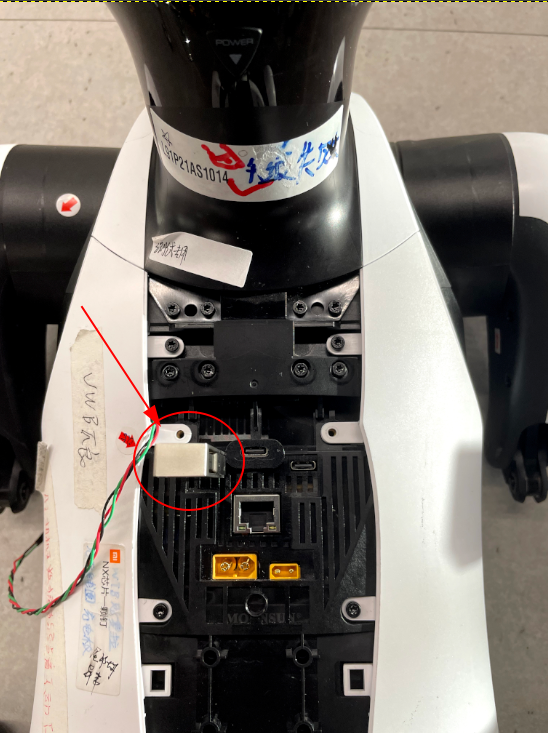

# Cyberdog开发者刷机操作说明文档

## 1. 刷机流程

1. 首先升级感知主板Xavier NX
2. 然后升级机器狗内部其他各个子板
3. 刷机过程中无论成功或者失败，均会有相应的提示音

## 2. 刷机配置文件说明

刷机流程中，升级感知主板Xavier NX为必选，其他各个子板可根据该配置文件来决定是否升级。

### 2.1 具体文件格式示例

```tex
r329 = on
mr813 = on
power = on
imu = on
head-tof = on
tail-tof = on   
mini-led = on
head-uwb = on    
tail-uwb = on
check-battery = 40
force-update = off
```

参数解释：

- **前9行，每行包括三个部分，以第一行来举例说明：**
  - r329代表要升级的主板名称

  - 符号 “=”

  - 是否升级其他主板，升级为"on"，不升级为"off"   (建议同步更新所有主板保证系统稳定性)


- **“check-battery”表示是否在升级NX板前检测电量或者检测电量的临界值：**
  - 取值范围为0—100
  - 0表示不检测电量
  - 大于0，比如30，表示如果当前机器电量低于30%则停止整机刷机，此时应该给机器充电，直到大于30%再次进行整机刷机

- **“force-update”表示是否在升级NX板后强制升级其他主板，也即是否检测其他主板与NX板的通信状态，提前检测通信状态能在升级NX板前发现不能进行升级的其他主板：**

  - “on”表示强制升级，也即不检测通信状态

  - “off”表示不强制升级，也即检测通信状态

### 2.2 配置文件格式要求

- **文件格式必须为linux下的文本格式（换行符LF）**

  

- **文件行数必须为11行，第11行之后不能有换行**

- **每行三部分之间必须有最少一个空格隔开**

- **每行的第一部分、第二部分必须和2.1中的示例文件相同**

- **每行的第三部分，必须为on或者off中的一个，或者“check-battery”的0—100**

### 2.3 不指定配置文件情况下的默认值

- 各个主板默认为“off”，也即不升级

- “check-battery”默认为0，也即不检查电量

- “force-update”默认为“on”，也即强制升级，在升级前不再检查各个主板与NX板的通信情况

## 3. 刷机方式介绍
**重要提示：刷机有风险，操作需谨慎。普通用户不建议刷机。**

目前机器狗刷机方式有两种：U盘卡刷和PC线刷，推荐采用U盘卡刷的方式进行刷机。

- PC线刷方式

  使用该方式进行刷机需要装有Ubuntu系统的PC一台以及一根通用刷机线，时间根据PC配置不同而定，基本需要至少15分钟。该方式对刷机配置文件的名称无要求。

   1. 请先在APP中申请成为开发者并通过审核
   2. 确保狗没有执行任何动作或者程序，处于趴下状态。
   3. 可以"ssh [mi@192.168.55.1](mailto:mi@192.168.55.1)" 登入系统(密码123)后，执行“sudo reboot --force forced-recovery” 使狗进入刷机模式。
   4. 请参照刷机文档中 "4. PC线刷方式" 进行刷机(跳过 “4.3 进入刷机模式”)。

- U盘卡刷方式

  使用该方式进行刷机需要U盘一个，时间由15分钟以上减少到10分钟以内，并且不需要刷机线的参与，也会更加方便。

  该方式要求刷机配置文件的名称必须固定为ota_others.conf，其他均与PC线刷方式相同

1. 1. 请参照刷机文档中“5. U盘卡刷方式”章节指导使用U盘刷机，注意需要自行购买刷机U盘。

   2. 由于结构限制对刷机U盘尺寸有一定要求，U盘建议购买链接：

      [【爱国者U350】爱国者（aigo）32GB Type-C手机U盘 U350 高速两用 双接口U盘 USB3.2 OTG 安卓苹果笔记本电脑通用优盘 【行情 报价 价格 评测】-京东](https://item.jd.com/5522803.html?bbtf=1#crumb-wrap)

      

**关于U盘卡刷方式，需要注意的是：** 

1. 该方式下U盘不支持通过Usb Hub连接，必须直接插入到机器狗中！

2. 目前不支持usb接口的固态硬盘作为刷机U盘

3. 每刷机一次都需要重新开启刷机标志，具体参见“5.7需要再次刷机”

4. U盘只支持type-c接口，并且由于机器狗的外形设计，提供给U盘插入的空间不是很大，  所以需要大小适合的U盘。如果需要购买的话可以参考如下链接：

​    

[【爱国者U350】爱国者（aigo）32GB Type-C手机U盘 U350 高速两用 双接口U盘 USB3.2 OTG 安卓苹果笔记本电脑通用优盘 【行情 报价 价格 评测】-京东](https://item.jd.com/5522803.html?bbtf=1#crumb-wrap)

以上两种刷机方式均需要一台装有Ubuntu系统的PC，目前暂时不支持Windows系统。

## 4. PC线刷方式

### 4.1 解压刷机包

执行如下命令，解压官方提供的release刷机包到PC的目录下（该目录的路径以及名称不做要求）

```bash
$ sudo tar -xvf 刷机包路径 -C 解压到的目录
```

### 4.2 配置刷机环境

解压完成后，进入到解压后的目录下，执行如下命令配置刷机环境

```bash
$ tools/otf_tools/setup.sh
```

> 注意：
>
> 1. 如提示权限问题，请执行：
>
>       $ chmod +x tools/otf_tools/setup.sh
>
> 2. 该脚本执行期间可能需要输入“Y”以确定继续安装，如遇到直接输入即可。

### 4.3 进入刷机模式

保持机器狗头部朝向前方的状态下，将附带的刷机线插入到最右边的usb typec接口中，然后按照下述说明进行操作：

- 如果当前处于关机状态，长按电源键5秒，此时表示机器狗已经进入刷机模式
- 如果当前处于开机状态，长按电源键5秒，松开电源键，再长按电源键5秒，此时表示机器狗已经进入刷机模式

### 4.4 进行刷机

机器狗进入刷机模式后，继续执行如下命令进行刷机（其中**flash_conf_file_path**即为前述提到的刷机配置文件在PC中的路径，具体路径以及名称不做要求）

```Shell
$ sudo ./flashall.sh --others-ota-conf-path flash_conf_file_path
```

### 4.5 等待刷机完成

时间依赖于具体PC的配置情况，大概15分钟左右，具体会按照下述顺序进行：

1. 执行上一步骤命令后，如果最终显示"Flash Successfully !"，表示感知主板Xavier NX升级成功，此时可以拔掉刷机线；
2. 语音提示“开始更新其他主板”，表示开始更新除了感知主板Xavier NX之外的其他各个子板，在更新过程中会循环播报“开始更新其他主板”；
3. 语音提示“其他主板更新成功”，表示其他各个子板更新成功，此时全部刷机完成；
4. 重启机器狗，具体的话，长按电源键5秒，松开电源键，再长按电源键5秒，此时机器狗重启成功并进入正常使用状态。

> 注意：目前已知安装ros环境时，如果配置如下有关字符集的内容：
>
> ```bash
> sudo apt update && sudo apt install locales
> sudo locale-gen en_US en_US.UTF-8
> sudo update-locale LC_ALL=en_US.UTF-8 LANG=en_US.UTF-8
> export LANG=en_US.UTF-8
> ```
>
> 会导致上述第一步升级完感知主板Xavier NX后不会继续执行之后的步骤。
>
> 此时需要手动重启机器狗才能继续执行上述第二步以及之后的步骤。

## 5. U盘卡刷方式

**以下操作会导致U盘之前的所有数据全部丢失！！请提前做好备份！！**

### 5.1 准备脚本工具

1. 如果已经使用过了PC线刷方式进行刷机，因为脚本工具放在了官方提供的release刷机包中，那么可以跳过该步骤，否则需要进行后面的操作

2. 执行如下命令，解压刷机包到PC的目录下（该目录的路径以及名称不做要求）

   ```bash
   $ sudo tar -xvf 刷机包路径 -C 解压到的目录
   ```


### 5.2 制作符合要求的U盘

#### 5.2.1 确定U盘设备名称

因为该名称后面的操作需要用到，所以需要首先确定。

方法可参考如下：

1. 在未插入U盘到PC的情况下，执行如下命令：

   ```bash
   $ ls /dev/sd*
   /dev/sda  /dev/sda1  /dev/sda2
   ```

2. 将U盘插入PC，再次执行上述命令：

   ```bash
   $ ls /dev/sd*
   /dev/sda  /dev/sda1  /dev/sda2  /dev/sdb  /dev/sdb1
   ```

​		可以看到，多出了“/dev/sdb”以及“/dev/sdb1”，其中：

​			/dev/sdb：表示U盘这个设备，这里称为**设备名称**

​			/dev/sdb1：表示设备的第一个分区，这里称为**设备分区名称**

**需要注意的是上述的/dev/sdb以及/dev/sdb1会随着PC的不同而有所变化，并不固定，需要根据个人情况而定。**

#### 5.2.2 进行制作

目前支持两种制作方式：

1. 第一种制作方式将所有的步骤都集成到了一个脚本工具中，方便快捷，推荐使用
2. 第二种制作方式将所有的步骤全部分解并需要手动去一步步操作，适用于第一种方式出现问题后备用

##### 5.2.2.1 制作方式1

1. 将U盘插入到PC

2. 执行如下命令，进入到“5.1 准备脚本工具”步骤中解压到的目录中的脚本工具存放目录

   ```bash
   cd 解压目录/tools/otf_tools
   ```

3. 执行如下命令，开始进行制作（“U盘设备名称”为上一步示例中确定的设备名称）

   ```bash
   $ sudo ./mkudisk.sh U盘设备名称
   ```
   
   出现如下显示则表示制作成功
   
   ```bash
   make udisk successfully!
   ```

##### 5.2.2.2 制作方式2

1. 卸载默认挂载的分区

   在“5.2.1 确定U盘设备名称”步骤中，由于最后插入了U盘，默认会自动挂载到某个目录下，但是之后的操作需要卸载，所以执行如下命令进行卸载（其中参数“/dev/sdb1”即为步骤“5.2.1 确定U盘设备名称”中确定的设备分区名称）

   ```bash
   $ umount /dev/sdb1
   ```

​		**保持U盘的插入状态，不要拔出，继续进行下面的操作！！**

2. 修改分区表为gpt格式

   由于该刷机功能需要U盘拥有gpt格式的分区表，但是一般新的U盘的分区表格式为msdos，所以需要进行修改。具体可以使用parted命令完成该要求，具体操作如下（其中参数“/dev/sdb”即为步骤“5.2.1 确定U盘设备名称”中确定的设备名称）

   ```bash
   $ sudo parted /dev/sdb                   
   GNU Parted 3.3
   使用 /dev/sdb
   欢迎使用 GNU Parted！输入 'help' 来查看命令列表。
   (parted) mklabel                                                          
   新的磁盘卷标类型？ gpt                                                    
   警告: 现有 /dev/sdd 上的磁盘卷标将被销毁，而所有在这个磁盘上的数据将会丢失。您要继续吗？
   是/Yes/否/No? y                                                           
   (parted) quit                                                             
   信息: 你可能需要 /etc/fstab。   
   ```
   
3. 重新分区

   分区表格式修改为gpt之后，之前的数据会全部丢失，所以需要重新分区。具体地，同样可以使用parted命令，具体操作如下（其中参数“/dev/sdb”即为步骤“5.2.1 确定U盘设备名称”中确定的设备名称）

   ```bash
   $ sudo parted /dev/sdb
   GNU Parted 3.3
   使用 /dev/sdb
   欢迎使用 GNU Parted！输入 'help' 来查看命令列表。
   (parted) mkpart 
   分区名称？  []? otf                                                       
   文件系统类型？  [ext2]? ext4                                              
   起始点？ 0%                                                               
   结束点？ 100%                                                             
   (parted) quit                                                             
   信息: 你可能需要 /etc/fstab。
   ```

4. 格式化并固定U盘的挂载目录名称

    a. 在Ubuntu系统下搜索“磁盘”软件，打开并找到U盘的对应界面，本例中为左边的第四个（根据个人实际情况找到U盘的对应磁盘）
    
    

​	   b. 点击设置按钮，选择格式化分区，如下图所示

​												

​		c. 进入到格式化界面，按照如下选择即可：

​				卷名：固定为“**otf_usb**”（注意，此处必须为此名称，否则之后的操作不会成功）

​				擦除：不选择默认即可

​				类型：选择第一项“只用于Linux系统的内部磁盘(Ext4)(I)

​				最终如下图所示

​										 	

​		d. 最后点击右上角的下一个，然后点击右上角的格式化，等待完成即可

​											

### 5.3 复制镜像到U盘

1. 确保制作的U盘已经挂载到PC

1. 执行如下命令，进入到“5.1 准备脚本工具”步骤中解压到的目录中的脚本工具存放目录

   ```bash
   cd 解压目录/tools/otf_tools
   ```

1. 在PC中打开一个终端，执行如下命令（其中脚本参数为官方提供的release刷机包在PC中的路径全称，刷机包名称后缀也需要写全）

   ```bash
   $ ./mkimage.sh 官方提供的release刷机包路径全称
   ```

   该命令大概需要10分钟左右的时间，请耐心等待。

> 注意：
>
> 1. 执行命令后需要输入密码，如果终端记住后则不再需要。
>
> 2. 如果提示 bash: ./mkimage.sh: 权限不够，执行以下命令即可：
>
>       $ chmod +x mkimage.sh

4. 最终显示如下内容则表示成功：

​			Make udisk image successfully!

​	   最终显示如下内容则表示失败：

​			Fail to make udisk image!

> 注意：
>
> ​	如果长时间停留在Wait for the udisk to be ready...，需要检查U盘是否已经插入到PC中，如果已经插入到PC中则可以重新插拔试一试。

### 5.4 将刷机配置文件放置到U盘根目录中

该刷机方式下，对于配置文件的要求，除了名称要求必须固定为ota_others.conf之外，其他与PC卡刷方式完全相同。

### 5.5 将U盘插入到机器狗并重启

1. 将U盘插入到机器狗的最左边的usb typec口，如下图所示：



2. 按照下述方式重启机器狗：

- 如果当前处于关机状态，长按电源键5秒，此时表示机器狗已经启动，开始进入刷机模式

- 如果当前处于开机状态，长按电源键5秒，松开电源键，再长按电源键5秒，此时表示机器狗已经启动，开始进入刷机模式

### 5.6 等待刷机完成

#### 5.6.1 提示音

升级过程中，会依次播放如下提示音：

1. 语音提示“开始应用板刷机”，表示开始升级感知主板Xavier NX；

1. 语音提示“应用板刷机成功”，表示感知主板Xavier NX升级成功；

1. 语音提示“开始更新其他主板”，表示开始更新除了感知主板Xavier NX之外的其他各个子板，需要注意的是在更新过程中会循环播报“开始更新其他主板”；

1. 语音提示“其他主板更新成功”，表示其他各个子板更新成功；

1. 至此，刷机过程全部完成，可以拔掉U盘；

1. 重启机器狗，具体的话，长按电源键5秒，松开电源键，再长按电源键5秒，此时机器狗重启成功并进入正常使用状态。

#### 5.6.2 所需时间

根据U盘的速度不同而定，大概需要10分钟。

### 5.7 需要再次刷机

#### 5.7.1 准备好前述制作的U盘

#### 5.7.2 接下来分为两种情况，请确认好属于哪一种后再进行操作

##### 5.7.2.1 不需要更新版本

1. 在PC中进入到准备好的U盘挂载的目录下，执行如下命令重新打开刷机标志（如下显示即为修改成功）

```Shell
$ ./enable_otf.sh 
enable otf function successfully!
```

2. 执行步骤"5.4 将刷机配置文件放置到U盘根目录中"

3. 执行步骤"5.5 将U盘插入到机器狗并重启"

4. 根据步骤"5.6 等待刷机完成“的说明，等待刷机完成

##### 5.7.2.2 需要更新版本

1. 执行步骤"5.3 复制镜像到U盘"

1. 执行步骤"5.4 将刷机配置文件放置到U盘根目录中"

1. 执行步骤"5.5 将U盘插入到机器狗并重启"

1. 根据步骤"5.6 等待刷机完成“的说明，等待刷机完成

## 6. 调试方法

**默认情况下所有的调试接口都是封禁的，可以用过申请开发者权限来开启调试接口。**

调试接口权限开启后，拆开调试盖板，有两种方式可以在PC中连接到机器狗：

1. 通过网线将PC与机器狗直接连接，之后在PC端输入如下命令即可连接到机器狗（密码：123）：

   ```shell
   $ ssh mi@192.168.44.1
   ```

2. 通过USB type-c线连接到机器狗（接口位于中间充电口的右侧），之后在PC端输入如下命令即可连接到机器狗（密码：123）：

   ```shell
   $ ssh mi@192.168.55.1
   ```


