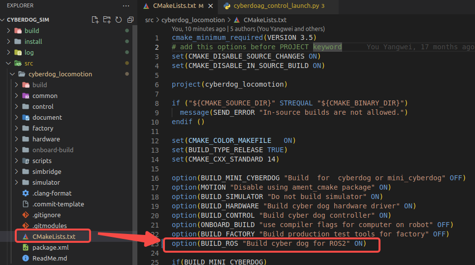
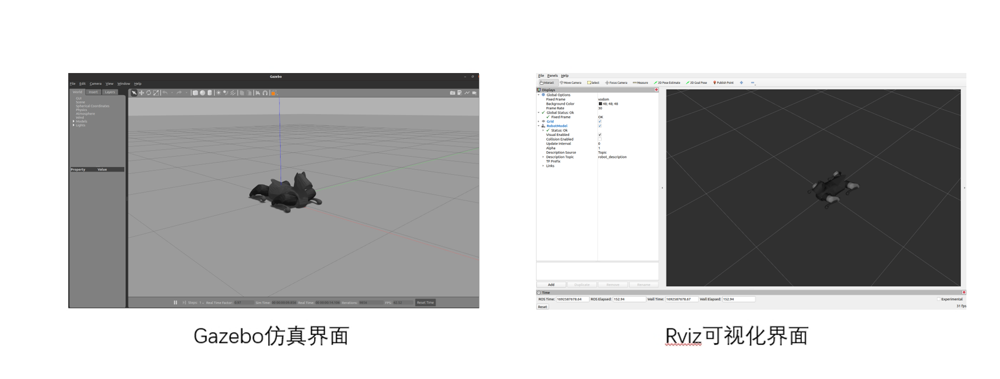
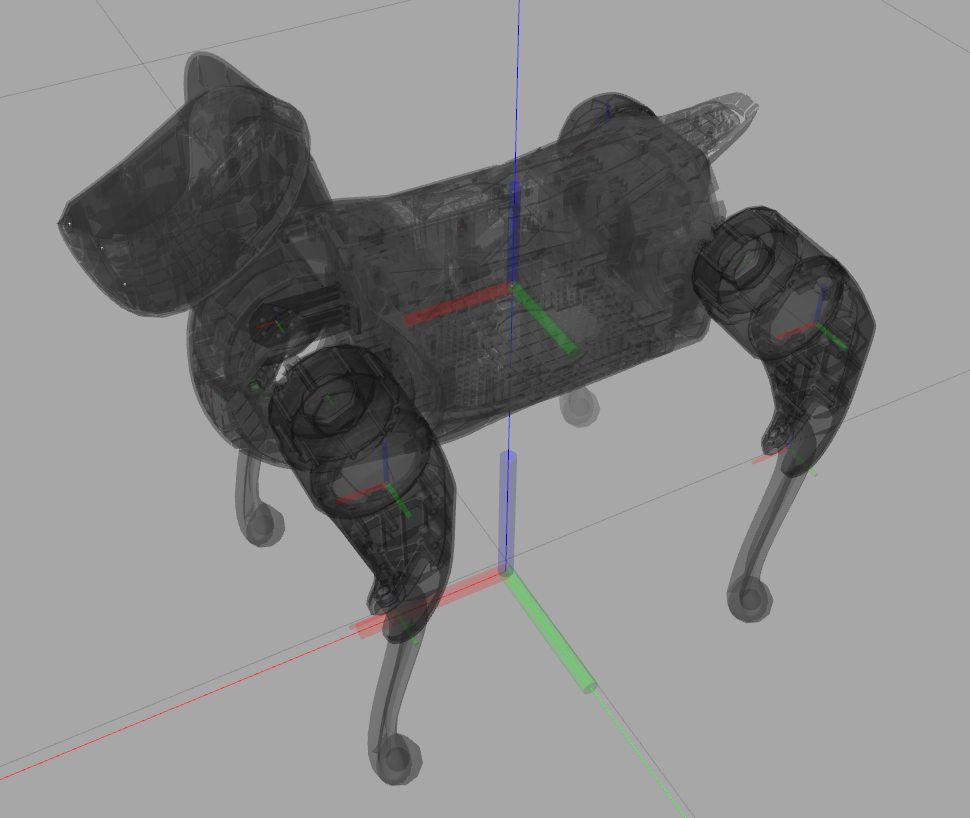
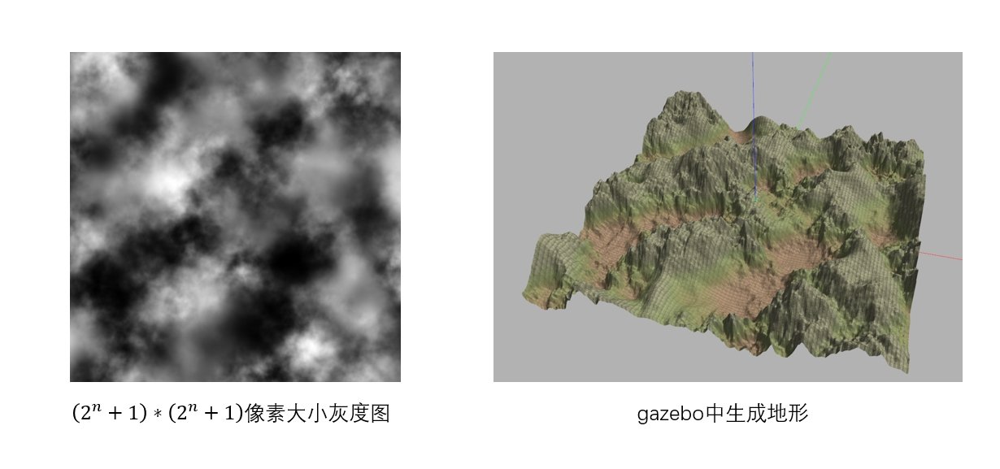
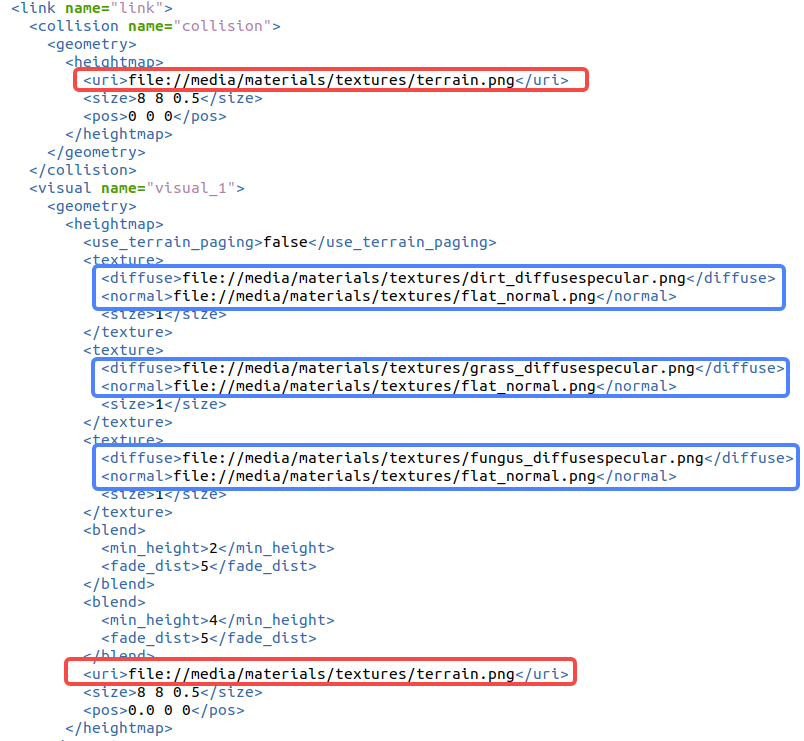

## Gazebo仿真平台
### 1. 概述
gazebo仿真平台能够使gazebo仿真程序直接与cyeberdog的控制程序cybredog_control进行通信，并将机器人的各关节数据与传感器数据转发为ros2 topic。
#### 1.1 通信框架
仿真环境目前主要由三个程序组成：cyberdog的控制程序cybredog_control，gazebo仿真程序legged_plugins和基于ros2可视化界面cyberdog_visual，其关系如下图所示。  

 
- cyberdog控制程序和gazebo之间通过sharedmemory进行通信，gazebo程序创建host的共享内存，控制程序通过attach到该内存上进行通信。其通信的内容为robotToSim/simToRobot。
- ros2仿真界面接受从控制程序通过lcm发送的电机和里程计信号等信号并通过topic转发为 /joint_states 与 /tf。
  -  可通过发送topic /yaml_parameter 向gazebo程序发送yaml中的robotparamter和userparameter的变更值，再由gazebo通过sharedmemory发送给控制程序。
- gazebo仿真程序会将仿真中的imu与激光雷达的数据以ros2 topic的形式进行发送，其topic名称为 /imu 和 /scan
#### 1.2 安装
该仿真平台推荐的推荐安装环境为： Ubuntu 20.04 + ROS2 Galactic
##### 1.2.1 依赖安装
运行仿真平台需要安装如下的依赖  
**ros2_Galactic**  
```
$ sudo apt update && sudo apt install curl gnupg lsb-release
$ sudo curl -sSL https://raw.githubusercontent.com/ros/rosdistro/master/ros.key -o /usr/share/keyrings/ros-archive-keyring.gpg
$ echo "deb [arch=$(dpkg --print-architecture) signed-by=/usr/share/keyrings/ros-archive-keyring.gpg] http://packages.ros.org/ros2/ubuntu $(source /etc/os-release && echo $UBUNTU_CODENAME) main" | sudo tee /etc/apt/sources.list.d/ros2.list > /dev/null
$ sudo apt update
$ sudo apt install ros-galactic-desktop
```
**Gazebo**
```
$ curl -sSL http://get.gazebosim.org | sh
$ sudo apt install ros-galactic-gazebo-ros
$ sudo apt install ros-galactic-gazebo-msgs
```
**LCM**
```
$ git clone https://github.com/lcm-proj/lcm.git
$ cd lcm
$ mkdir build
$ cd build
$ cmake -DLCM_ENABLE_JAVA=ON ..
$ make
$ sudo make install
```
**Eigen**
```
$ git clone https://github.com/eigenteam/eigen-git-mirror
$ cd eigen-git-mirror
$ mkdir build
$ cd build
$ cmake ..
$ sudo make install
```
**xacro**
```
$ sudo apt install ros-galactic-xacro
```
注意：若环境中安装有其他版本的yaml-cpp，可能会与ros galactic 自带的yaml-cpp发生冲突，建议编译时环境中无其他版本yaml-cpp
##### 1.2.2 安装仿真程序
在依赖安装完后，在需要安装的目录下进行如下操作
```
$ vcs import < cyberdog_sim.repos
```
##### 1.2.3 编译
需要确认src/cyberdog locomotion/CMakeLists.txt中的BUILD_ROS置为ON，如下图所示  


需要在cyberdog_sim文件夹下运行
```
$ source /opt/ros/galactic/setup.bash 
$ colcon build --merge-install --symlink-install --packages-up-to cyberdog_locomotion cyberdog_ros2
```

#### 1.3 运行
##### 1.3.1 脚本启动所有程序
需要在cyberdog_sim文件夹下运行以下命令即可打开gazebo仿真，cyberdog控制与rviz可视化程序。
```
$ python3 src/cyberdog_ros2/cyberdog_gazebo/script/launchsim.py
```
  
 

##### 1.3.2 分别运行各程序
除脚本启动外，可通过以下步骤分别运行各程序  
**Gazebo仿真程序**  
首先启动gazebo程序，于cyberdog_sim文件夹下进行如下操作：
```
$ source /opt/ros/galactic/setup.bash
$ source install/setup.bash
$ ros2 launch cyberdog_gazebo gazebo.launch.py
```
也可通过如下命令打开gazebo仿真中的激光雷达传感器
```
$ source /opt/ros/galactic/setup.bash
$ source install/setup.bash
$ ros2 launch cyberdog_gazebo gazebo.launch.py use_lidar:=true
```
对于gazebo进程无法通过ctrl+C彻底杀死的问题，可以使用如下脚本运行gazebo，运行时在检测到ctrl+C后该脚本会自动杀死所有gazebo的进程。在cyberdog_sim文件夹下运行：
```
$ source /opt/ros/galactic/setup.bash
$ source install/setup.bash
$ chmod +x src/cyberdog_ros2/cyberdog_gazebo/script/gazebolauncher.py
$ python3 src/cyberdog_ros2/cyberdog_gazebo/script/gazebolauncher.py ros2 launch cyberdog_gazebo gazebo.launch.py
```
**cyberdog控制程序**  
然后启动cyberdog_locomotion的控制程序。在cyberdog_sim文件夹下运行：
```
$ source /opt/ros/galactic/setup.bash
$ source install/setup.bash
$ ros2 launch cyberdog_gazebo cyberdog_control_launch.py
```
**rviz可视化界面**  
最后打开可视化界面，在cyberdog_sim文件夹下运行：
```
$ source /opt/ros/galactic/setup.bash
$ source install/setup.bash
$ ros2 launch cyberdog_visual cyberdog_visual.launch.py
```
### 2. 通信接口
在仿真中，能够通过向控制程序进行lcm通信控制机器人。而在仿真程序中也提供了ros2 topic接口控制机器人以及实现一些仿真的功能，并且能够通过lcm或ROS2 topic的方式发送仿真中的机器人的各项数据。
#### 2.1 控制程序接口
在仿真中，控制程序的高层接口会也能够使用，可以通过lcm通信向控制程序发送指令，控制仿真中的机器人。具体的功能与实现方法可参照运控文档的运动控制模块 2.高层接口 中的内容。
#### 2.2 仿真程序接口
仿真程序提供了通过lcm发送基础控制命令的接口以及通过ROS2 topic实时修改机器人控制程序参数的接口，还提供了通过ros2 topic对机器人施加外部作用力的接口，该接口仅能够在仿真中使用。同时仿真中机器人的各项数据会以lcm和ROS2 topic的形式发送出来。
##### 2.2.1 机器人控制
仿真中提供了gamepad_lcmt的lcm通信方法来向控制程序发送一些基本的控制指令，该lcm type模仿了APP中控制机器人方向的两个摇杆，其结构如下：
```
/** lcm通道信息
- url: "udpm://239.255.76.67:7667?ttl=255"
- channel: "gamepad_lcmt"
*/

/** lcm数据结构 */
struct gamepad_lcmt {
    int32_t leftBumper, 
    int32_t rightBumper,
    int32_t leftTriggerButton,
    int32_t rightTriggerButton,
    int32_t back,
    int32_t start,
    int32_t a, //切换为缓慢趴下模式
    int32_t b, //切换为恢复站立模式
    int32_t x, //切换为QP站立模式(kp kd较小)
    int32_t y, //切换为locomotion模式
    int32_t leftStickButton,
    int32_t rightStickButton,
    float leftTriggerAnalog,
    float rightTriggerAnalog,
    float leftStickAnalog[2], //机器人x,y方向速度控制
    float rightStickAnalog[2]， //机器人pitch, yaw方向速度控制
}
```

仿真中提供了ROS2 topic /yaml_parameter 来控制仿真中的机器人。该topic的结构如下  
YamlParam.msg
```
uint64 DOUBLE = 1
uint64 S64 = 2
uint64 VEC_X_DOUBLE = 3

string name
uint64 kind
int64 s64_value
float64 double_value
float64[12] vecxd_value
int64 is_user
```
该topic能对控制程序cyberdog_locomotion/common/config文件夹中cyberdog2-ctrl-user-parameters.yaml与cyberdog2-defaults.yaml文件中的任意参数进行实时的调试。  
topic中的name为参数名，kind为参数的类型，共有double，int64_t，与vector&lt;double&gt;三种类型。s64_value, double_value, vecxd_value分别对应各类型要修改为的值。is_user作用为选择yaml文件，为0时程序会在cyberdog2-defaults.yaml查找参数，非零时从cyberdog2-ctrl-user-parameters.yaml中查找参数。

##### 2.2.2 施加外部力
通过ROS2 topic /apply_force可对仿真中机器人的任意构件的任意位置施加持续任意时间的任意力，其结构如下  
ApplyForce.msg
```
string link_name
float64 time
float64[3] force
float64[3] rel_pos
```
其中，link_name为要施加关节的名字，time为要施加力的持续时间，force为加载力在世界坐标系下xyz方向的大小，relative pos为加载力在构件坐标系下的相对位置。

##### 2.2.3 机器人数据的抓取
仿真中机器人数据会以lcm和ROS2 topic的方式对外进行发送，可根据自身的需求选择抓取数据的方式。  
  
**lcm数据的抓取**  
lcm数据，可以在控制程序cyberdog_locomotion/script文件下使用lcm自带的lcm-logger抓取数据，然后使用第三方库log2smat将抓取的数据转换为matlab的mat文件。具体使用方法如下：
```
$ cd cyberdog_locomotion/script
$ ./make_types.sh  #安装后首次使用需运行该脚本以生成lcm的type文件
$ lcm-logger #可通过Crtl+C退出数据抓取，会自动生成lcm的log文件。
$ ./log_convert <生成的log文件名> <要生成的mat文件名.mat>
```
也可在script文件夹下运行launch_lcm_spy.sh脚本实时显示lcm数据。  
仿真程序发送的lcm数据simulator_state结构如下
simulator_lcmt.lcm  
```cpp
struct simulator_lcmt {
   double vb[3];     //机身坐标系下xyz速度
   double rpy[3];    //翻滚角 俯仰角 偏航角 

   int64_t timesteps;  //实际时间戳
   double  time;       //
   double quat[4];     //机身朝向四元数
   double R[9];        //机身朝向旋转矩阵
   double omegab[3];   //机身坐标系下角速度
   double omega[3];    //机身角速度
   double p[3];        //机身位置
   double v[3];        //机身速度
   double vbd[3];      //机身加速度
   double q[12];       //关节位置
   double qd[12];      //关节速度
   double qdd[12];     //关节加速度
   double tau[12];     //关节输出转矩
   double tauAct[12];  //关节
   double f_foot[12];  //足端接触力xyz方向分量
   double p_foot[12];  //足端位置xyz坐标
}
```
其中未提及坐标的数据皆为世界坐标系下的数据。  
关节相关数据的顺序为 FR-侧摆髋关节 FR-前摆髋关节 FR-膝关节 FL-侧摆髋关节 FL-前摆髋关节 FL-膝关节 RR-侧摆髋关节 RR-前摆髋关节 RR-膝关节 RL-侧摆髋关节 RL-前摆髋关节 RL-膝关节。  
足端相关数据的顺序为 FR FL RR RL。 

**ROS2 topic数据**  
仿真平台会以标准的ROS2 topic /tf2 /joint_states /imu进行发送
具体可参照：  
[**sensor_msgs文档**](http://docs.ros.org/en/melodic/api/sensor_msgs/html/index-msg.html)  
[**tf2官方文档**](https://docs.ros.org/en/foxy/Tutorials/Intermediate/Tf2/Introduction-To-Tf2.html)

##### 2.2.4 仿真例程
在仿真程序中提供了cyberdog_example的仿真例程包，该包提供了keybroad_commander和cyberdogmsg_sender两个例程。
keybroad_commander演示了如何使用gampad_lcmt向控制发送基本控制指令
该程序运行方法如下：
需要在cyberdog_sim文件夹下运行
```
$ source /opt/ros/galactic/setup.bash
$ source install/setup.bash
$ ./build/cyberdog_example/keybroad_commander
```
运行后，可在终端输入对应的指令来控制机器人  

|键位|指令|键位|指令|
| ------ | ------ | ------ | ------ |
|w|x方向速度增加最大速度的0.1倍|i|pitch方向速度增加最大速度的0.1倍|
|s|x方向速度减少最大速度的0.1倍|k|pitch方向速度减少最大速度的0.1倍|
|d|y方向速度增加最大速度的0.1倍|l|yaw方向速度增加最大速度的0.1倍|
|a|y方向速度减少最大速度的0.1倍|j|yaw方向速度减少最大速度的0.1倍|
|e|切换为QP站立模式(kp kd较小)|t|切换为缓慢趴下模式|
|r|切换为locomotion模式|y|切换为恢复站立模式|

cyberdogmsg_sender演示了使用/yaml_parameter来对yaml文件中的控制参数进行实时修改，以及使用/apply_force来仿真中的机器人施加外力。
该程序的运行方法如下：
需要在cyberdog_sim文件夹下运行
```
$ source /opt/ros/galactic/setup.bash
$ source install/setup.bash
$ ./build/cyberdog_example/cyberdogmsg_sender
```
该例程先把参数use_rc置为0(该参数为1时为遥控模式，置为0后才能够通过仿真程序进行控制)；  
然后通过设置control_mode参数使机器人站立起来，并进入locomotion模式，即原地踏步(control_mode的参数可参阅控制程序的control_flag.h文件)；  
接着对机器人的左前小腿施加侧向的外力；
最后通过修改des_roll_pitch_height参数使机器人在踏步时roll角变为0.2弧度。

### 3. 仿真参数
以下将对一些仿真平台使用中可以调整的参数进行说明
#### 3.1 仿真器参数
Gazebo的ode物理引擎的求解器参数可在cyberdog_gazebo包的world文件夹下simple.world文件中进行设置。  
simple.world
```xml
<?xml version="1.0" ?>
<sdf version="1.5">
    <world name="earth">

        <physics type="ode">
            <max_step_size>0.001</max_step_size>
            <real_time_factor>1</real_time_factor>
            <real_time_update_rate>1000</real_time_update_rate>
            <gravity>0 0 -9.81</gravity>
            <ode>
                <solver>
                <type>world</type>
                <min_step_size>0.0001</min_step_size>   
                <iters>50</iters> 
                <sor>1.3</sor>
                </solver>  
                <constraints>
                <cfm>0.0</cfm>
                <erp>0.2</erp>
                </constraints>  
            </ode>
        </physics>

        <scene>
            
        </scene>

        <!-- A global light source -->
        <include>
            <uri>model://sun</uri>
        </include>

        <!-- A ground plane -->
        <include>
            <uri>model://ground_plane</uri>
        </include>
        
    </world>
</sdf>
```
重要参数说明：  
max_step_size: 该参数为ode一个计算步所计算的时间，影响仿真结果的精度，不建议修改。  
real_time_update_rate: 该参数为ode的频率，此处设置为1000Hz。  
type: 该参数可设置为“world”或“quick”，“world”模式下ode的求解更精确但计算速度较慢，会影响实时率；而“quick”模式会迭代一定的步数接近解，精确相对较低但计算速度快。

#### 3.2 机器人模型
机器人模型参数存放于cyberdog_robot包中，mesh文件夹下存放了机器人模型，xacro文件夹下存放了机器人的xacro模型文件，该文件会在launch是作为urdf被gazebo读取，在仿真平台中生成机器人模型。  
urdf相关文档可参照[**官方urdf文档**](https://docs.ros.org/en/foxy/Tutorials/Intermediate/URDF/URDF-Main.html)  
机器人模型的关节坐标系与零位如下图所示。  
 


仿真中机器人四条腿分别以FR,FL,RR,RL来命名，以下为左前退为例各关节和构件的名称。(方形为构件名，椭圆为关节名)


#### 3.3 地形设置
gazebo的地形可通过heightmap进行生成，可通过生成一张像素为（2^n+1）X（2^n+1）大小的灰度图来进行heightmap的绘制。如下图所示的灰度图  
  
需要注意灰度图的大小必须为（2^n+1）X（2^n+1）(如513X513)，否则gazebo无法读取。  

**地形生成方法的说明**
将要生成的地形图像文件放置在media/materials/textures文件夹下，将world文件夹下的hightmap.world文件中如下图中红框所是地址改为对应文件的地址即可。也可通过修改蓝框处的地址修改地形的表面材质。  
 

保存后运行以下程序即可启动gazebo程序并生成地形
```
$ source /opt/ros/galactic/setup.bash
$ source "src所在文件夹"/install/setup.bash
$ ros2 launch cyberdog_gazebo heightmap_gazebo.launch.py
```

