# 
cyberdog_interactive 设计文档

##  目录 
* [1. 修订](#1-修订)
* [2. 概述](#2-概述)
* [3. 设计](#3-设计)
  * [3.1. 功能设计](#31-功能设计)
  * [3.2. 模块设计](#32-模块设计)
---
## 1. 修订

项目|软件版本|协议版本|修订日期|修订人员|备注
:--:|:--|:--|:--:|:--:|:--:
互动|V1.1.0.0|V1.0.0.0|2023-02-06|尚子涵|无

## 2. 概述
仿生机器人互动功能将内置固定场景下的互动功能，作为机器人的基础能力，并以此为用户提供编程例子，抛砖引玉，希望用户（开发者）可以开发出更加好玩炫酷的功能。

## 3. 设计
### 3.1. 功能设计

摸下巴的仅在狗处于“坐下”状态时才会触发，且摸下巴动作分为以下三种状态：
1. 来回触摸下巴：
  - 当障碍物在狗下巴左右来回触摸时会进入该状态，该状态下狗会触发如下动作：
    - 狗吠一声；
    - 左右扭屁股动作；
2. 触摸下巴左侧：
  - 当障碍物在狗下巴左侧持续触摸时会进入该状态，该状态下狗会触发如下动作：
    - 狗吠一声；
    - 向右扭屁股动作；
3. 触摸下巴右侧
  - 当障碍物在狗下巴右侧持续触摸时会进入该状态，该状态下狗会触发如下动作：
    - 狗吠一声；
    - 向左扭屁股动作；

#### 3.2 模块设计

如上图所示，该功能可分为两个模块，一个主模块，主模块下仅挂一个检测摸下巴的互动模块，互动模块依赖TOF模块、运动模块和语音模块：
1. TOF模块：提供头部TOF传感数据，用于感知狗下巴附近是否存在障碍物；
2. 运动模块：提供基础运动能力；
3. 和语音模块：提供基础语音交互能力。
