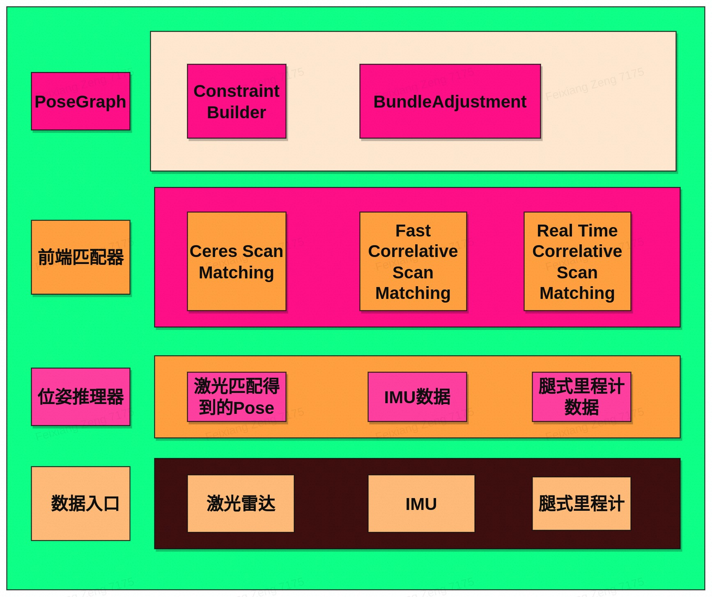

# cyberdog_laserslam

## 模块简介

cyberdog_laserslam是一个基于开源项目Cartographer开发的基于激光雷达、IMU可以实时定位建图的模块，包含的子模块有：位姿融合推理、激光地图匹配、位姿图等。

## 模块架构

数据入口： 提供LaserSlam所需的数据入口

位姿推理器：根据激光前端匹配得到的位姿势，imu的角度信息，腿式里程计的速度信息来推理当前时刻的位姿

前端匹配器：通过新入激光数据，从位姿推理器拿到当前时刻位姿估计，将激光数据转换到世界坐标系和占据栅格匹配得到纠正后的位姿

Pose Graph：通过整理前端匹配得到的节点和SubMap构建位姿图，进行图优化平均误差，顺滑位姿

## 处理流程

