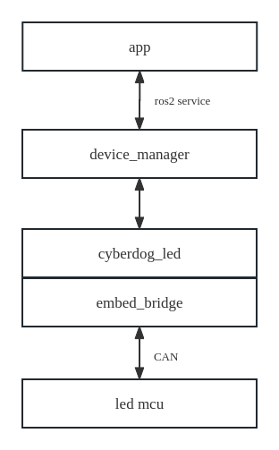

# Cyberdog_led 设计文档
## 1. 功能概述
  cyberdog_led模块负责系统中头部led灯带、尾部led灯带以及mini led 灯效的控制。该模块在device_manager pkg中以ros2 plugin的形式引用，并提供相应的ros2 service用与相应系统中需要使用LED模块调用。代码放置在device仓库中。
  https://github.com/MiRoboticsLab/devices/tree/rolling/cyberdog_led

## 2. 模块结构

<center>

 

</center>


   - app为系统中需要使用led的应用模块例如 bms、tracking、connector、可视化编程模块等。
   - device_manager 为系统中所有device的管理模块，led功能在其中已ros2 service的形式对外部提供调用接口。
   - cyberdog_led 已ros2 plugin的形式实现对系统中led功能的控制和实现。
   - embed_bridge 封装了底层can utils指令的通用接口
   - led mcu 包含头灯条带、尾灯条带、mini led的嵌入式控制程序

   

   ### 2.1 ROS2 Service协议

   #### 2.1.1 srv内容

   led模块采用service方式提供服务，应用端例如（“bms”，”connector“等）通过发送request执行所需等效。led plugin 端会通过优先级策略判定是否立即播放请求灯效。

   - service file: "bridge/protocol/ros/srv/LedExecute.srv"
 
   

  #### 2.1.2 命令行测试例子:

   - case1：connector模块请求将head led当前灯效设置为系统预置代号为0xA1（红灯亮）灯效。 

   ```Python
   ros2 service call /`ros2 node list | grep "mi_" | head -n 1 | cut -f 2 -d "/"`/led_execute protocol/srv/LedExecute "{occupation: 1, client: "connector", target: 1, mode: 1, effect: 0xA1}"
   ```

   

   - case2：connector模块请求将tail led当前灯效模式选择自定义模式，基础灯效选择0x02（闪烁）。R，G，B像素值分别设定为255、0、0。

   ```Python
   ros2 service call /`ros2 node list | grep "mi_" | head -n 1 | cut -f 2 -d "/"`/led_execute protocol/srv/LedExecute "{occupation: 1, client: "connector", target: 2, mode: 2, effect: 2 ,r_value: 255, g_value: 0, b_value: 0}"
   ```

   - case3:connector模块请求将head led灯效关闭

   ```Python
   ros2 service call /`ros2 node list | grep "mi_" | head -n 1 | cut -f 2 -d "/"`/led_execute protocol/srv/LedExecute "{occupation: 1, client: "connector", target: 1, mode: 1, effect: 0xA0}"
   ```

   - case4:connector模块请求将head led释放占用，允许低优先级用户控制

   ```Python
   ros2 service call /`ros2 node list | grep "mi_" | head -n 1 | cut -f 2 -d "/"`/led_execute protocol/srv/LedExecute "{occupation: 0, client: "connector", target: 1}"
   ```

   - case5：connector模块请求将mini led当前灯效模式选择系统自定义模式，灯效选择0x34。

   ```Python
   ros2 service call /`ros2 node list | grep "mi_" | head -n 1 | cut -f 2 -d "/"`/led_execute protocol/srv/LedExecute "{occupation: 1, client: "connector", target: 3, mode: 1, effect: 0x34}"
   ```

   

   - case6：connector模块请求将mini led当前灯效模式选择自定义模式，基础灯效选择0x31（画圆环）。R，G，B像素值分别设定为0、0、255。

   ```Python
   ros2 service call /`ros2 node list | grep "mi_" | head -n 1 | cut -f 2 -d "/"`/led_execute protocol/srv/LedExecute "{occupation: 1, client: "connector", target: 3, mode: 2, effect: 0x31, r_value: 0, g_value: 0, b_value: 255}"
   ```

   - case7：connector模块请求将mini led灯效关闭

   ```Python
   ros2 service call /`ros2 node list | grep "mi_" | head -n 1 | cut -f 2 -d "/"`/led_execute protocol/srv/LedExecute "{occupation: 1, client: "connector", target: 3, mode: 1, effect: 0x32}"
   ```

   - case8:onnector模块请求将mini led释放占用，允许低优先级用户控制

   ```Python
   ros2 service call /`ros2 node list | grep "mi_" | head -n 1 | cut -f 2 -d "/"`/led_execute protocol/srv/LedExecute "{occupation: 0, client: "connector", target: 3}"
   ```

  ## 3. 优先级策略

   - led占用采用优先级的策略进行管理，优先级高的模块请求会抢占优先级低的模块占用具体在  /opt/ros2/cyberdog/share/params/toml_config/device/led_priority.toml中描述。

   ```Lua
   # 该toml配置文件用于规定各模块使用灯的优先级,头灯、尾灯、mini led遵循一样的优先级配置
   # id越小优先级越高
   
   [[priority]]
   client = "lowpower"
   id = 0
   
   [[priority]]
   client = "bms"
   id = 1
   
   [[priority]]
   client = "connector"
   id = 2
   
   [[priority]]
   client = "vp"
   id = 3
   
   [[priority]]
   client = "tracking"
   id = 4
   
   [[priority]]
   client = "system"
   id = 5
   ```


   - 常用颜色的rgb取值，同时包含系统默认灯效的相关配置，可以在/opt/ros2/cyberdog/share/params/toml_config/device/led_color_config.toml中查找

   ```Makefile
   # 该toml配置文件用于规定rgb led预设颜色的r、g、b值。
   
   blue = [44,252,255]
   dark_blue = [0 ,20,100]
   bright_blue = [44,252,255]
   yellow = [255,150,0]
   orange = [255,30,0]
   pink = [255,100,255]
   red = [255,50,50]
   
   
   [system_headled]
   occupation = true
   client = "system"
   target = 1        # 头灯
   mode =  2         # 用户自定义模式
   effect =  9       # 逐个点亮基础灯效
   r_value = 6       # 天蓝色
   g_value = 33
   b_value = 226
   
   [system_tailled]
   occupation = true
   client = "system"
   target = 2        # 尾灯
   mode =  2         # 用户自定义模式
   effect =  9       # 逐个点亮基础灯效
   r_value = 6       # 天蓝色
   g_value = 33
   b_value = 226
   
   [system_miniled]
   occupation = true
   client = "system"
   target = 3        # mini led
   mode =  2         # 用户自定义模式
   effect =  48      # 圆形缩放基础灯效
   r_value = 6       # 天蓝色
   g_value = 33
   b_value = 226
   ```


  ## 4.api接口
  ```makefile
  bool Config():加载配置参数，优先级配置、默认的灯的颜色等等
  bool Init():加载系统灯效和初始化优先级记录数据等
  void Play(
    const std::shared_ptr<protocol::srv::LedExecute::Request> info_request,
    std::shared_ptr<protocol::srv::LedExecute::Response> info_response):响应用户请求，播放相应的灯效。
  void rgb_led_cmd(std::vector<uint8_t> & temp_vector, Request_Attribute & operatecmd):根据用户请求，生成待执行的rgb led的灯效。
  void mini_led_cmd(std::vector<uint8_t> & temp_vector, Request_Attribute & operatecmd):根据用户请求，生成待执行的mini led的灯效。
  void find_cmd(
    const std::shared_ptr<protocol::srv::LedExecute::Request> info_request,
    Request_Attribute & operatecmd):根据优先级策略在历史队列中找到需要执行的灯效。
  int32_t request_legal(const std::shared_ptr<protocol::srv::LedExecute::Request> info_request):判断用户请求的参数是否合法。
  int32_t play_by_priority(Request_Attribute & operatecmd):执行灯效
  bool request_load_priority(
    const std::shared_ptr<protocol::srv::LedExecute::Request> info_request):判断当前请求的优先级是否足够立即播放灯效。
  void head_led_callback(std::string & name, std::shared_ptr<cyberdog::device::LedToml> data):头灯接收其mcu返回信号的callback函数。
  void tail_led_callback(std::string & name, std::shared_ptr<cyberdog::device::LedToml> data):尾灯接收其mcu返回信号的callback函数。
  void mini_led_callback(std::string & name, std::shared_ptr<cyberdog::device::LedToml> data):mini led 接收其mcu返回信号的callback函数。
  ```