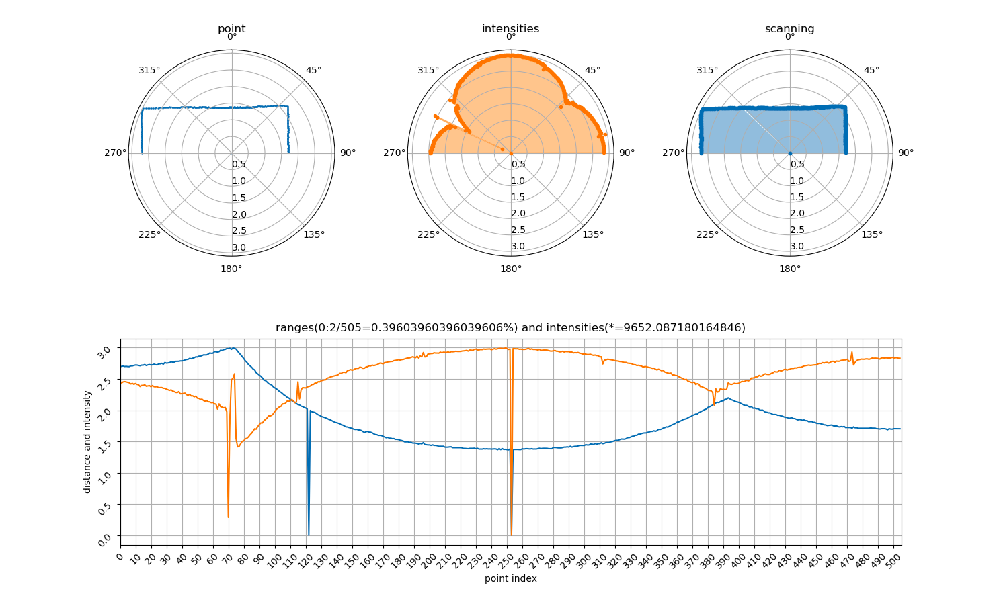

# 
cyberdog_lidar 设计文档

## 1. 概述

如上图所示，仿生机器人雷达驱动主要用于：需要实时反馈仿生机器人所处环境中的障碍物距离及距离探测值强度信息的场景。

## 2. 设计
### 2.1. 功能设计

仿生机器人雷达驱动工作流程主要如下：
1. 解析雷达配置参数并按照参数配置雷达软硬件；
2. 初始化雷达；
3. 如果初始化成功则继续下一步反之退出；
4. 采集雷达原始数据；
5. 如果需要滤波则对雷达原始数据进行过滤（拖尾滤波）并发布，反之直接发布原始数据；
6. 如果程序收到终止信号则退出，反之进行第4步。

#### 2.2 模块设计

如上图所示，  仿生机器人雷达驱动架构组成及各组成部分主要功能如下：
1. Lidar SDK：提供 Linux 下雷达固件数据采集及解析功能；
2. Utils：提供常用工具，如日志；
3. 雷达软硬件配置功能模块：提供雷达硬件及软件的配置功能；
4. 雷达数据采集功能模块：提供雷达数据采集及解析功能；
5. 雷达数据过滤功能模块：提供雷达数据过滤（拖尾滤波）功能；
6. 发布雷达数据：提供雷达数据发布功能。
