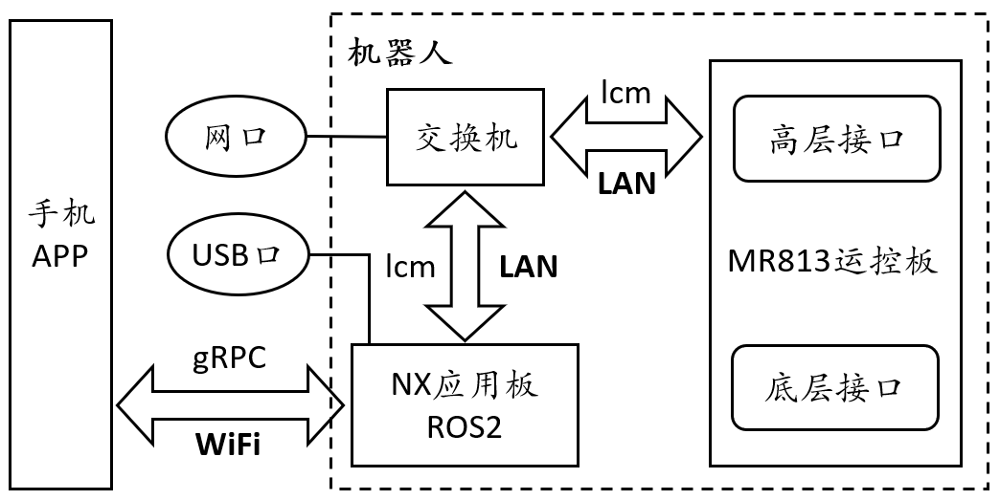
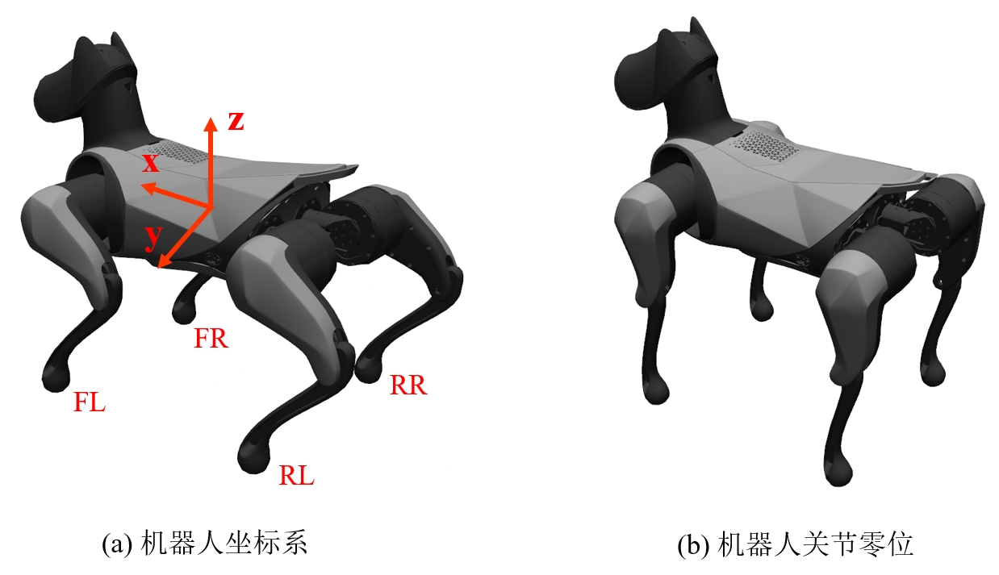
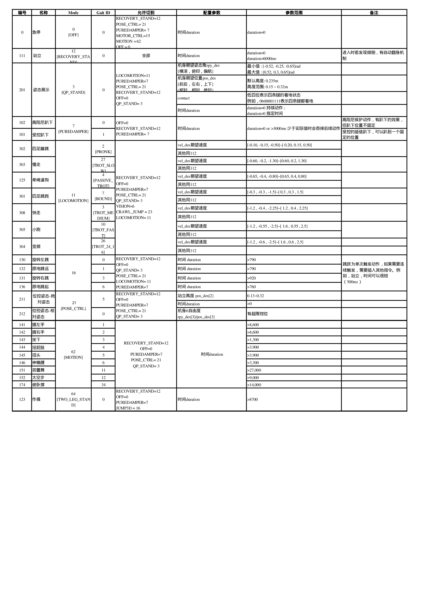

# 运动控制二次开发接口

## 1. 概述
运动控制(运控)模块类似人的小脑，负责协调各个关节完成规定的动作，比如行走，后空翻，舞蹈等等。运控模块既提供了偏高层的接口，可以让用户直接调用预制的动作单元，也开放了底层的关节电机接口，方便用户开发自己的控制器。运控的接口是基于**LCM**（**Lightweight Communications and Marshalling**）通信，NX应用板上的ROS上层决策部分也基于本接口构建。

### 1.1 通信框架
机器人整体的通信框架如下图所示：



运控程序部署在M813运控板上，基于LCM通信提供高层和底层两种接口，供用户调用。用户程序既可以部署在机器人内置的NX应用板上，也可以部署在外部的用户PC上，此时外部PC需通过网口或者USB口连接机器人。详细连接教程参见1.4节连接机器人部分。

### 1.2 LCM介绍
LCM是致力于高带宽，低延时的实时通信开源库，支持多种编程语言。如果需要在用户电脑使用二次开发接口，可以按照如下方法安装LCM：
```shell
# python版安装：pip install lcm

# 源码安装：
$ git clone https://github.com/lcm-proj/lcm.git
$ cd lcm
$ mkdir build && cd build
$ cmake .. && make
$ sudo make install
```
此外，LCM库附带了命令行工具lcm-gen，可以生成各种编程语言对应的数据类型定义文件，具体用法如下表：

| 编程语言 | 用法 | 编程语言 | 用法 |
| ------ | ------ | ------ | ------ |
| C    | lcm-gen -c example_t.lcm  | Python | lcm-gen -p example_t.lcm |
| C++  | lcm-gen -x example_t.lcm  | C#     | lcm-gen --csharp example_t.lcm |
| Java | lcm-gen -j example_t.lcm  | MATLAB | Generate Java code |
| Lua  | lcm-gen -l example_t.lcm  | Go     | lcm-gen -g example_t.lcm |

其中，example_t.lcm示例如下：
```cpp
struct example_t
{
    int64_t  timestamp;
    double   position[3];
    double   orientation[4]; 
    int32_t  num_ranges;
    int16_t  ranges[num_ranges];
    string   name;
    boolean  enabled;
}
```
更多使用细节，参见[官方说明文档](https://lcm-proj.github.io/)。

### 1.3 坐标系和关节
机器人坐标系如下图(a)所示，遵循右手法则，其中，x轴指向机器人前方，y轴指向机器人左侧，z轴指向机器人上方。四条腿分别以FR（Front-right）、FL（Front-left）、RR（Rear-right）、RL（Rear-left）来命名，并以此顺序作为腿的编号顺序。每条腿包含3个关节，分别是侧摆髋关节、前摆髋关节、膝关节。关节零位定义见下图(b)，侧摆髋关节水平，前摆髋关节和膝关节组成的腿部垂直向下时为电气零位（因连杆机械限制，无法实际达到）。关节旋转正方向也符合围绕转轴的右手法则，关节范围、最大速度和力矩如下表所示。




| 关节名称 | 关节范围 | 最大速度 | 最大力矩 | 关节名称 | 关节范围 | 最大速度 | 最大力矩 |
| ------ | ------- | ------- | ------- | ------ | ------- | ------- | ------- |
| FR-侧摆髋关节 | [-0.68, 0.68] | 38.19 | 12 | FL-侧摆髋关节 | [-0.68, 0.68] | 38.19 | 12 |
| FR-前摆髋关节 | [2.79, -1.33] | 38.19 | 12 | FL-前摆髋关节 | [2.79, -1.33] | 38.19 | 12 |
| FR-膝关节    | [-0.52, -2.53] | 38.19 | 12 | FL-膝关节    | [-0.52, -2.53] | 38.19 | 12 |
| RR-侧摆髋关节 | [-0.68, 0.68] | 38.19 | 12 | RL-侧摆髋关节 | [-0.68, 0.68] | 38.19 | 12 |
| RR-前摆髋关节 | [3.14, -0.98] | 38.19 | 12 | RL-前摆髋关节 | [3.14, -0.98] | 38.19 | 12 |
| RR-膝关节    | [-0.52, -2.53] | 38.19 | 12 | RL-膝关节    | [-0.52, -2.53] | 38.19 | 12 |

### 1.4 连接机器人
使用运动控制二次开发接口，首先需要申请开发者权限，否则相关端口会被封禁，用户无法进入或连接机器人控制板。其次，独立调用运动控制高层接口或底层接口时，需要断开APP连接，避免控制信号冲突。另外，如果开启了低功耗模式(默认关闭，详见APP设置)，机器人处于趴下状态超过30秒，系统会进入休眠，此时，运动控制接口也无法使用。在确认权限和模式正确后，拆开调试盖板，用户电脑有两种方式连接到机器人控制板：

**方式1(推荐)**：通过网线连接铁蛋的网口，并将用户电脑IP设为：192.168.44.100/255.255.255.0
```shell
$ ping 192.168.44.100     #用户电脑被分配的IP
$ ssh mi@192.168.44.1     #登录NX应用板，密码123
$ ssh root@192.168.44.233 #可从用户电脑直接登录运控板
```
**方式2**：将用户电脑连接至铁蛋的USB Type-C接口(位于中间充电口的右侧)，等待出现”L4T-README” 弹窗，用户电脑IP会被自动分配
```shell
$ ping 192.168.55.100     #用户电脑被分配的IP
$ ssh mi@192.168.55.1     #登录NX应用板 ,密码123
$ ssh root@192.168.44.233 #可在登录NX应用板后，再登录运控板（192.168.44网段）
```
> **注意**：方式2中，用户虽然可以登录NX应用板和运控板查看机器人状态，但因为用户电脑和运控板不在同一个网段，所以用户无法在自己电脑上基于LCM通信使用该运控接口进行开发。

如需**在用户电脑**使用该运控开发接口，按照方式1通过网线连接铁蛋后，在用户电脑用下面脚本配置路由表即可：
```shell
$ git clone loco_hl_example.git # 下载高层接口例程仓库
$ cd loco_hl_example/scripts
$ ./auto_lcm_init.sh #配置路由表脚本
```

## 2. 高层接口
高层接口包括机器人的基本控制，自定义步态和状况反馈，用于调用不仅限于app端的各类动作和步态，同时可接受机器人当前的运动状况以及报错等等。

### 2.1 基本控制
基本控制指令用于调用运控预制的各个基本动作和步态并设定相应的参数，比如坐下、行走等动作。它所用到的LCM通道和数据结构信息如下：
```cpp
/** lcm通道信息
- url: "udpm://239.255.76.67:7671?ttl=255"
- channel: "robot_control_cmd"
- frequncy: 2~500HZ，超时500ms触发趴下保护
*/

/** lcm数据结构 **/
struct robot_control_cmd_lcmt {
    int8_t   mode;
    int8_t   gait_id;
    int8_t   contact;           // Whether the four feet touch the ground
    int8_t   life_count;        // Life count, command takes effect when count incremented
    float    vel_des[ 3 ];      // x y(1.6) yaw speed(2.5)  m/s 
    float    rpy_des[ 3 ];      // roll pitch yaw(0.45)  rad
    float    pos_des[ 3 ];      // x y z(0.1-0.32)  m
    float    acc_des[ 6 ];      // acc for jump m^2/s
    float    ctrl_point[ 3 ];   // pose ctrl point  m
    float    foot_pose[ 6 ];    // front/back foot pose x,y,z  m
    float    step_height[ 2 ];  // step height when trot 0~0.08m
    int32_t  value;             // bit0: 在舞蹈模式，use_mpc_traj 是否使用MPC轨迹
                                // bit1: 0表示内八节能步态   1表示垂直步态
    int32_t  duration;          // Time of command execution
}
```
其中：
1. **mode**：运控程序中状态机定义的一种状态或模式，详见附表1
2. **gait_id**：mode下细分的子动作，详见附表1
3. **contact**：低四位用于位控姿态模式(mode/gait_id:21/0 )下定义哪条腿抬起，默认值0x0F，表示四条腿都不抬起。如需抬起一条腿，比如：0b1110抬右前腿，0b1101左前腿，0b1011右后腿，0b0111抬左后腿
4. **life_count**：递增的心跳信号(0~255)，用于检测通信是否正常，避免超时，同时确保任务型命令只触发一次。和上一帧数值相同时，当前帧内容被忽略，避免被重复添加到任务栈。
5. **vel_des/rpy_des**：分别控制机器人前进速度，侧移速度，转向速度，俯仰角度，横滚角度和扭动角度
6. **pos_des**：位控姿态模式(mode/gait_id:21/0 )时作为期望质心位置(右手坐标系，前x+，左y+，上z+)偏移量 ，普通模式pos_des[2]用于表示身体质心距地面高度
7. **acc_des**：用于mode=22时FORCE_JUMP跳跃动作控制
8. **ctrl_point**：mode=21时(POSE_CTRL)作为俯仰角控制中心点坐标
9. **foot_pose**：位控姿态模式(mode/gait_id:21/0 )时，抬起腿足端的坐标偏移，用于握手等，后3位为视觉行走时后腿抬腿位置预留
10. **step_height**：行走时，前后腾空腿抬腿高度 0~0.06m
11. **value(bit0~bit31)** : 其他和具体模式相关参数，比如
- 行走模式：<br>
    bit2: 0: 正常模式，1:出厂前触发速度偏置校准，步态速度vel_des值会被作为偏置量存储<br>
    bit1: 0: 表示内八步态   1:表示垂直步态
- 自定义步态模式：<br>
    uint32_t 表示自定义步态是否使用MPC轨迹(use_mpc_traj)
12. **duration**: 期望命令块对应动作持续时间，单位ms，最小执行单元2ms
- 等于0时：<br>
    表示持续，不限制动作执行时间，直到新指令更新。使用场景: 比如行走类指令(可以一直行走，直到速度更新或者切换动作)，如恢复站立等实际执行时间不定类动作（比如当机器人发现已接近站立，可快速完成，若发现摔倒，需要先翻身再站立，耗时较长）
- 大于0时：<br>
    表示指定该动作在运控控制命令序列栈里停留时间，间接控制动作期望执行时间。使用场景：比如增量位置控制动作（此时该变量可指定身体用多久的时间（间接控制速度）向目标姿态进行动作）；比如实现一段开环姿态调整，抬起一条腿进行握手动作，对于这一系列的命令块，可以通过该值指定每个动作的期望执行时间，进而实现对一段开环动作指令的短时间连续下发。
- 综上，可以看出，duration=0时，主要用于实时控制，上层需实时检测机器人实时状态和命令执行情况，进而持续更新命令，详细使用可参考2.4.1内的基本动作。duration>0时，主要用于开环序列控制，比如一段舞蹈动作，指定每个动作的执行时间，详细使用可参考2.4.2的序列动作。
- 值得注意的是，当指定时间小于动作本身执行所需的最小时间，等于进行请求切换动作，切换请求会失败，进而占用下一任务动作的时间，当动作小于设定时间提前结束时，动作会保持不动直到指定时间结束。另外duration=0的动作，有更高的执行优先级，会覆盖先前任务类动作序列。

### 2.2 自定义步态
步态可以理解为机器人的每条腿支撑和摆动相位随时间变化的关系，周期步态是指每条腿的支撑相和摆动相是周期变化的，比如四足机器人对角步态就是典型的周期步态。周期步态可以实现周期的动作，比如走路、奔跑等，但是舞蹈动作往往没有一个严格的周期，所以就需要一种定义非周期步态并编辑步态参数的方法。定义的步态配合相应参数，包括躯干的轨迹，落足点的位置，抬脚的高度等，就形成了不同的动作，简单来说就是“步态定义+步态参数=动作”，也就是这节要介绍的自定义步态。

#### 2.2.1 步态定义
步态表示每条腿支撑和摆动相位随时间变化的关系，为了方便修改，我们将步态定义内容以文件的形式存储。以太空步定义为例，每一个section表示一个步态单元，每个步态单元内包括支撑状态contact和持续时间duration。对于支撑状态，1表示支撑，0表示摆动，四个数字分别代表FR，FL，RR，RL四条腿；持续时间表示支撑状态持续N个单位时间，单位时间是30毫秒(ms)。对应的时间为Ti=Ni*30ms (i=1...8)，具体实现如下：
```toml
# Gait Def
[[section]]
contact  = [1, 1, 1, 1]
duration = N1
 
[[section]]
contact  = [0, 0, 0, 0]
duration = N2
 
[[section]]
contact  = [0, 1, 1, 0]
duration = N3
 
[[section]]
contact  = [0, 0, 0, 0]
duration = N4
 
[[section]]
contact  = [1, 1, 1, 1]
duration = N5
 
[[section]]
contact  = [0, 0, 0, 0]
duration = N6
 
[[section]]
contact  = [1, 0, 0, 1]
duration = N7
 
[[section]]
contact  = [0, 0, 0, 0]
duration = N8

[[section]]
contact  = [1, 1, 1, 1]
duration = N1
```
> **注意**：文件头部的关键字# Gait Def用于格式校验，是必须的。
为方便理解，图2描述了太空步前5个section的状态。红色表示左侧腿，蓝色表示右侧腿。T1时间内，机器人对应状态1，机器人处于站立状态，所有腿的偏置都为零；2状态对应T2时间段，所有腿处于摆动状态，右前腿向前迈步，左前腿原地摆动；3状态对应T3时间段，左前腿支撑，右前腿继续向前摆动；之后再次起跳达到状态4，持续T4时间，此时间段内左前腿向后摆动，右前腿准备落地；最后5状态表示T5时间段的四足支撑状态，右前腿落地偏置为正lx（lx>0），左前腿落地偏置为负lx，完成一步的太空步。在此过程中，左前腿整体向后运动，将其抬脚高度h_min设置很小，就会有在地上滑动的效果；右前腿整体向前跨步，将其抬脚高度h_max设置较大，就有跨步的效果了，最后整体就会出现太空步的效果。


#### 2.2.2 步态参数
步态参数文件用于描述步态运行中的所有参数，每一个step代表一个参数块，包括：类型参数type对应的“usergait”表示此步态用于非周期步态；机身速度body_vel_des(单位: m/s 和 rad/s)，顺序为x、y、yaw；机身姿态(单位: rad)和位置(单位: m)body_pos_des，顺序为roll、pitch、yaw、x、y、z；摆动腿的落足点landing_pos_des共十二个变量，分别代表每条腿在x，y，z方向的落地位置偏置(单位: m)，[0.0, 0.0, 0.0]表示落足点在对应髋关节的正下方，落足点位置的偏置方向与机身坐标系方向相同；摆动腿的抬腿高度step_height(单位: m)，四个参数分别表示FR，FL，RR，RL四条腿的抬腿高度；weight与body_pos_des对应，表示每个维度在全身运动控制(WBC)中的跟踪权重；use_mpc_traj为“1”时表示使用模型预测控制(MPC)优化后的躯干轨迹，“0”时表示使用期望速度积分出的轨迹；mu表示足底与地面摩擦系数，一般为0.1到1.0区间；landing_gain表示落足点的调整幅度，机器人为了保证自身稳定，会根据期望速度和实际速度调整落足点，landing_gain越大落足点调整幅度越大；自定义步态的gait_id统一为110；最后的duration是这个步态的持续时间。下面是太空步的步态参数示例：
```toml
# Gait Params
[[step]]
type            = "usergait"
body_vel_des    = [vx, 0.0, 0.0]
body_pos_des    = [0.0, 0.0, 0.0, 0.0, 0.0, 0.0]
landing_pos_des = [lx, 0.0, 0.0,  0.0, 0.0, 0.0,  0.0, 0.0, 0.0,  lx, 0.00, 0.0]
step_height     = [h_max, h_min, h_min, h_max]
weight          = [w1, w2, w3, w4, w5, w6]
use_mpc_traj    = 1/0
mu              = 0.1~1.0
landing_gain    = 1.0~2.0 
gait_id         = 110
duration        = T1 + T2
 
[[step]]
type            = "usergait"
body_vel_des    = [vx, 0.0, 0.0]
body_pos_des    = [0.0, 0.0, 0.0, 0.0, 0.0, 0.0]
landing_pos_des = [lx, 0.0, 0.0,  -lx, 0.0, 0.0,  -lx, 0.0, 0.0,  lx, 0.0, 0.0]
step_height     = [h_max, h_min, h_min, h_max]
weight          = [w1, w2, w3, w4, w5, w6]
use_mpc_traj    = 1/0
mu              = 0.0~1.0
landing_gain    = 1.0~2.0 
gait_id         = 110
duration        = T3 + T4
 
[[step]]
type            = "usergait"
body_vel_des    = [vx, 0.0, 0.0]
body_pos_des    = [0.0, 0.0, 0.0, 0.0, 0.0, 0.0]
landing_pos_des = [0.0, 0.0, 0.0,  lx, 0.0, 0.0,  lx, 0.0, 0.0,  0.0, 0.0, 0.0]
step_height     = [h_min, h_max, h_max, h_min]
weight          = [w1, w2, w3, w4, w5, w6]
use_mpc_traj    = 1/0
mu              = 0.0~1.0
landing_gain    = 1.0~2.0 
gait_id         = 110
duration        = T5 + T6
 
[[step]]
type            = "usergait"
body_vel_des    = [vx, 0.0, 0.0]
body_pos_des    = [0.0, 0.0, 0.0, 0.0, 0.0, 0.0]
landing_pos_des = [-lx, 0.0, 0.0,  lx, 0.0, 0.0,  lx, 0.0, 0.0,  -lx, 0.0, 0.0]
step_height     = [h_min, h_max, h_max, h_min]
weight          = [w1, w2, w3, w4, w5, w6]
use_mpc_traj    = 1/0
mu              = 0.0~1.0
landing_gain    = 1.0~2.0 
gait_id         = 110
duration        = T7 + T8
```
> **注意**：文件头部的关键字# Gait Params用于格式校验，是必须的。

需要注意的是，步态定义和步态参数的持续时间是相关的，但并不是一一对应的。一般只有在支撑相位变化时才需要规定落足点。仍然以太空步为例，从步态定义的前三个section可以看出，FL在第二个section抬起，第三个section落地，所以在第T1+T2的时候FL才会出现摆动腿落地的情况，所以步态参数的第一个参数块的持续时间是T1+T2，里面指明FL的抬脚高度和落地位置；同理，FR和FL在步态定义中的第五个section会落地，相比FL第一次落地经过了T3+T4，所以步态参数的第二个参数块的持续时间就是T3+T4。落足点和最大抬腿高度是对摆动腿的描述，只有对应的腿在摆动相位的时候，此参数才会有效果。应用上述方法定义的步态和相应参数，也可以实现周期步态的功能，所以是一个广义的步态定义和参数编辑方法。

> **注意**：步态参数在发送给运控模块的过程中，复用了基本控制robot_control_cmd_lcmt结构体，所以需要将上述的字段进行映射，再通过string下发。推荐用户编辑完步态参数序列后，通过脚本自动映射成基本控制字段序列，具体见2.4.3节自定义步态的示例代码。

#### 2.2.3 执行过程
完成步态定义和步态参数后，就开始了动作的执行。这里需要将定义的步态和相应的参数转化为每一个时刻计算机器人所有的期望状态。
对于躯干，期望的状态包括位移、姿态、线速度和角速度，在步态参数文件中，如果某个方向指定了期望速度，那么这个方向的期望位移就根据速度的积分获得。以太空步第一个参数块为例，在x方向指定了速度为vx，持续时间为T1，那么x方向期望的位移就vx*T1，body_pos_des中x方向的期望位移0.0就不会被使用。如果速度为0.0，那么就与以body_pos_des中定义的位移为准，期望速度就为位移除以时间，其他的方向与x方向逻辑相同。在实际使用中，平移运动一般通过速度定义，因为用户比较关心机器人往哪个方向运动，对于具体的运动距离并没有特别要求；旋转运动一般通过姿态定义，因为用户更关心旋转的角度而不是速度。
对于摆动腿，需要计算它的摆动轨迹，我们使用三阶贝塞尔曲线，只需要指定曲线初始的位置速度和终点的位置速度就可以计算出每个时刻的位置。这里说的x，y，z方向都有各自的贝塞尔轨迹，描述的是对应方向的位移与时间的关系。摆动腿的起点就是支撑状态的终点，不需要用户指定，用户只需要指定每条腿的摆动终点即可，也就是落足点。其中x，y方向只有一个终点，计算一条贝塞尔曲线即可，z方向由于有抬腿高度的需求，所以包括抬起和落下，需要两条贝塞尔曲线。由于摆动腿抬起和落地时刻相对于地面的速度都是零，所以通过给定的落足点和抬脚高度，就可以计算出摆动腿的轨迹了。
机器人在每一时刻都会检测动作执行是否完成，完成的标志就是执行时间到达用户定义的总时间，如果执行完成，机器人就进入站立状态等待下一个指令；否则就时刻增加dt，继续执行动作。

### 2.3 状态反馈
 反馈信息包括：运动状态(50Hz)，电机温度(1Hz)，自定义步态文件发送结果，里程计信息(50Hz)等。

#### 2.3.1 运动状态
机器人反馈的数据结构如下：
```cpp
/** lcm通道信息
- url: "udpm://239.255.76.67:7670?ttl=255"
- channel: "robot_control_response"
- frequncy: 50HZ
*/

/** lcm数据结构 */
struct robot_control_response_lcmt {
    int8_t  mode;
    int8_t  gait_id;
    int8_t  contact;
    int8_t  order_process_bar;  // 进度条order process, 1 == 1 %
    int8_t  switch_status;      // 0:Done, 1:TRANSITIONING, 2:ESTOP, 3:EDAMP, 4:LIFTED 5:BAN_TRANS 6:OVER_HEAT 7:LOW_BAT
    int8_t  ori_error;
    int16_t  footpos_error;
    int32_t  motor_error[12];
}
```
1. **mode**:运控实际模式；
2. **gait_id**:实际模式下的子动作；
3. **contact**:估计的四腿触地状态，用于高级保护拓展；
4. **order_process_bar**:作揖、后空翻等不可打断动作的执行进度条，百分制。行走时总是100；
5. **switch_status**:切换新命令时的响应情况 。

| 数值 | 字符表示 | 定义 |
| ------ | ------- | ---------- 
| 0 | Done          | 切换成功 
| 1 | TRANSITIONING | 转换中，上一动作未完成且不可打断时，或者上一动作为快跑但没有停稳时 
| 2 | ESTOP         | 急停，无动力保护模式  
| 3 | EDAMP         | 高阻尼保护模式，低电量或者行走失稳时会进入 
| 4 | LIFTED        | 机器人被提起 
| 5 | BAN_TRANS     | 模式切换无法执行，停留在旧模式(建议用应用层或app的转换策略替代) 
| 6 | OVER_HEAT     | 前后空翻电机温度预警，目前设置在74度。超过后，禁止切换至空翻 
| 7 | LOW_BAT       | 前后空翻低电量预警，前空翻50%，后空翻20%。超过后，禁止切换至空翻

> **注意**：切换出现2或者3状态后，为保证安全，上层应禁止除恢复站立外的其他模式请求(运控会允许部分其他模式切换)

6. **ori_error**:值为true时表示机器人的倾角超过安全范围，会触发高阻尼保护模式，仅恢复站立可退出保护
7. **footpos_error**: 低12位分别表示4条腿超出前后\左右\上下工作空间报错，行走步态下会触发高阻尼保护模式，仅恢复站立可退出保护，具体各位定义如下表：

|左后腿 上下|左后腿 左右|左后腿 前后|右后腿 上下|右后腿 左右|右后腿 前后|左前腿 上下|左前腿 左右|左前腿 前后|右前腿 上下|右前腿 左右|右前腿 前后|
|----|----|----|----|----|----|----|----|----|----|----|----
|bit11|bit10|bit9|bit8|bit7|bit6|bit5|bit4|bit3|bit2|bit1|bit0

1. **motor**[12]:12个关节电机的警告和错误状态，有问题的电机会自我保护并进入失能状态。针对电机出错，运控内置的保护策略是：不论出现电机警告或错误反馈，都首先进入高阻尼保护模式，机器狗缓慢趴下，3秒后再进入急停无动力模式，在满足清错条件后会自动执行清错操作。在电机错误被清除前，运控无法响应外部指令。

```markdown
    # ERROR
BIT(0)      电机掉线 
BIT(1)      电机线圈过温                Coil Thermal-Shutdown（87度）
BIT(2)      驱动芯片故障                Motor driver chip error
BIT(3)      低压故障                   Motor bus under voltage
BIT(4)      高压故障                   Motor bus over voltage 
BIT(5)      B相电流采样过流             B phase sample overcurrent
BIT(6)      C相电流采样过流             C phase sample overcurrent
BIT(8)      编码器未标定                Encoder not calibrate
BIT(9~16)   过载故障 (xxA电流持续xx秒)   Overload error
BIT(17)     A相电流采样过流             A phase sample overcurrent
BIT(18~23)  空

    # WARNING
BIT(24)     电机线圈温度高           Coil Thermal too high（82度）
BIT(25)     空
BIT(26)     空
BIT(27)     空

    # MODE
BIT(30~31)  00: REST_MODE复位模式   
            01: CALIBRATION_MODE校准模式  
            02: MOTOR_MODE电机模式  
            03: BRAKE_MODE刹车模式
```

> **注意**：基础编程主要查询mode/gait_id是否符合请求，查询新命令反馈需延迟1个控制周期

#### 2.3.2 电机温度
反馈各个电机的温度，数据结构如下：
```cpp
/** lcm通道信息
- url: "udpm://239.255.76.67:7670?ttl=255"
- channel: "motor_temperature"
- frequncy: 1HZ
*/

/** lcm数据结构 */
struct danger_states_lcmt
{       
    float motor_temperature[12]; // 单位(度)，0右前腿侧摆髋关节，1右前腿前摆髋关节 2右前腿膝关节，以此类推，3~5左前腿，6~8右后腿，9~11左后腿
}
```
#### 2.3.3 自定义步态
反馈自定义步态文件的发送结果，数据结构如下：
```cpp
/** lcm通道信息
- url: "udpm://239.255.76.67:7671?ttl=255"
- channel: "user_gait_result"
*/

/** lcm数据结构 */
struct file_recv_lcmt {
    int8_t  result; // 动作文件下发查收，0: 成功， 1：异常；暂无格式检查
}
```
#### 2.3.4 里程计信息
反馈机器人腿式里程计，数据结构如下：
```cpp
/** lcm通道信息
- url: "udpm://239.255.76.67:7667?ttl=255"
- channel: "global_to_robot"
- frequncy: 50HZ
*/

/** lcm数据结构 */
struct localization_lcmt {
  float xyz[3];       // 表达在腿式里程计坐标系的机身位置
  float vxyz[3];      // 表达在腿式里程计坐标系的机身线速度
  float rpy[3];       // 表达在腿式里程计坐标系的机身欧拉角
  float omegaBody[3]; // 表达在机身坐标系的机身角速度
  float vBody[3];     // 表达在机身坐标系的机身线速度
  int64_t timestamp;  // 时间戳，单位nanoseconds
}
```
### 2.4 接口示例
本节编写了高层接口的3个例程以供参考，例程可以部署在用户电脑或者NX应用板上运行。如果部署在用户电脑，需要按照1.2节所介绍的步骤，安装LCM通信库。所有例程都可以在例程仓库(后续开源)下载。

#### 2.4.1 基本动作
本例程是Python脚本，控制机器人依次完成站立，握手，作揖，抬头，低头，原地踏步旋转，趴下等动作。
```python
'''
This demo show the communication interface of MR813 motion control board based on Lcm.
Dependency: 
- robot_control_cmd_lcmt.py
- robot_control_response_lcmt.py
'''
import lcm
import sys
import os
import time
from threading import Thread, Lock

from robot_control_cmd_lcmt import robot_control_cmd_lcmt
from robot_control_response_lcmt import robot_control_response_lcmt

def main():
    Ctrl = Robot_Ctrl()
    Ctrl.run()
    msg = robot_control_cmd_lcmt()
    try:
        msg.mode = 12 # Recovery stand
        msg.gait_id = 0
        msg.life_count += 1 # Command will take effect when life_count update
        Ctrl.Send_cmd(msg)
        Ctrl.Wait_finish(12, 0)

        msg.mode = 62 # Shake hand, based on position interpolation control
        msg.gait_id = 2
        msg.life_count += 1
        Ctrl.Send_cmd(msg)
        Ctrl.Wait_finish(62, 2)

        msg.mode = 64 # Twoleg Stand
        msg.gait_id = 0
        msg.life_count += 1
        Ctrl.Send_cmd(msg)
        Ctrl.Wait_finish(64, 0)

        msg.mode = 21 # Position interpolation control
        msg.gait_id = 0
        msg.rpy_des = [0, 0.3, 0] # Head up
        msg.duration = 500 # Expected execution time, 0.5s 
        msg.life_count += 1
        Ctrl.Send_cmd(msg)
        time.sleep( 0.5 )

        msg.mode = 21 # Position interpolation control
        msg.gait_id = 0
        msg.rpy_des = [0, -0.3, 0] # Head down
        msg.duration = 300 
        msg.life_count += 1
        Ctrl.Send_cmd(msg)
        time.sleep( 0.3 )

        msg.mode = 21 # Position interpolation control
        msg.gait_id = 5
        msg.rpy_des = [0, 0, 0]
        msg.pos_des = [0, 0, 0.22] # Set body height
        msg.duration = 400 
        msg.life_count += 1
        Ctrl.Send_cmd(msg)
        time.sleep( 1 )

        msg.mode = 11 # Locomotion
        msg.gait_id = 26 # TROT_FAST:10 TROT_MEDIUM:3 TROT_SLOW:27 自变频:26
        msg.vel_des = [0, 0, 0.5] #转向
        msg.duration = 0 # Zero duration means continuous motion until a new command is used.
                         # Continuous motion can interrupt non-zero duration interpolation motion
        msg.step_height = [0.06, 0.06] # ground clearness of swing leg
        msg.life_count += 1
        Ctrl.Send_cmd(msg)
        time.sleep( 5 )

        msg.mode = 7    # PureDamper
        msg.gait_id = 0
        msg.life_count += 1
        Ctrl.Send_cmd(msg)
        Ctrl.Wait_finish(7, 0)

    except KeyboardInterrupt:
        pass
    Ctrl.quit()
    sys.exit()


class Robot_Ctrl(object):
    def __init__(self):
        self.rec_thread = Thread(target=self.rec_responce)
        self.send_thread = Thread(target=self.send_publish)
        self.lc_r = lcm.LCM("udpm://239.255.76.67:7670?ttl=255")
        self.lc_s = lcm.LCM("udpm://239.255.76.67:7671?ttl=255")
        self.cmd_msg = robot_control_cmd_lcmt()
        self.rec_msg = robot_control_response_lcmt()
        self.send_lock = Lock()
        self.delay_cnt = 0
        self.mode_ok = 0
        self.gait_ok = 0
        self.runing = 1

    def run(self):
        self.lc_r.subscribe("robot_control_response", self.msg_handler)
        self.send_thread.start()
        self.rec_thread.start()

    def msg_handler(self, channel, data):
        self.rec_msg = robot_control_response_lcmt().decode(data)
        if(self.rec_msg.order_process_bar >= 95):
            self.mode_ok = self.rec_msg.mode
        else:
            self.mode_ok = 0

    def rec_responce(self):
        while self.runing:
            self.lc_r.handle()
            time.sleep( 0.002 )

    def Wait_finish(self, mode, gait_id):
        count = 0
        while self.runing and count < 2000: #10s
            if self.mode_ok == mode and self.gait_ok == gait_id:
                return True
            else:
                time.sleep(0.005)
                count += 1

    def send_publish(self):
        while self.runing:
            self.send_lock.acquire()
            if self.delay_cnt > 20: # Heartbeat signal 10HZ, It is used to maintain the heartbeat when life count is not updated
                self.lc_s.publish("robot_control_cmd",self.cmd_msg.encode())
                self.delay_cnt = 0
            self.delay_cnt += 1
            self.send_lock.release()
            time.sleep( 0.005 )

    def Send_cmd(self, msg):
        self.send_lock.acquire()
        self.delay_cnt = 50
        self.cmd_msg = msg
        self.send_lock.release()

    def quit(self):
        self.runing = 0
        self.rec_thread.join()
        self.send_thread.join()

# Main function
if __name__ == '__main__':
    main()
```
> **注意**：依赖lcm数据类型文件robot_control_cmd_lcmt.py和robot_control_response_lcmt.py。

#### 2.4.2 序列动作
 本例程是Python脚本，通过读取序列动作文件，实现控制机器人依次站立，调整高度，抬起右后腿，原地踏步旋转，趴下等动作。
 ```python
 '''
This demo show the communication interface of MR813 motion control board based on Lcm
Dependency: 
- robot_control_cmd_lcmt.py
- mini_cyberdog_ctrl.py
'''
import lcm
import toml
import sys
import os
import time

from robot_control_cmd_lcmt import robot_control_cmd_lcmt

def findAllFile(base):
    for root, ds, fs in os.walk(base):
        for f in fs:
            yield f

def main():
    base='./'
    num=0
    filelist=[]
    for i in findAllFile(base):
        filelist.append(i)
        print(str(num)+","+str(filelist[num]))
        num=num+1
    print('Input a toml ctrl file number:')
    numInput=int(input())

    lc=lcm.LCM("udpm://239.255.76.67:7671?ttl=255")
    msg=robot_control_cmd_lcmt()
    file = os.path.join(base,filelist[numInput])
    print("Load file=%s\n" % file)
    try:
        steps = toml.load(file)
        for step in steps['step']:
            msg.mode = step['mode']
            msg.value = step['value']
            msg.contact = step['contact']
            msg.gait_id = step['gait_id']
            msg.duration = step['duration']
            msg.life_count += 1
            for i in range(3):
                msg.vel_des[i] = step['vel_des'][i]
                msg.rpy_des[i] = step['rpy_des'][i]
                msg.pos_des[i] = step['pos_des'][i]
                msg.acc_des[i] = step['acc_des'][i]
                msg.acc_des[i+3] = step['acc_des'][i+3]
                msg.foot_pose[i] = step['foot_pose'][i]
                msg.ctrl_point[i] = step['ctrl_point'][i]
            for i in range(2):
                msg.step_height[i] = step['step_height'][i]

            lc.publish("robot_control_cmd",msg.encode())
            print('robot_control_cmd lcm publish mode :',msg.mode , "gait_id :",msg.gait_id , "msg.duration=" , msg.duration)
            time.sleep( 0.1 )
        for i in range(300): #60s Heat beat, maintain the heartbeat when life count is not updated
            lc.publish("robot_control_cmd",msg.encode())
            time.sleep( 0.2 )
    except KeyboardInterrupt:
        msg.mode = 7 #PureDamper before KeyboardInterrupt:
        msg.gait_id = 0
        msg.duration = 0
        msg.life_count += 1
        lc.publish("robot_control_cmd",msg.encode())
        pass
    sys.exit()

# Main function
if __name__ == '__main__':
    main()
 ```
> **注意**：运行该Python脚本，依赖lcm数据类型文件robot_control_cmd_lcmt.py和序列动作文件mini_cyberdog_ctrl.toml。

#### 2.4.3 自定义步态
本例程是Python脚本，通过读取自定义步态文件和序列动作文件，实现控制机器人依次站立，太空步和趴下等动作。示例中Gait_Params_moonwalk.toml 文件包含2.2.2自定义步态相关参数介绍，脚本首先按一定映射关系将其编码为基本robot_control_cmd_lcmt 结构体序列(Gait_Params_moonwalk_full.toml)再下发。
```python
'''
This demo show the communication interface of MR813 motion control board based on Lcm
Dependency: 
- robot_control_cmd_lcmt.py
- file_send_lcmt.py
- Gait_Def_moonwalk.toml
- Gait_Params_moonwalk.toml
- Usergait_List.toml
'''
import lcm
import sys
import time
import toml
import copy
import math
from robot_control_cmd_lcmt import robot_control_cmd_lcmt
from file_send_lcmt import file_send_lcmt

robot_cmd = {
    'mode':0, 'gait_id':0, 'contact':0, 'life_count':0,
    'vel_des':[0.0, 0.0, 0.0],
    'rpy_des':[0.0, 0.0, 0.0],
    'pos_des':[0.0, 0.0, 0.0],
    'acc_des':[0.0, 0.0, 0.0, 0.0, 0.0, 0.0],
    'ctrl_point':[0.0, 0.0, 0.0],
    'foot_pose':[0.0, 0.0, 0.0, 0.0, 0.0, 0.0],
    'step_height':[0.0, 0.0],
    'value':0,  'duration':0
    }

def main():
    lcm_cmd = lcm.LCM("udpm://239.255.76.67:7671?ttl=255")
    lcm_usergait = lcm.LCM("udpm://239.255.76.67:7671?ttl=255")
    usergait_msg = file_send_lcmt()
    cmd_msg = robot_control_cmd_lcmt()
    try:
        steps = toml.load("Gait_Params_moonwalk.toml")
        full_steps = {'step':[robot_cmd]}
        k =0
        for i in steps['step']:
            cmd = copy.deepcopy(robot_cmd)
            cmd['duration'] = i['duration']
            if i['type'] == 'usergait':                
                cmd['mode'] = 11 # LOCOMOTION
                cmd['gait_id'] = 110 # USERGAIT
                cmd['vel_des'] = i['body_vel_des']
                cmd['rpy_des'] = i['body_pos_des'][0:3]
                cmd['pos_des'] = i['body_pos_des'][3:6]
                cmd['foot_pose'][0:2] = i['landing_pos_des'][0:2]
                cmd['foot_pose'][2:4] = i['landing_pos_des'][3:5]
                cmd['foot_pose'][4:6] = i['landing_pos_des'][6:8]
                cmd['ctrl_point'][0:2] = i['landing_pos_des'][9:11]
                cmd['step_height'][0] = math.ceil(i['step_height'][0] * 1e3) + math.ceil(i['step_height'][1] * 1e3) * 1e3
                cmd['step_height'][1] = math.ceil(i['step_height'][2] * 1e3) + math.ceil(i['step_height'][3] * 1e3) * 1e3
                cmd['acc_des'] = i['weight']
                cmd['value'] = i['use_mpc_traj']
                cmd['contact'] = math.floor(i['landing_gain'] * 1e1)
                cmd['ctrl_point'][2] = i['mu']
            if k == 0:
                full_steps['step'] = [cmd]
            else:
                full_steps['step'].append(cmd)
            k=k+1
        f = open("Gait_Params_moonwalk_full.toml", 'w')
        f.write("# Gait Params\n")
        f.writelines(toml.dumps(full_steps))
        f.close()

        file_obj_gait_def = open("Gait_Def_moonwalk.toml",'r')
        file_obj_gait_params = open("Gait_Params_moonwalk_full.toml",'r')
        usergait_msg.data = file_obj_gait_def.read()
        lcm_usergait.publish("user_gait_file",usergait_msg.encode())
        time.sleep(0.5)
        usergait_msg.data = file_obj_gait_params.read()
        lcm_usergait.publish("user_gait_file",usergait_msg.encode())
        time.sleep(0.1)
        file_obj_gait_def.close()
        file_obj_gait_params.close()

        user_gait_list = open("Usergait_List.toml",'r')
        steps = toml.load(user_gait_list)
        for step in steps['step']:
            cmd_msg.mode = step['mode']
            cmd_msg.value = step['value']
            cmd_msg.contact = step['contact']
            cmd_msg.gait_id = step['gait_id']
            cmd_msg.duration = step['duration']
            cmd_msg.life_count += 1
            for i in range(3):
                cmd_msg.vel_des[i] = step['vel_des'][i]
                cmd_msg.rpy_des[i] = step['rpy_des'][i]
                cmd_msg.pos_des[i] = step['pos_des'][i]
                cmd_msg.acc_des[i] = step['acc_des'][i]
                cmd_msg.acc_des[i+3] = step['acc_des'][i+3]
                cmd_msg.foot_pose[i] = step['foot_pose'][i]
                cmd_msg.ctrl_point[i] = step['ctrl_point'][i]
            for i in range(2):
                cmd_msg.step_height[i] = step['step_height'][i]
            lcm_cmd.publish("robot_control_cmd",cmd_msg.encode())
            time.sleep( 0.1 )
        for i in range(75): #15s Heat beat, used to maintain the heartbeat when life count is not updated
            cmd_msg.life_count += 1
            lcm_cmd.publish("robot_control_cmd",cmd_msg.encode())
            time.sleep( 0.2 )
    except KeyboardInterrupt:
        cmd_msg.mode = 7 #PureDamper before KeyboardInterrupt:
        cmd_msg.gait_id = 0
        cmd_msg.duration = 0
        cmd_msg.life_count += 1
        lcm_cmd.publish("robot_control_cmd",cmd_msg.encode())
        pass
    sys.exit()

if __name__ == '__main__':
    main()
```
> **注意**：运行该Python脚本，依赖lcm数据类型文件robot_control_cmd_lcmt.py和file_send_lcmt.py，自定义步态文件Gait_Def_moonwalk.toml和Gait_Params_moonwalk.toml，以及序列动作文件Usergait_List.toml。

## 3. 底层接口
底层接口开放了电机驱动器和机身IMU传感器接口，方便用户开发自己的运动控制器。参见[cyberdog_motor_sdk](https://github.com/MiRoboticsLab/cyberdog_motor_sdk)中mini_cyberdog分支

### 3.1 接口介绍
底层接口的CustomInterface类实现了对电机控制指令的下发，以及关节编码器，IMU传感器信息的获取，具体接口内容包括：
```cpp
/** 反馈信息 **/
struct RobotData {
    float    q[ 12 ];              //12个关节电机角度，弧度制
    float    qd[ 12 ];             //电机角速度，弧度制
    float    tau[ 12 ];            //电机扭矩，单位Nm
    float    quat[ 4 ];            //机身姿态四元数xyzw，右手坐标系
    float    rpy[ 3 ];             //机身姿态横滚、俯仰、偏航角，弧度制
    float    acc[ 3 ];             //IMU加速度计输出，单位m/s^2
    float    omega[ 3 ];           //IMU陀螺仪输出，单位rad/s
    float    ctrl_topic_interval;  //控制帧接收时间间隔
    uint32_t motor_flags[ 12 ];    //电机模式和报错信息，同2.3.1节中的motor_error
    int16_t  err_flag;             //错误标志位
};

/** 控制指令 **/
struct MotorCmd {
    //期望扭矩tau = tau_des + (q_des - q)*kp_des + (qd_des - qd)*kd_des
    float q_des[ 12 ];    //12个关机电机期望角度，弧度制
    float qd_des[ 12 ];   //电机期望角速度，弧度制，-12~12rad/s
    float kp_des[ 12 ];   //电机位置控制比例系数，0~200
    float kd_des[ 12 ];   //电机速度控制比例系数，0~10
    float tau_des[ 12 ];  //电机期望前馈扭矩，-12~12Nm
};
```
RobotData->err_flag错误标志位的具体含义如下：
```markdown
BIT(0) 警告，用户程序和机器人通信延迟超过10ms，为避免危险，关节期望位置和力矩会随时间衰减
BIT(1) 错误，用户程序和机器人通信延迟超过500ms，机器人会进入kp=0, kd=10, tau=0 高阻尼状态趴下，等待用户发全零帧复位
BIT(2) 警告，侧摆髋关节期望位置变化大于8度，该帧变化幅度会被钳位到8度，以避免腿部飞车
BIT(3) 警告，前摆髋关节期望位置变化大于10度，该帧变化幅度会被钳位到10度，以避免腿部飞车
BIT(4) 警告，膝关节期望位置变化大于12度，该帧变化幅度会被钳位到12度，以避免腿部飞车
```
> **注意**：bit2~bit4为**位置指令跳变警告**，即相邻帧期望角度变化过大（比如膝关节前一帧的期望角度是10度，如果当前帧下发30度，实际会被钳位到10度执行）。该机制用于提供一定的飞车保护功能，默认开启。如需关闭，可以登录运控板，将配置文件/robot/robot-software/common/config/cyberdog-mini-ctrl-user-parameters.yaml 中的 motor_sdk_position_mutation_limit 置0。

> **注意**：出现BIT(1)超时错误时，待机器人趴下后(2s)发送全零控制帧可以清除错误。由于大部分超时是通信断联引起的，此时如果是在用户电脑上部署运行，需要重新配置路由表。

### 3.2 控制模式切换
成功连接机器人并验证登录后（详见1.4 连接机器人），向运控发布消息名为"motor_ctrl"的Motor_Cmd结构体LCM消息命令，可使运控板进入电机控制模式，其中前几帧需为全零帧，用于激活机器人并复位通信超时错误，详见SDK中CustomInterface类初始化示例。

如需退出电机控制模式，重启机器人即可，此时会恢复至普通APP控制模式。

使用底层控制接口过程中建议断开APP连接，避免控制指令冲突。

### 3.3 编译及部署

#### 3.3.1 用户电脑部署
使用底层接口的程序部署在用户电脑，难以保证lcm通信的实时性，可能会影响控制性能，仅推荐编译验证和简单的关节位置控制测试 ：

- 安装LCM通信库（如1.2节所述）
- 通过网口连接机器人，并配置路由表
```shell
$ ./auto_lcm_init.sh #配置路由表，脚本存放在高层接口例程仓库
```
- 编译并运行代码
```shell
$ git clone -b mini_cyberdog https://github.com/MiRoboticsLab/cyberdog_motor_sdk #下载底层接口示例代码
$ cd cyberdog_motor_sdk
$ mkdir build && cd build
$ cmake .. #编译
$ make -j4
$ ./example_motor_ctrl #运行
```

#### 3.3.2 NX应用板部署
和部署在用户电脑一样，考虑到跨设备通信的时延和不稳定，在NX应用板使用底层接口，也仅推荐编译验证和简单的关节位置控制测试：

```shell
$ git clone -b mini_cyberdog https://github.com/MiRoboticsLab/cyberdog_motor_sdk #下载底层接口示例代码
$ scp -r cyberdog_motor_sdk mi@192.168.44.1:/home/mi/ #将底层接口示例代码拷入应用板，密码123
$ ssh mi@192.168.44.1 #登录应用板
mi@lubuntu:~$ cd /home/mi/cyberdog_motor_sdk
mi@lubuntu:~$ mkdir build && cd build
mi@lubuntu:~$ cmake .. #编译
mi@lubuntu:~$ make -j2
mi@lubuntu:~$ ./example_motor_ctrl #运行
```
#### 3.3.3 运控板交叉编译部署
运控板TinaLinux经过裁剪，缺少编译环境，故运控侧部署需在用户电脑上使用docker镜像环境交叉编译，然后再将编译产物发送至运控板上运行，具体步骤如下：
- 在用户电脑安装docker(https://docs.docker.com/engine/install/ubuntu/)，并给docker设置root权限：
```shell
$ sudo groupadd docker
$ sudo usermod -aG docker $USER
```
- 下载交叉编译所需docker镜像
```shell
$ wget https://cdn.cnbj2m.fds.api.mi-img.com/os-temp/loco/loco_arm64_20220118.tar
$ docker load --input loco_arm64_20220118.tar
$ docker images
```
- 运行docker镜像进行交叉编译
```shell
$ git clone -b mini_cyberdog https://github.com/MiRoboticsLab/cyberdog_motor_sdk #下载底层接口示例代码
$ docker run -it --rm --name cyberdog_motor_sdk -v /home/xxx/{sdk_path}:/work/build_farm/workspace/cyberdog cr.d.xiaomi.net/athena/athena_cheetah_arm64:2.0 /bin/bash #运行docker镜像，/home/xxx/{sdk_path}是示例代码绝对路径
[root:/work] # cd /work/build_farm/workspace/cyberdog/ #进入docker系统的代码仓
[root:/work/build_farm/workspace/cyberdog] # mkdir onboard-build && cd onboard-build
[root:/work/build_farm/workspace/cyberdog] # cmake -DCMAKE_TOOLCHAIN_FILE=/usr/xcc/aarch64-openwrt-linux-gnu/Toolchain.cmake .. #指定交叉编译工具链
[root:/work/build_farm/workspace/cyberdog] # make -j4 #编译
[root:/work/build_farm/workspace/cyberdog] # exit #退出docker镜像
```
- 将编译产物libcyber_dog_sdk.so和example_motor_ctrl拷贝至运控板/mnt/UDISK目录下运行
```shell
$ cd /home/xxx/{sdk_path}/onboard-build
$ ssh root@192.168.44.233 "mkdir /mnt/UDISK/cyberdog_motor_sdk" #在运控板内创建文件夹
$ scp libcyber_dog_motor_sdk.so example_motor_ctrl root@192.168.44.233:/mnt/UDISK/cyberdog_motor_sdk #拷贝编译产物
$ ssh root@192.168.44.233 #进入运控板
root@TinaLinux:~# cd /mnt/UDISK/cyberdog_motor_sdk
root@TinaLinux:~# export LD_LIBRARY_PATH=/mnt/UDISK/cyberdog_motor_sdk #设置动态链接库路径变量
root@TinaLinux:~# ./example_motor_ctrl #运行，也可通过“nohup ./example_motor_ctrl &”后台运行，退出ssh连接不受影响
```
- 如需开机自启动，可配置/robot/robot-software/common/config/fork_para_conf_lists.json 进程管理文件(注意结尾逗号)，然后重启运控程序或者重启运控板
 "600003": {"fork_config":{"name": "example_motor_ctrl",  "object_path": "/cyberdog_motor_sdk/",  "log_path": "", "paraValues": ["", "", ""] }}
```shell
  # 重启运控程序:
$ ssh root@192.168.44.233 "ps | grep -E 'example_motor_ctrl' | grep -v grep | awk '{print \$1}' | xargs kill -9" #需先于主进程暂停，避免急停
$ ssh root@192.168.44.233 "ps | grep -E 'manager|ctrl|imu_online' | grep -v grep | awk '{print \$1}' | xargs kill -9"
$ ssh root@192.168.44.233 "export LD_LIBRARY_PATH=/robot/robot-software/build;/robot/robot-software/manager /robot/ >> /robot/manager.log 2>&1 &"

  # 重启运控板系统:
$ ssh root@192.168.44.233 "reboot"
```

### 3.4 接口示例
底层接口代码中包含了一个示例程序example_motor_ctrl.cpp，它实现了机器人从当前实际关节位置线性插值到站立姿态，从而实现基本的站立功能。

其中first_run在起始和错误出现时被置True，用于进行复位初始化。相关错误重置逻辑可自行按需调整。


target1_q和target2_q分别对应蹲下和站立时的单腿关节角，角度正方向符合右手坐标系，详见1.3节坐标系和关节。

> **注意**：进行关节位控开发调试时，推荐将机器人悬起，关节kp_des 和 kd_des 从小值起调，如(5/0.2)，出现异常，及时关闭相关进程，过程中谨慎操作避免夹手。
```cpp
#include <custom_interface.hpp>

class CustomCtrl : public CustomInterface {
public:
    CustomCtrl( const double& loop_rate ) : CustomInterface( loop_rate ){};
    ~CustomCtrl(){};

private:
    long long count_ = 0;
    float     init_q_[ 12 ];
    float     target1_q_[ 3 ] = { 0 / 57.3, 80 / 57.3, -135 / 57.3 }; // 蹲下
    float     target2_q_[ 3 ] = { 0 / 57.3, 45 / 57.3, -70 / 57.3 };  // 站立
    void      UserCode( bool first_run ) {

        float t = ( count_ / 1500.0 ) > 2 ? 2 : ( count_ / 1500.0 );
        if ( first_run == true ) { // 等待复位 进行初始化
            for ( int i = 0; i < 12; i++ )
                init_q_[ i ] = robot_data_.q[ i ];
            if ( init_q_[ 2 ] < -0.1 && init_q_[ 5 ] < -0.1 && init_q_[ 8 ] < -0.1 && init_q_[ 11 ] < -0.1 ) {
                count_ = -1;
            }
        }
        else {
            for ( int i = 0; i < 12; i++ ) {
                if ( t < 1.0 )
                    motor_cmd_.q_des[ i ] = target1_q_[ i % 3 ] * t + init_q_[ i ] * ( 1 - t );
                else
                    motor_cmd_.q_des[ i ] = target2_q_[ i % 3 ] * ( t - 1 ) + target1_q_[ i % 3 ] * ( 2 - t );
                motor_cmd_.kp_des[ i ]  = 60;
                motor_cmd_.kd_des[ i ]  = 2;
                motor_cmd_.qd_des[ i ]  = 0;
                motor_cmd_.tau_des[ i ] = 0;
            }
        }
        if ( ( count_++ ) % 1000 == 0 )
            PrintData( robot_data_ );
    }
};

std::shared_ptr< CustomCtrl > io;
void signal_callback_handler( int signum ) {
    io->Stop();
    ( void )signum;
}

int main() {
    /* user code ctrl mode:1 for motor ctrl */
    signal( SIGINT, signal_callback_handler );
    io = std::make_shared< CustomCtrl >( 500 );
    io->Spin();
    return 0;
}
```
> **注意**：电机控制模式通信超时后，运控板会接管控制机器人趴下，并停止响应后续指令，log提示：Err: 0x02 Communicate lost over 500ms。此时可以通过发送全零控制帧复位。电机控制模式初始化时默认为通信超时状态，避免遗留进程误发位置指令导致危险，故每次开机需先发全零帧激活。

## 4. 常见问题
1. 高层接口支不支持足端着地状态的反馈？

    **答**：支持，目前的着地状态信息有两种来源，一是当前期望的各腿着地状态，另一个是通过关节电机电流估计关节力矩，从而反算出足端受力和接触状态。这两种方法给出的着地信息都可能和真实值有偏差，用户请慎重使用。

2. 调用底层接口时，机器人还会不会提供安全保护？

    **答**：即使用户只是调用底层接口，机器人一些必要的安全保护逻辑也会一直运行，包括电池的过流保护，低电量保护，电机出错保护，通信中断保护等等。

3. 电机控制模式每次开机都需要重新设定吗，还是可以永久设定？
   
    **答**：每次开机后，下发相关lcm控制命令，运控自动切入电机模式，遇到异常情况(如电机过温，通信超时)运控主动切出，下发全零帧可复位相关错误。重启恢复正常使用模式。

## 附录
表1. 模式动作定义列表

