# 状态机设计

## 设计原则

- 使用软编码做映射；
- 支持扩展；
- 状态代码之间没有约束关系，通过业务层面进行约束；

## 状态流程

### 状态流转


### 特别设计

1. setup、selfcheck与treardown本身也是状态，在业务中做了特别处理，要求执行器自动完成setup状态后再初始化状态机service，setup内包含了configure和init操作；
2. Selfcheck 提供给控制器的特别处理，若该状态有问题，要求状态机返回切换失败，由控制器进行后续控制处理；
3. Extending为以后扩展预留，上图中的状态为系统要求必须具备，具体状态说明如下：


| 状态      | 启动时机&方式  | 切换过程       | 切换完成状态                                 | 备注 |
| --------- | -------------- | -------------- | -------------------------------------------- | ---- |
| SetUp     | 开机自启动     | 加载资源       | ros通信就绪，状态机service就绪，开始发送心跳 |      |
| TearDown  |                | 释放资源       | 结束程序生命周期                             |      |
| SekfCheck | controller触发 | 执行自检指令   | 自检结果                                     |      |
| Active    | controller触发 | 启动执行状态   | 可执行ros指令                                |      |
| DeActive  | controller触发 | 关闭执行状态   | 拒绝执行ros指令                              |      |
| LowPower  | controller触发 | 启动低功耗模式 | 进入低功耗模式                               |      |
| Protected | controller触发 | 启动低电量模式 | 进入低电量模式                               |      |
| OTA       | controller触发 | 启动OTA模式    | 进入OTA模式                                  |      |

# 状态机业务概述

## 各状态的业务逻辑

- **Setup**：加载并依次启动配置文件中需要被状态机管控的模块。目前管控的模块有—— motion、audio、device、sensor、algorithm、vp_engine、realsense；
- **Selfcheck**：检查上述模块是否成功启动，并且运行状态正常；
- **Active**：该状态下铁蛋的全部功能均能正常使用；
- **Protect**：该状态下铁蛋的部分剧烈的运动将禁止使用，如前/后空翻；
- **LowPower**：该状态下铁蛋将会趴下且各组件都将以低功耗的形式运行，同时所有与运动相关的功能都将被禁止；
- **OTA**：该状态为在线升级模式，在升级完成之间，铁蛋将趴下同时所有运动相关功能将被禁止；
- **TearDown**：该状态下铁蛋会依次关闭Setup中加载的模块，然后执行关机。

## 状态机流转图示

状态机总体流转如下图所示，铁蛋开机后，状态机首先进行Setup，启动完成之后进入selfcheck阶段，自检成功将进入Acticve，随后状态机的状态将由电量、运动状态、用户等多方面因素进行管控切换；在关机前状态机将切换至TearDown模式，依次关闭被加载的组件。



在实际的业务中，为缩短用户等待时间，状态机的starup阶段将分为两部分进行：

1. 基础的运动、语音、联网部分
2. 算法模型、导航等资源加载时间较长的部分

状态机流转的具体流程如下：


## 代码框架设计

1. 状态机的跨进程通信使用内置ros service完成，在初始化时传入node指针；
2. 状态由string数据格式表达；
3. 初始化函数会进行配置文件检查，配置错误则返回失败；
4. 通过配置文件实现状态约束，形如：

```Makefile
[controller]
actuators = ["test1", "test2"]
states = ["SetUp", "TearDown", "SelfCheck", "Active", "DeActive", "Protected", "LowPower", "OTA", "Error"]
default_time = 100 # milliseconds
default_state = "Uninitialized"


[actuator.test1]
states = ["SetUp", "TearDown", "SelfCheck", "Active", "DeActive", "Protected", "LowPower", "OTA", "Error"]
times = [100, 100, 100, 100, 100, 100, 100, 100, 100]


[actuator.test2]
states = ["SetUp", "TearDown", "SelfCheck", "Active", "DeActive", "Protected", "LowPower", "OTA", "Error"]
times = [100, 100, 100, 100, 100, 100, 100, 100, 100]
```

其中：

- controller 控制器配置，default为默认参数；actuators和state要求与实际对应，会影响状态机初始化是否通过；
- actuator 为执行器配置，比如在controller里面添加过的才会被检测；
- actuator 的states和times为size相同的列表，要求严格对应，代表每一个状态的切换开销。

### 状态机控制器

***控制器负责切换状态***

1. 执行器需要维护配置文件controller部分；
2. 依照C++习惯，控制器作为业务代码的一个成员出现，不推荐继承
3. 控制器基本API如下：
   - 初始化操作，默认已经选择了配置文件；

```PHP
/**
   * @brief 初始化控制器
   *          1. 检测配置文件合法性，合法性规则详见状态机设计文档
   *          2. 构造控制器的一系列管理容器
   *          3. 初始化工作结束后，运行时不再依赖toml文件
   *
   * @param node_ptr ros指针，用于内置与执行器的切换通信
   * @return true 只有返回初始化成功，才可以使用状态机
   * @return false 若初始化失败，状态机不可用，否则在切换、查询中其行为未定义
   */
  bool MachineControllerInit(const std::string & config_file=kConfigFile, rclcpp::Node::SharedPtr node_ptr=nullptr);
```

   - 等待执行器加载成功，此时已经进入setup状态

```PHP
/**
   * @brief 阻塞函数，等待所有执行器接入状态机
   *
   * @return true 全部接入成功
   * @return false 超时
   */
  bool WaitActuatorsSetUp();
```

   - 查询操作，支持获取全局字典和单一执行器状态

```PHP
/**
   * @brief 获取状态机管理字典，预留功能
   *
   * @param state_map
   */
  void GetStateMap(std::map<std::string, std::string> & state_map)
  
  
  /**
   * @brief 查询特定执行器的状态
   *          1. 该状态由controller的map维护，不需要动态进程间查询
   *          2. 执行器名称合法性由控制器配置管理，状态机字典此时在初始化检测时已经保证了安全性
   *
   * @param target_actuator 查询目标
   * @param state 查询结果
   * @return true 参数是否合法
   * @return false 返回失败时，引用状态可能为空，其使用后程序行为未定义
   */
  bool GetState(const std::string & target_actuator, std::string & state);
```

   - 设置操作，支持全局设置和特定执行器的设置

```PHP
/**
   * @brief 设置特定Actuator的状态
   *
   * @param target_actuator 目标name
   * @param target_state 目标状态
   * @return true 略。
   * @return false 如果返回失败，则目标状态为前一个状态，不受影响
   */
  bool SetState(const std::string & target_actuator, const std::string & target_state)
  
  /**
   * @brief 设置全局状态机
   *
   * @param target_state 目标状态
   * @return true
   * @return false
   */
  bool SetState(const std::string & target_state);
```

   - 执行流程

严格遵循状态流转图，按照Init，waitsetup，selfcheck，active的顺序进行控制。

   - 集成建议

```C%2B%2B
# 预设string变量
std::string Uninitialized_V = std::string("Uninitialized");
std::string SetUp_V = std::string("SetUp");
std::string SelfCheck_V = std::string("SelfCheck");
std::string Active_V = std::string("Active");
std::string DeActive_V = std::string("DeActive");
std::string Protected_V = std::string("Protected");
std::string LowPower_V = std::string("LowPower");
std::string OTA_V = std::string("OTA");
std::string Error_V = std::string("Error");
std::string Actuator_1 = std::string("test1");
std::string Actuator_2 = std::string("test2");

# 以成员指针方式持有控制器
auto machine_controller_ptr_ = std::make_shared<cyberdog::machine::MachineController>();
```

   - Demo code：https://github.com/MiRoboticsLab/utils/blob/rolling/cyberdog_machine/test/fs_machine_test_controller.cpp

### 状态机执行器

***控制器负责切换状态***

1. 执行器需要维护状态机配置文件actuator部分；
2. 依照C++习惯，执行器作为业务代码的父类，以继承方式进行展开；
3. 执行器基本API如下：
   - 初始化操作，默认已经选择了配置文件；

```PHP
/**
   * @brief 初始化状态机
   *        若该操作失败，则后续状态机行为是未定义的
   *
   * @param node_ptr
   * @return true
   * @return false
   */
  bool MachineActuatorInit(
    const std::string & config_file = kConfigFile,
    rclcpp::Node::SharedPtr node_ptr = nullptr);
```

   - 注册回调函数，要求与配置文件严格对应；

```PHP
/**
   * @brief 注册回调函数,需要将配置中支持的状态机全部注册
   *
   * @param state 目标状态
   * @param callback 回调函数
   */
  void RegisterStateCallback(const std::string & state, std::function<int32_t(void)> callback)；
```

   - 注册完成后，需要显式的进行start操作，并且判断返回成功与否。若失败，则应该直接退出程序并报错；

```PHP
/**
   * @brief 启动状态机执行器
   *
   * @return true 成功则状态机正常运行
   * @return false 返回失败，状态机不可用
   */
  bool ActuatorStart();
```

   - Demo code：https://github.com/MiRoboticsLab/utils/blob/rolling/cyberdog_machine/test/fs_machine_test_actuator1.cpp

