# cyberdog_manager设计文档

## 概述
cyberdog_manager为系统顶层管理器，用于接收机器人能力调用指令，管控机器人状态；
## 架构
## 框架设计

## 数据流

## 主要管理模块功能
### 电量管理（BatteryCapacityInfo）
1. 管控与电量相关的所有Led灯效展示

   - 非充电状态
     - 电量≤20%：眼灯红色圆形缩放，头灯和尾灯红色流星灯效
     - 20%<电量<80%：眼灯青色圆形缩放，头灯和尾灯青色流星灯效
     - 电量≥80%：眼灯蓝色圆形缩放，头灯和尾灯蓝色流星灯效

   - 充电状态
     - 电量≤20%：眼灯红色圆形缩放，头灯和尾灯红色逐个点亮灯效
     - 20%<电量<80：眼灯青色圆形缩放，头灯和尾灯青色逐个点亮灯效
     - 电量≥80%：眼灯蓝色圆形缩放，头灯和尾灯蓝色逐个点亮灯效

2. 管控与电量相关的所有语音提示

   - 电量下降为0%：“电量为0，关机中!”
   - 电量下降至≤5%：“电量低于5%，电池即将耗尽，请尽快充电!”
   - 电量下降至≤20%：“电量低于20%，部分功能受限!”
   - 电量下降至≤30：“电量低于30%，请尽快充电!”

3. 管控与电量相关的状态机切换

   - 电量下降为0%：状态机切换到TearDown
   - 电量下降至≤5%：状态机切换至LowPower
   - 电量下降至≤20%：状态机切换至Protect
     
### 功耗管理（PowerConsumptionInfo)
1. 关机、重启、低功耗进入/退出、电机上/下的接口实现
2. 根据运动状态变化进入低功耗：铁蛋趴下超过30s进入低功耗（需打开低功耗开关）
3. 进/退低功耗led灯效的提示

     - 进入低功耗：尾部灯带熄灭
     - 退出低功耗：尾部灯带天蓝慢呼吸灯效
### 状态机管理（MachineStateSwitchContext）
1. 状态机配置管理入口
2. 根据实时电量对整机状态进行切换
3. 低功耗启用/禁用接口的实现
4. 与CyberdogMchine关联，同步切换各模块状态
### touch管理（TouchInfo）

1. 双击Touch：语音播报当前电量
2. 双击Touch：退出低功耗模式
3. 长按Touch：开启配网功能

### audio管理（AudioInfo）
1. audio初始化及自检
2. 整机自检状态语音播报
2. 各组件错误状态的语音播报接口实现
### led管理（LedInfo）
电量相关的所有Led灯效展示的实现

### 帐号管理（AccountInfo）
家庭成员帐号的增、删、改、查的接口实现

### 节点错误状态管理（ErrorContxt）
节点错误状态记录与发布

### 心跳管理（HeartContext）
铁蛋的心跳管理，包含以下模块：

audio、device、sensor、motion_manager、algorithm_manager

### 请求管理（QueryInfo）
查询并向app端上报设备sn码、ota版本、电机温度、音量、 电量、运动、低功耗等数据。

### 就绪管理（ReadyInfo）
1. 发布自检及状态机状态
2. 发布APP连接状态
3. 开机后第一连接APP，控制铁蛋站立的接口实现

