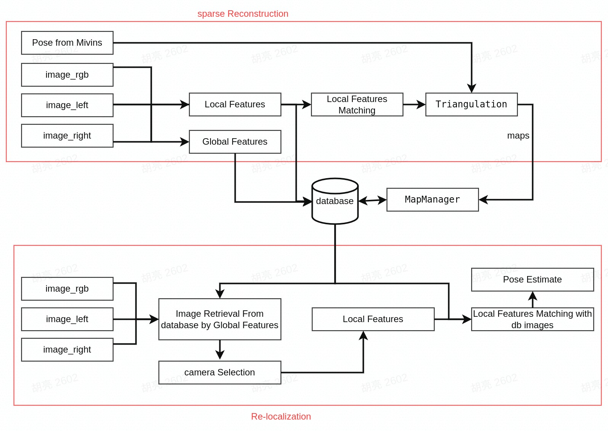

# cyberdog_mivins

## 模块简介

cyberdog_miloc是一个基于的三目相机的视觉的建图与重定位模块，用于视觉建图、导航功能中。在建图过程基于cyberdog_mivins输出的机器人位姿，建立稀疏的重定位地图；在导航过程基于重定位地图为机器人提供在当前地图下的位姿。

## 模块架构

cyberdog_miloc算法包括视觉建图、重定位、地图地图管理等模块。

## 服务流程

### 建图服务流程

### 重定位定位服务流程

