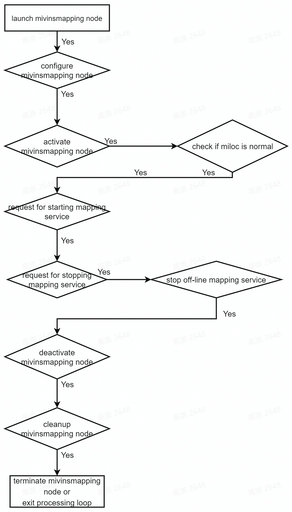

# cyberdog_mivins

## 模块简介

cyberdog_mivins在视觉建图、视觉定位、视觉跟随等功能中使用，提供实时输出足式机器人位姿TF服务。基于开源项目SVO、VINS-FUSION开发，使用相机、IMU、足式里程计等多传感器数据融合定位。

## 模块架构

cyberdog_mivins定位算法包括数据输入、前端跟踪、前端建图、后端优化、输出等模块。

## 服务流程

### 建图服务流程

### 定位服务流程

### 跟随定位服务流程

