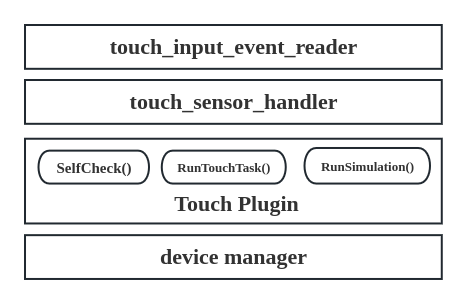

# Touch设计文档
# 目录
## 一. 概述
## 二. 设计
- 2.1 功能划分
- 2.2 模块架构
- 2.3 接口设计
- 2.4 模块设计
# 一、概述
下文旨在说明机器狗touch交互逻辑及其功能映射等。
# 二、设计
## 2.1 功能划分
主要功能如下：
- 获取touch触发事件（双击（0x03）、长按(0x07)等）；
- touch自检；
## 2.2 模块架构
模块架构图如下：

 

## 2.3 接口设计
touch模块数据流如下：

 

touch模块消息协议如下：

- 话题名称：“touch_status”
- 话题消息文件目录：“/bridges/protocol/ros/msg/TouchStatus.msg”
- 话题消息结构如下：
    int32 touch_state    //touch信号量，非0表示touch被触发
    uint64 timestamp     //时间戳
- touch_state信号量值如下：
    #define LPWG_SINGLETAP_DETECTED                      0x01
    #define LPWG_DOUBLETAP_DETECTED                      0x03
    #define LPWG_TOUCHANDHOLD_DETECTED                   0x07
    #define LPWG_CIRCLE_DETECTED                         0x08
    #define LPWG_TRIANGLE_DETECTED                       0x09
    #define LPWG_VEE_DETECTED                            0x0A
    #define LPWG_UNICODE_DETECTED                        0x0B
    #define LPWG_SWIPE_DETECTED                          0x0D
    #define LPWG_SWIPE_DETECTED_UP_CONTINU               0x0E
    #define LPWG_SWIPE_DETECTED_DOWN_CONTINU             0x0F
    #define LPWG_SWIPE_DETECTED_LEFT_CONTINU             0x10
    #define LPWG_SWIPE_DETECTED_RIGHT_CONTINU            0x11
## 2.4 模块设计
主要分为touch_input_event_reader、touch_base和- touch_sensor_handler和touch_plugin等模块。
- touch_input_event_reader主要实现了从events中读取touch事件功能；
- touch_base主要实现了touch模块初始化、自检等功能的定义；
- touch_sensor_handler主要实现了设备文件打开、基于epolling机制对触摸事件进行处理和映射等功能；
- touch_plugin主要实现了touch模块初始化、自检、触摸事件信号的话题发布等功能。
