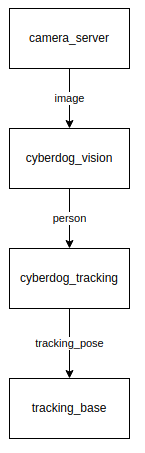

# cyberdog_tracking

## 模块简介

cyberdog_tracking是一个基于ROS2的功能包，主要用于对跟踪目标进行3D位置的估计，为下游跟随控制模块提供跟随的目标点。其中，位置估计的对象包括行人以及万物跟随中用户框选的任何规则非规则的目标。

## 模块架构

- camera_server：提供图像

- cyberdog_vision：AI算法处理

- cyberdog_tracking：位置估计

- tracking_base：跟随规划控制

## 处理流程

- 模块输入：AI算法的处理结果及对齐后的深度图

- 模块输出：跟踪目标的位置及跟踪状态

- 状态发布：近距离、远距离、边缘
