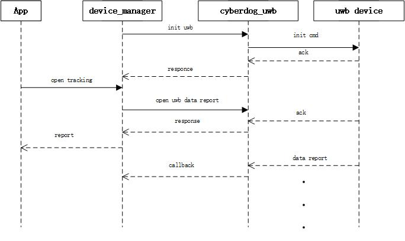
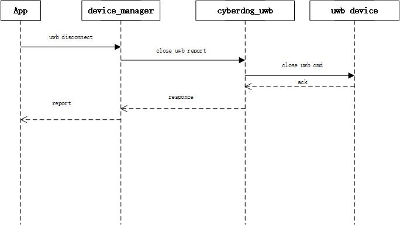

# Cyberdog_uwb设计

##  概述

``cyberdog_uwb`` 是与uwb位置传感器关联的传感器插件，此插件为控制传感器提供必要的API接口，并把采集到的uwb数据转换成ros消息格式反馈给客户端。

## 软件设计

#### 软件框架

 

#### 数据流开启

 

#### 数据流关闭

 

## 功能设计

 - 通过配置文件可灵活配置传感器个数、消息源、指令id等
 - 提供传感器使能、关闭、自检等基本能力接口

## 配置文件

- 源码路径：``bridges/params/toml_config/device``
- 安装路径：``/opt/ros2/cyberdog/share/params/toml_config/device``
- 配置文件：
  - ``uwb_config.toml``:用于配置传感器个数和实际的配置文件
  - ``uwb_head_tof.toml``:用于配置前方传感器
  - ``uwb_head_uwb.toml``:用于配置后方传感器
  - ``uwb_rear_uwb.toml``:用于配置左边传感器
  - ``uwb_head_tof.toml``:用于配置右边传感器
- 主要配置说明：
  - ``simulate``:模拟器设置开关
  - ``use_static_mac``:uwb静态mac设置开关
  - ``uwb``:配置uwb设备实体，程序根据此字段的个数实例出uwb个数
    - ``com_file ``:uwb设备子配置文件
  - ``protocol``:通信协议，默认为CAN。
  - ``can_interface``:CAN通信的消息通道，可配置``can0``、``can1``
  - ``array``:数据包消息接收配置
    - ``array_name``:数据包名称
    - ``can_package_num``:数据包中，CAN数据帧的个数
    - ``can_id``:数据包中，CAN数据帧的``CAN_id``

  - ``cmd``:指令包消息发送配置
    - ``cmd_name``:指令包名称
    - ``can_id``:指令包中，CAN数据帧的``CAN_id``
    - ``ctrl_len``:指令包中，CAN数据帧的数据长度
    - ``ctrl_data``:指令包中，CAN数据帧的数据默认值

## API接口
  - ``bool Init(std::function<void(UwbSignleStatusMsg)>function_callback, bool simulation)``：初始化配置
    - ``simulator = true``:配置为仿真模式
    - ``function_callback``:消息发布回调函数
  - ``Open()``：打开传感器
  - ``Stop()``：停止传感器
  - ``SelfCheck()``：传感器自检
  - ``LowPower()``：进入低功耗模式
  - ``SetConnectedState(bool connected)``：设置uwb连接状态
  - ``void Play(const std::shared_ptr<protocol::srv::GetUWBMacSessionID::Request> info_request,std::shared_ptr<protocol::srv::GetUWBMacSessionID::Response> info_response)``：ros2 service打开uwb接口
