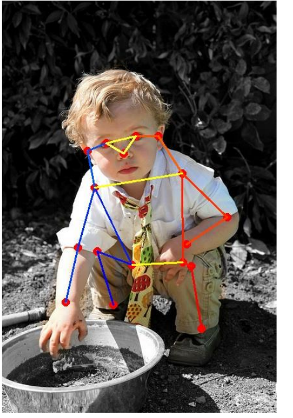

# 开发者手册 

# 基础能力 

## 运动功能 

### 伺服指令下发 

- 具体功能：持续接受运动指令完成相关的动作，可以动态响应速度、步态等参数，包括以下动作：
  - 以慢频步态行走（最大纵向速度0.65（单位m/s，下同），最大横移速度0.3，最大角速度1.25（单位rad/s，下同））
  - 以中频步态行走（最大纵向速度1.0，最大横移速度0.3， 最大角速度1.25）
  - 以快速步态行走（最大纵向速度1.6，最大横移速度0.55， 最大角速度2.5）
  - 以四足同时离地的步态行走（最大纵向速度0.25，最大横移速度0.1， 最大角速度0.5）
  - 以前后足交替离地的步态行走（最大纵向速度0.4，最大横移速度0.3， 最大角速度0.75）
- 接口形式：ros topic
- 接口名字："motion_servo_cmd"
- 消息文件：protocol/msg/MotionServoCmd.msg
- 消息内容：

```js
int32         motion_id    # 机器人运控姿态

int32         cmd_type     # 指令类型约束, 1: Data, 2: End；

                           # Data帧根据控制需求写入以下参数，End帧无需填写参数

int32         cmd_source   # 指令来源，

                           # 0：App, 1: Audio, 2: Vis，3: BluTele 4: Algo

int32         value        # 0, 内八步态， 2，垂直步态

float32[3]    vel_des      # x y(最大值1.5） yaw（最大值2.0） speed  m/s

float32[3]    rpy_des      # 当前暂不开放。roll pitch yaw（最大值0.4）  rad

float32[3]    pos_des      # 当前暂不开放。x y（最大值0.2）z（最大值0.3)  m

float32[3]    acc_des      # 当前暂不开放。acc for jump m^2/s

float32[3]    ctrl_point   # 当前暂不开放。pose ctrl point  m

float32[3]    foot_pose    # 当前暂不开放。front/back foot pose x,y,z  m

float32[2]    step_height  # 行走时的抬腿高度，默认可按0.05m设定
```

### 伺服指令反馈 

- 具体功能：向用户反馈当前的伺服指令执行状态（包括当前的步态、伺服指令的执行结果是否正确）
- 接口形式：ros topic
- 接口名字："motion_servo_response"
- 消息文件：protocol/msg/MotionServoResponse.msg
- 消息内容：

```js
int32  motion_id

int8   order_process_bar   # 动作执行进度

int8   status              # 运控步态切换的状态

bool   result              # 动作是否执行成功        

int32  code                # 异常时的错误码
```

### 结果指令 

- 具体功能：以客户端/服务端的形式，接受运动指令，完成预置的所有动作，能够返回所有动作的执行结果，并上报所有的异常原因，包括电机异常、状态机异常、运控异常等。同时还可以在可视化编程中由用户自定义动作，目前放开的自定义参数较为有限，包含落足点位置、足腿的腾空时间、机器狗的整体速度等参数。动作完成定义后，即可与内置动作采用相同的接口在可视化编程中实现调用。内置动作包括：

| motion_id | 动作名称       | motion_id | 动作名称       | motion_id | 动作名称         |
| --------- | -------------- | --------- | -------------- | --------- | ---------------- |
| 0         | 急停           | 131       | 3D跳跃右转90度 | 144       | 屁股画圆   |
| 101       | 高阻尼趴下     | 132       | 3D跳跃前跳60cm | 145       | 头画圆   |
| 111       | 恢复站立       | 134       | 3D跳跃左跳20cm | 146       | 伸展身体   |
| 118       | 强化起身        | 135      | 3D跳跃右跳20cm | 151       | 芭蕾舞  |
| 121       | 后空翻         | 140       | 舞蹈集合       | 152       | 太空步         |
| 123       | 作揖           | 141       | 握左手       | 174       | 俯卧撑 |
| 125       | 遛狗           | 142       | 握右手         | 175       | 作揖比心     |
| 130       | 3D跳跃左转90度  | 143       | 坐下         |           |        |

- 接口形式：ros service
- 接口名字："motion_result_cmd"
- 服务文件：protocol/srv/MotionResultCmd.srv
- 服务内容：

```js
int32         motion_id    # 机器人运控姿态

int32         cmd_source   # 指令来源，

                           # 0：App, 1: Audio, 2: Vis， 3: BluTele 4: Algo

float32[3]    vel_des      # 当前暂不开放。x y(最大值1.5，m/s） yaw（最大值2.0，rad/s）

float32[3]    rpy_des      # roll pitch yaw（最大值0.4）rad

float32[3]    pos_des      # x y（最大值0.2）z（最大值0.3) m

float32[3]    acc_des      # 当前暂不开放。acc for jump m^2/s

float32[3]    ctrl_point   # 当前暂不开放。pose ctrl point  m

float32[3]    foot_pose    # 当前暂不开放。front/back foot pose x,y,z  m

float32[2]    step_height  # 抬腿高度，当前可按0.05m设定

int32         duration     # 进行增量位控和增量力控、绝对量力控姿态控制时设定的期望

                           # 完成时间

---

int32         motion_id    # 机器人运控姿态

bool          result       # 执行结果

int32         code         # module code
```

## 视觉功能 

### 相机服务

**CameraService.srv** 

```Go
uint8 SET_PARAMETERS = 0

uint8 TAKE_PICTURE = 1

uint8 START_RECORDING = 2

uint8 STOP_RECORDING = 3

uint8 GET_STATE = 4

uint8 DELETE_FILE = 5

uint8 GET_ALL_FILES = 6

uint8 START_LIVE_STREAM = 7

uint8 STOP_LIVE_STREAM = 8

uint8 START_IMAGE_PUBLISH = 9

uint8 STOP_IMAGE_PUBLISH = 10


uint8 command

# command arguments

string args

uint16 width

uint16 height

uint16 fps

---

uint8 RESULT_SUCCESS = 0

uint8 RESULT_INVALID_ARGS = 1

uint8 RESULT_UNSUPPORTED = 2

uint8 RESULT_TIMEOUT = 3

uint8 RESULT_BUSY = 4

uint8 RESULT_INVALID_STATE = 5

uint8 RESULT_INNER_ERROR = 6

uint8 RESULT_UNDEFINED_ERROR = 255


uint8 result

string msg

int32 code
```

#### RGB和鱼眼相机 

- 打开、关闭camera

```Bash
ros2 launch camera_test stereo_camera.py

#查看name space

ros2 node list 


###如果是开机自启，注意topic前加上命名空间


ros2 lifecycle set /stereo_camera configure


ros2 lifecycle set /stereo_camera activate


ros2 lifecycle set /stereo_camera deactivate


ros2 lifecycle set /stereo_camera cleanup
```

- 获取图像

接口形式：ros topic  

接口名称：camera_server 

话题名称： 

```Bash
#使用topic订阅rgb相机、左鱼眼相机，右鱼眼相机


#左鱼眼

/image_left  

#右鱼眼  

/image_right

#rgb相机 

/image_rgb 
```

 

图像数据话题内容:  sensor_msgs::msg::Image 

 

#### AI相机 

- 打开、关闭camera

```Bash
ros2 run camera_test camera_server


##开启AI相机指令

ros2 service call /camera_service protocol/srv/CameraService "{command: 9, width: 640, height: 480, fps: 0}"


##关闭相机指令

ros2 service call /camera_service protocol/srv/CameraService "{command: 10, args: ''}"
```

- 获取图像

接口形式：ros topic  

接口名称：camera_server 

话题名称： 

```Bash
#使用topic订阅AI相机

#AI相机topic

topic: /image
```

图像数据话题内容:  sensor_msgs::msg::Image 

 

 

#### Realsense 

- 通过lifecycle状态机控制RealSense数据的开启关闭

```Bash
  # /camera/camera节点启动指令

  ros2 launch realsense2_camera on_dog.py

  

  #初始化

  ros2 lifecycle set /camera/camera configure 

  

  #开启数据

  ros2 lifecycle set /camera/camera activate

  

  #关闭数据

  ros2 lifecycle set /camera/camera deactivate

  

  #重置节点

  ros2 lifecycle set /camera/camera cleanup

  

  #/camera/camera_align节点启动指令

  ros2 launch realsense2_camera realsense_align_node.launch.py

  

  #初始化

  ros2 lifecycle set /camera/camera_align configure 

  

  #开启数据

  ros2 lifecycle set /camera/camera_align activate

  

  #关闭数据

  ros2 lifecycle set /camera/camera_align deactivate

  

  #重置节点

  ros2 lifecycle set /camera/camera_align cleanup
```

- 获取图像

接口形式：ros topic  

接口名称：realsense2_camera_node、realsense_align_node 

话题名称： 

```Bash
---开机自启动需要加域名

#左目图像

/camera/infra1/image_rect_raw

#右目图像

/camera/infra1/image_rect_raw

#深度图

/camera/depth/image_rect_raw

#IMU数据

/camera/imu

#align深度图

/camera/aligned_depth_to_extcolor/image_raw
```

图像数据话题内容 

```js
# Header （timestamp and frame)

std_msgs/Header header 


# image height, that is, number of rows

uint32 height


# image width, that is, number of columns 

uint32 width 


# Encoding of pixels -- channel meaning, ordering, size

string encoding 


# is this data bigendian?

uint8 is_bigendian 


# Full row length in bytes

#uint32 step 


# actual matrix data, size is (step * rows)

#uint8[] data 

 
```

IMU数据话题内容 

```Bash
#Header （timestamp and frame)

std_msgs/Header header  

  

#orientation 

geometry_msgs/Quaternion orientation 


#orientation_covariance

double[9] orientation_covariance 


# angular_velocity 

geometry_msgs/Vector3 angular_velocity 


#angular_velocity_covariance 

float64[9] angular_velocity_covariance 


#linear_acceleration 

geometry_msgs/Vector3 linear_acceleration 


#linear_acceleration_covariance 

float64[9] linear_acceleration_covariance 
```

### 人脸录入和识别 

- 指定录入昵称，通过语音交互录入人脸。
- 在合适的角度和距离下，可识别已录入数据库中人脸。

#### 人脸录入 

- 具体功能：通过语音交互，录入指定昵称的人脸，录入人脸的信息唯一。
- 接口形式：ros service/topic  当前人脸录入模块提供一个service和一个topic，service用于激活人脸录入功能，激活后，在规定的timeout时间内，该节点会发布是否成功录入人脸的topic。
- 接口名称：

service："cyberdog_face_entry_srv" 

topic： "face_entry_msg" 

- 服务文件：protocol/srv/FaceEntry.srv
- 服务文件内容

```Go
# request

int32  ADD_FACE = 0                      #添加人脸

int32  CANCLE_ADD_FACE = 1               #取消添加人脸

int32  CONFIRM_LAST_FACE = 2             #确认上次人脸

int32  UPDATE_FACE_ID = 3                #更新人脸ID

int32  DELETE_FACE = 4                   #删除人脸

int32  GET_ALL_FACES = 5                 #获取所有人脸


int32  command                           #人脸录入命令

string username                          #用户名字

string oriname                           #用户原始名字

bool   ishost                            #是否为主人

---

int32  RESULT_SUCCESS = 0                #请求录入服务成功

int32  RESULT_INVALID_ARGS = 5910        #录入参数为无效参数

int32  RESULT_UNSUPPORTED = 5908         #不支持录入

int32  RESULT_TIMEOUT = 5907             #录入超时

int32  RESULT_BUSY = 5911                #录入繁忙

int32  RESULT_INVALID_STATE = 5903       #录入无效状态

int32  RESULT_INNER_ERROR = 5904         #内部错误

int32  RESULT_UNDEFINED_ERROR = 5901     #未知错误


int32  result                            #请求录入服务结果

string allfaces                          #获取所有人脸
```

- 消息文件：protocol/msg/FaceEntryResult.msg
- 消息文件内容：

```Go
// protocol/msg/FaceEntryResult.msg

int32  RESULT_SUCCESS =0                  #录入结果成功

int32  RESULT_TIMEOUT =5907               #录入超时

int32  RESULT_FACE_ALREADY_EXIST = 5921   #人脸已存在


int32  result                             #录入结果

string username                           #录入的名字
```

#### 人脸识别 

- 具体功能：识别数据库中已录入的人脸。
- 接口形式：ros service/topic  当前人脸识别模块提供一个service和一个topic，service用于激活人脸识别功能，激活后，在规定的timeout时间内，该节点会发布检测到人脸ID的topic。
- 接口名称：

service："cyberdog_face_recognition_srv" 

topic： "face_rec_msg" 

- 服务文件：protocol/srv/FaceRec.srv
- 服务文件内容

```Go
#request

int32 COMMAND_RECOGNITION_ALL = 0             #请求识别所有人

int32 COMMAND_RECOGNITION_SINGLE = 1          #请求识别某个人

int32 COMMAND_RECOGNITION_CANCEL = 2          #取消识别人脸

int32 MAX_TIMEOUT = 300                       #识别最大时长

int32 MIN_TIMEOUT = 30                        #识别做小时长

int32 DEFAULT_TIMEOUT = 60                    #默认识别时长


int32 command                                 #请求识别指令

string username                               #识别人脸的名字

string id                                     #识别人脸的id

int32 timeout                                 #有效时间30s～300s，default = 60 

                                              #如果不添加该字段，采用默认值

---

int32 ENABLE_SUCCESS = 0                      #请求识别成功

int32 ENABLE_FAIL = 5901                      #请求识别失败

int32 result                                  #请求识别结果
```

- 消息文件：protocol/msg/FaceRecognitionResult.msg
- 消息文件内容：

```C%2B%2B
// protocol/msg/FaceRecognitionResult.msg

int32 RESULT_SUCCESS =0                      #识别成功

int32 RESULT_TIMEOUT =5907                   #识别超时


string username                              #识别到人脸的名字

int32 result                                 #识别结果

string id                                    #识别到人脸的ID

float32 age                                  #识别到的年龄

float32 emotion                              #识别到的情绪
```

### 动态手势识别 

- 具体功能：连贯手势动作识别，包括手掌/手指向左挥动、手掌/手指向右挥动、手掌/手指向上移动、手掌/手指向下移动、手掌/手指张开、手掌/手指闭合。
- 接口形式：ros service/topic  目前手势识别模块提供一个service和一个topic，service用于激活手势识别功能，激活后，在规定的timeout时间内，该节点会发布检测到的手势动作id的topic。
- 接口名称：

service："gesture_action_control" 

topic： gesture_action_msg 

- 服务文件：protocol/srv/GestureActionControl.srv
- 服务文件内容

```C%2B%2B
// protocol/srv/GestureActionControl.srv

uint8 START_ALGO = 0

uint8 STOP_ALGO = 1

int32 DEFAUT_TIMEOUT = 60               #算法持续时间默认为60s


uint8 command                           #打开或者停止手势动作识别算法

int32 timeout                           #算法持续时间有效时间为（1s-300s），请求中忽略此关键字

                                        #取值范围不在（1s-300s）算法持续时间默认为60s。

---

int32 RESULT_SUCCESS = 0                #请求成功回执

int32 RESULT_BUSY = 1                   #重复请求开启/关闭算法请求回执


int32 code                              #请求回执
```

- 消息文件：protocol/msg/GestureActionResult.msg
- 消息文件内容

```C%2B%2B
// protocol/msg/GestureActionResult.msg

int32 NO_GESTURE =0                                      #没有手势

int32 PULLING_HAND_OR_TWO_FINGERS_IN =1                  #手掌拉近

int32 PUSHING_HAND_OR_TWO_FINGERS_AWAY =2                #手掌推开

int32 SLIDING_HAND_OR_TWO_FINGERS_UP = 3                 #手向上抬

int32 SLIDING_HAND_OR_TWO_FINGERS_DOWN =4                #手向下压

int32 SLIDING_HAND_OR_TWO_FINGERS_LEFT =5                #手向左推

int32 SLIDING_HAND_OR_TWO_FINGERS_RIGHT =6               #手向右推

int32 STOP_SIGN =7                                       #停止手势 

int32 THUMB_UP =8                                        #大拇指朝上

int32 ZOOMING_IN_WITH_HAND_OR_TWO_FINGERS = 9            #张开手掌或手指

int32 ZOOMING_OUT_WITH_HAND_OR_TWO_FINGERS =10           #闭合手掌或手指

int32 THUMB_DOWN =11                                     #大拇指朝下


int32 id                                                 #手势识别结果id
```

### 表情识别 

- 具体功能：识别场景中目标人的表情，包括中性、微笑、大笑、生气、哭泣五种表情，如下所示：

| 中性                                                         | 微笑                                                         | 大笑                                                         | 生气                                                         | 哭泣                                                         |
| ------------------------------------------------------------ | ------------------------------------------------------------ | ------------------------------------------------------------ | ------------------------------------------------------------ | ------------------------------------------------------------ |
|  |  |  |  |  |

- 接口形式：ros service + topic  调用service开启人脸识别算法，请求中algo_enable传入参数ALGO_FACE。通过topic获取人脸识别结果，其中topic person的face_info.info[i].emotion表示对应人脸的表情信息。
- 接口名称/服务文件/文件位置：统一见目标跟踪。

### 年龄预测 

- 具体功能：可预测场景中目标人的年龄，输出年龄范围为0-80。
- 接口形式：ros service + topic  调用service开启人脸识别算法，请求中algo_enable传入参数ALGO_FACE。通过topic获取人脸识别结果，其中topic person的face_info.info[i].age表示对应人脸的年龄信息。
- 接口名称/服务文件/文件位置：统一见目标跟踪。

### 人体骨骼点检测 

- 具体功能：检测场景中所有人的关键点位置，单个目标人输出17个关键点的坐标，分别为：nose、left_eye、right_eye、left_ear、right_ear、left_shoulder、right_shoulder、left_elbow、right_elbow、left_wrist、right_wrist、left_hip、right_hip、left_knee、right_knee、left_ankle、right_ankle，对应各关键点位置如下：



- 接口形式：ros service + topic  调用service开启关键点检测算法，请求中algo_enable传入参数ALGO_BODY和ALGO_KEYPOINTS。通过topic获取关键点检测结果，其中topic person中body_info.infos[i].keypoints为关键点的位置信息。
- 接口名称/服务文件/文件位置：统一见目标跟踪。

### 静态手势识别 

- 具体功能：识别场景中所有人的手势，单个目标人对应一个手势，手势类别及定义如下所示：

 

- 接口形式：ros service + topic  调用service开启手势识别算法，请求中algo_enable传入参数ALGO_BODY和ALGO_GESTURE。通过topic获取手势识别结果，其中topic person中body_info.infos[i].gesture为手势识别的结果。
- 接口名称/服务文件/文件位置：统一见目标跟踪。

### 人体检测 

- 具体功能：检测场景中所有人体，给出每个人体的位置及置信度信息。
- 接口形式：ros service + topic  调用service开启人体检测算法，请求中algo_enable传入参数ALGO_BODY。通过topic获取人体检测结果，其中topic person中body_info.infos[i]为人体检测的结果。
- 接口名称/服务文件/文件位置：统一见目标跟踪。

### 目标跟踪 

- 可实现指定目标（人体、篮球、机器狗、玩具车等）的长时稳定跟踪，跟踪目标出视野或者交叉遮挡再出现后，限定时间内支持重新找回。
- 接口形式：ros service + topic  调用service开启人体跟踪算法进行人体的跟踪，请求中algo_enable传入参数ALGO_BODY和ALGO_REID。除人体外其他目标的跟踪，调用service开启万物跟踪算法，请求中algo_enable传入参数 ALGO_FOCUS。通过topic获取人体及万物跟踪的结果，其中topic person中track_res为人体及万物的跟踪结果。
- 接口名称：

     service: "algo_manager" 

     topic: "person" 

- 文件位置：

     protocol/srv/AlgoManager.srv 

     protocol/msg/AlgoList.msg 

     protocol/msg/Person.msg 

     protocol/msg/FaceInfo.msg 

     protocol/msg/Face.msg 

     protocol/msg/BodyInfo.msg 

     protocol/msg/Body.msg 

     protocol/msg/Keypoint.msg 

     protocol/msg/Gesture.msg 

     protocol/msg/TrackResult.msg 

- 文件内容：

```js
# protocol/srv/AlgoManager.srv

# request

AlgoList[] algo_enable

AlgoList[] algo_disable

# param of face(预留字段，暂未使用)

bool open_age

bool open_emotion


---


# response

uint8 ENABLE_SUCCESS = 0

uint8 ENABLE_FAIL = 1

uint8 result_enable


uint8 DISABLE_SUCCESS = 0

uint8 DISABLE_FAIL = 1

uint8 result_disable
# protocol/msg/AlgoList.msg

uint8 ALGO_FACE = 0

uint8 ALGO_BODY = 1

uint8 ALGO_GESTURE = 2

uint8 ALGO_KEYPOINTS = 3

uint8 ALGO_REID = 4

uint8 ALGO_FOCUS = 5


uint8 algo_module
# protocol/msg/Person.msg

# frame header

std_msgs/Header header


# face info （人脸识别结果）

FaceInfo face_info


# body info

BodyInfo body_info


# auto track

TrackResult track_res
# protocol/msg/FaceInfo.msg

# face info

# frame header

std_msgs/Header header


# number of faces

uint32 count


# face descriptions

Face[] infos
# protocol/msg/Face.msg

# single face info

# face locations in image

sensor_msgs/RegionOfInterest roi


# face id

string id


# confidence

float32 score


# matching degree

float32 match


# face pose

float32 yaw

float32 pitch

float32 row


# is host

bool is_host


float32 age

float32 emotion
# protocol/msg/BodyInfo.msg

# body info

# frame header

std_msgs/Header header


# number of bodys

uint32 count


# body descriptions

Body[] infos
# protocol/msg/Body.msg

# single body info

# body locations in image

sensor_msgs/RegionOfInterest roi


# body REID

string reid


# features

float32[] feats


# keypoints

Keypoint[] keypoints


# gesture

Gesture gesture
# protocol/msg/Keypoint.msg

float32 x

float32 y
# protocol/msg/Gesture.msg

# gesture rect

sensor_msgs/RegionOfInterest roi


# gesture cls

int32 GESTURE_OK = 0

int32 GESTURE_FAST_BACKWARD = 1

int32 GESTURE_FAST_FORWARD = 2

int32 GESTURE_STOP_LEFT = 3

int32 GESTURE_STOP_RIGHT = 4

int32 GESTURE_THUMBS_UP = 5

int32 GESTURE_SHHH = 6

int32 GESTURE_FIST = 7

int32 GESTURE_PALM2FIST = 8

int32 GESTURE_INVALID = 9

int32 cls
# protocol/msg/TrackResult.msg

# frame header

std_msgs/Header header


# rect tracked

sensor_msgs/RegionOfInterest roi
```

## 外设及传感器 

### touch手势识别 

- 支持单击、双击、长按等多种手势触碰识别。
- 根据touch_status的值实现长按触发联网，双击报电量的功能。

#### touch 手势获取 

具体功能：touch手势识别获取 

接口形式：ros topic 

接口名字："touch_status" 

接口内容： 

```Go
std_msgs/Header header


int32    touch_state     // 0x01 ：单击， 0x03:双击 ， 0x07: 长按

uint64   timestamp       // 时间戳
```

### 连网功能 

- 有无线网卡，接入互联网的能力
- 查询联网状态能力

### uwb数据 

- 初始化UWB传感器固件
- 开启UWB传感器数据采集
- 关闭UWB传感器数据采集
- 4个UWB传感器数据信息

##### uwb数据发布 

- 接口形式：ros topic
- 接口名字："uwb_raw"
- 话题文件：protocol/msg/UwbRaw
- 话题内容：

```js
std_msgs/Header header

        builtin_interfaces/Time stamp

                int32 sec

                uint32 nanosec

        string frame_id


float32 dist

float32 angle

float32 n_los

float32 rssi_1

float32 rssi_2
```

### 超声数据 

- 功能描述：获取超声传感器探测目标测距值与强度值。
- 接口形式：ros topic
- 接口名称：ultrasonic_payload
- 发送频率：10hz
- 接口内容：

”sensor_msgs/msg/Range.msg“ 

```C%2B%2B
#  包含topic的时间戳和序列信息，详情见std_msgs/Header

Header header           

    

# 特定传感器的字段定义

uint8 ULTRASOUND=0

uint8 INFRARED=1

# 传感器类型包含超声 0 和红外 1               

uint8 radiation_type    

# 使用传感器的fov

float32 field_of_view   

# 传感器能够探测的最小距离[m]

float32 min_range       

# 传感器能够探测的最大距离[m]

float32 max_range       

# 传感器返回的测距值[m]

float32 range 
```

其中引用了ros2系统自带的消息 std_msgs/Header 

```C%2B%2B
# Standard metadata for higher-level stamped data types.

# This is generally used to communicate timestamped data 

# in a particular coordinate frame.

# 

# sequence ID: consecutively increasing ID 

uint32 seq

#Two-integer timestamp that is expressed as:

# * stamp.sec: seconds (stamp_secs) since epoch (in Python the variable is called 'secs')

# * stamp.nsec: nanoseconds since stamp_secs (in Python the variable is called 'nsecs')

# time-handling sugar is provided by the client library

time stamp

#Frame this data is associated with

string frame_id
```

 

### tof数据 

- 功能描述：有四个tof传感器，由头部mcu和尾部mcu各控制两个，单个tof可以获取8*8矩阵的高程数据
- 接口形式：ros topic
- 接口名字：topic_name: head_tof_payload，rear_tof_payload
- 发送频率：10hz
- 数据描述：TOF 目前设定的有效距离是150-660mm，小于150mm，显示的值是0.150；大于660mm，显示的是最大值0.660m；
- 接口内容：

“HeadTofPayload.msg 

```C%2B%2B
# This message is  used to describe head tofs


SingleTofPayload left_head

SingleTofPayload right_head
```

”RearTofPayload.msg"  

```C%2B%2B
# This message is  used to describe rear tofs


SingleTofPayload left_rear

SingleTofPayload right_rear
```

其中引用了自定义的”SingleTofPayload.msg" 

```C%2B%2B
#  包含topic的时间戳和序列信息，详情见std_msgs/Header

# This message is  used to describe single tof payload

# Send frequency: 10

# The effective distance currently set by TOF is 150-660mm, less than 150mm, the displayed value is 150; 

# greater than 660mm, the displayed value is the maximum value of 660mm;

# At present, there is a tof sensor on each of the four legs of the dog, which is used to Obtain the elevation information 


std_msgs/Header header # Header timestamp should be acquisition time of tof data


uint8 LEFT_HEAD=0  #  the macro definition of tof serial number 

uint8 RIGHT_HEAD=1 #  Used to set tof position

uint8 LEFT_REAR=2

uint8 RIGHT_REAR=3

uint8 HEAD=4

uint8 REAR=5


int32 TOF_DATA_NUM=64 # number of tof data 


float32 SCALE_FACTOR=0.001 # factor of tof data used to compute real distance


bool data_available  # A flag that tof data is available


uint8 tof_position   # location of tof sensor 

                     # (LEFT_HEAD, RIGHT_HEAD, LEFT_REAR,RIGHT_REAR) [enum]


float32[] data      # tof data , Unit: m    

float32[] intensity      # tof data intensity    
```

其中引用了ros2系统自带的消息 std_msgs/Header 

```C%2B%2B
# Standard metadata for higher-level stamped data types.

# This is generally used to communicate timestamped data 

# in a particular coordinate frame.

# 

# sequence ID: consecutively increasing ID 

uint32 seq

#Two-integer timestamp that is expressed as:

# * stamp.sec: seconds (stamp_secs) since epoch (in Python the variable is called 'secs')

# * stamp.nsec: nanoseconds since stamp_secs (in Python the variable is called 'nsecs')

# time-handling sugar is provided by the client library

time stamp

#Frame this data is associated with

string frame_id
```

 

### gps数据 

- 功能描述：获取设备当前的经纬度数据信息
- 接口形式：ros topic
- 接口名字：topic_name: gps_payload
- 发送频率：1hz
- 接口内容：

“GpsPayload.msg 

```C%2B%2B
# GPS msg

uint32 sec # The seconds component of nv current time .

uint32 nanosec #The nanoseconds component of nv current time .

uint32 itow # the GPS Timestamps

uint8 fix_type # GNSSfix Type:

uint8 num_sv # Number of satellites used (range: 0-12)

float64 lon # longitude    

float64 lat #  latitude
```

### 电池信息 

#### 电池状态信息获取 

- 具体功能：获取当前电池状态
- 接口形式：ros topic
- 接口名字："bms_status"
- 消息文件：protocol/msg/BmsStatus
- 消息内容：

```js
std_msgs/Header header


uint16 batt_volt              # 电压

int16 batt_curr               # 电流

uint8 batt_soc                # 电量

int16 batt_temp               # 电池温度

uint8 batt_st                 # 电池状态

int8  batt_health             # 电池健康度

int16 batt_loop_number        # 电池循环次数


bool power_normal             # 正常模式

bool power_wired_charging     # 有线充电中

bool power_finished_charging  # 充电完成

bool power_motor_shutdown     # 电机掉电

bool power_soft_shutdown      # 软关机

bool power_wp_place           # 无线充电在位

bool power_wp_charging        # 无线充电中

bool power_expower_supply     # 外部供电
```

 

### 灯效 

#### 灯效设置 

- 具体功能：设置灯带的显示颜色及模式
- 接口形式：ros service
- 接口名字："led_execute"
- 服务文件：protocol/srv/LedExecute
- 服务内容：

```js
# client 

string UNDEFINED ="undefined"          #调试时可用，优先级最高。       

string VP ="vp"

string BMS ="bms"

string CONNECTOR ="connector"

 


# target

uint8 HEAD_LED =1

uint8 TAIL_LED =2

uint8 MINI_LED =3


# mode

uint8 SYSTEM_PREDEFINED =0x01          #使用系统预定义的模式，此模式下，用户使用时只需从effect字段中

                                       #选择所需灯效。r_value、g_value、b_value字段无意义。

                                       #例如 target = 1 effect = 0xA1 代表头灯红常亮。

uint8 USER_DEFINED =0x02               #使用用户自定义的模式，此模式下，灯效由effect和r_value、g_value、

                                       #b_value字段联合决定。effect字段决定灯亮的方式，r_value、g_value、b_value

                                       #字段决定灯效的颜色。例如 target = 1，effect = 0x01， r_value =255 

                                       #g_value =0 b_value=0 代表头灯红灯亮。


# effect

#HEAD_LED和TAIL_LED的基础灯效（0x01 ～0x09），在 mode = USER_DEFINED 时配合r_value、g_value、b_value使用。

uint8 RGB_ON =0x01                     #常亮

uint8 BLINK =0x02                      #闪烁

uint8 BLINK_FAST =0x03                 #快速闪烁    

uint8 BREATH =0x04                     #呼吸

uint8 BREATH_FAST =0x05                #快速呼吸 

uint8 ONE_BY_ONE =0x06                 #逐个点亮

uint8 ONE_BY_ONE_FAST =0x07            #快速逐个点亮

uint8 BACK_AND_FORTH =0x08             #往返逐个点亮

uint8 TRAILING_RACE =0x09              #拖尾流跑马 


# HEAD_LED和TAIL_LED系统预定义的灯效（0xA0 ～0xB5），在mode = SYSTEM_PREDEFINED 时有效。

uint8 RGB_OFF =0xA0                    #常灭


uint8 RED_ON =0xA1                     #红灯常亮

uint8 RED_BLINK =0xA2                  #红灯闪烁

uint8 RED_BLINK_FAST =0xA3             #红灯快速闪烁

uint8 RED_BREATH =0xA4                 #红灯呼吸

uint8 RED_BREATH_FAST =0xA5            #红灯快速呼吸

uint8 RED_ONE_BY_ONE =0xA6             #红灯逐个点亮

uint8 RED_ONE_BY_ONE_FAST =0xA7        #红灯快速逐个点亮


uint8 BLUE_ON =0xA8                    #蓝灯常亮

uint8 BLUE_BLINK =0xA9                 #蓝灯闪烁

uint8 BLUE_BLINK_FAST =0xAA            #蓝灯快速闪烁

uint8 BLUE_BREATH =0xAB                #蓝灯呼吸

uint8 BLUE_BREATH_FAST =0xAC           #蓝灯快速呼吸

uint8 BLUE_ONE_BY_ONE =0xAD            #蓝灯逐个点亮

uint8 BLUE_ONE_BY_ONE_FAST =0xAE       #蓝灯快速逐个点亮


uint8 YELLOW_ON =0xAF                  #黄灯常亮

uint8 YELLOW_BLINK =0xB0               #黄灯闪烁

uint8 YELLOW_BLINK_FAST =0xB1          #黄灯快速闪烁

uint8 YELLOW_BREATH =0xB2              #黄灯呼吸

uint8 YELLOW_BREATH_FAST =0xB3         #黄灯快速呼吸

uint8 YELLOW_ONE_BY_ONE =0xB4          #黄灯逐个点亮

uint8 YELLOW_ONE_BY_ONE_FAST =0xB5     #黄灯快速逐个点亮


#MINI LED的基础灯效（0x30 ～0x31），在 mode = USER_DEFINED 时配合r_value、g_value、b_value使用。

uint8 CIRCULAR_BREATH = 0x30           #圆形缩放

uint8 CIRCULAR_RING = 0x31             #画圆环


# MINI LED系统预定义的灯效（0x32 ～0x36），在mode = SYSTEM_PREDEFINED 时有效。

uint8 MINI_OFF = 0x32                  #常灭

uint8 RECTANGLE_COLOR = 0x33           #方块变色(无须设定r,g,b取值)

uint8 CENTRE_COLOR = 0x34              #中间彩带(无须设定r,g,b取值)

uint8 THREE_CIRCULAR = 0x35            #三圆呼吸(无须设定r,g,b取值)

uint8 COLOR_ONE_BY_ONE = 0x36          #彩带逐个点亮(无须设定r,g,b取值)


# request


string client                          # 使用模块，例如"bms";"vp";"connector" 具体见协议中常量定义

uint8 target                           # 用户希望使用的灯，可选择 HEAD_LED , TAIL_LED, MINI_LED

uint8 mode                             # 用户采用的模式（自定义USER_DEFINED/预置SYSTEM_PREDEFINED），取值见协议中常量定义

uint8 effect                           # 灯效，见协议中常量定义

uint8 r_value                          # 自定义模式下，红色通道的灰度值，取值范围0～255，其它模式下无意义。

uint8 g_value                          # 自定义模式下，绿色通道的灰度值，取值范围0～255，其它模式下无意义。

uint8 b_value                          # 自定义模式下，蓝色通道的灰度值，取值范围0～255，其它模式下无意义。


---

# response 

int32 SUCCEED =0                        # 当前请求参数合理，优先级最高，请求灯效执行成功

int32 TIMEOUT =1107                     # 当前请求led硬件响应超时

int32 TARGET_ERROR =1121                # 当前请求的target参数为空或者不在可选列表中

int32 PRIORITY_ERROR =1122              # 当前请求的client为空或者不在预设的优先级列表中

int32 MODE_ERROR = 1123                 # 当前请求的mode参数为空或者不在可选列表中

int32 EFFECT_ERROR =1124                # 当前请求的effect参数为空或者不在可选列表中

int32 LOW_PRIORITY = 1125               # 当前请求优先级较低，无法立即执行请求灯效


int32 code #执行结果
```

- 头灯（led灯带）

支持多种系统预置灯效，例如红常亮、绿呼吸、蓝渐变等。 

 允许用户进行自定义设置，包含基础灯效（常亮、呼吸、渐变、闪烁等）和自定义的颜色（R、G、B通道值） 

- 尾灯（led灯带）

        支持多种系统预置灯效，例如红常亮、绿呼吸、蓝渐变等等。 

         允许用户进行自定义设置，包含基础灯效（常亮、呼吸、渐变、闪烁等）和自定义的颜色（R、G、B通道值） 

- 眼灯（mini led）

         支持多种系统预置灯效，例如方块变色、中间彩带等。 

         允许用户进行自定义设置，包含基础灯效（圆环、圆形缩放）和自定义的颜色（R、G、B通道值） 

## 语音功能 

### 开关及调节 

#### 音量获取 

- 具体功能：获取当前音量大小
- 接口形式：ros service
- 接口名字："audio_volume_get"
- 服务文件：protocol/srv/AudioVolumeGet
- 服务内容：

```js
# request

---

# response

uint8 volume    # 音量大小
```

#### 音量设置 

- 具体功能：设定指定大小音量
- 接口形式：ros service
- 接口名字："audio_volume_set"
- 服务文件：protocol/srv/AudioVolumeSet
- 服务内容：

```js
# request

uint8 volume    # 音量大小

---

# response

bool success    # true：成功；false：失败
```

#### 麦克风开关 

- 具体功能：打开/关闭麦克风，开启/禁用收音功能
- 接口形式：ros service
- 接口名字："set_audio_state"
- 服务文件：protocol/srv/AudioExecute
- 服务内容：

```js
# request

string          client         # 请求服务的模块名称："BMS";"BLUETOOTH";"SENSOR" ..;

AudioStatus     status         # 状态消息

---

# response

bool            result         # true：成功；false：失败
```

- 引用消息：
  - 消息文件：protocol/msg/AudioStatus
  - 消息内容：

```js
uint8 AUDIO_STATUS_NORMAL = 0     # 开麦状态

uint8 AUDIO_STATUS_OFFMIC = 1     # 关麦状态


uint8 state                       # 状态值，取如上常量值
```

#### 语音开关 

- 具体功能：开启/禁用语音控制垂域功能
- 接口形式：ros service
- 接口名字："audio_action_set"
- 服务文件：std_srvs/srv/SetBool
- 服务内容：

```js
# request

bool     data             # true：开启；false：关闭

---

# response

bool     success          # true：成功；false：失败

string   message          # 成功失败信息
```

### 语音播放 

#### 离线/在线语音播放消息 

- 具体功能：离线不需要访问互联网的能力，在线需要访问互联网的能力。离线播放是播放预置的音频文件。在线播放是通过tts（text to speech）过程将文字转为语音进行播放。此功能的播放过程是非阻塞式播放，在任一时刻只能播放一条语音，在接收到其他其他消息时，会立即打断当前正在播放的语音，然后播放最新的消息对应的语音。
- 接口形式：ros topic
- 接口名字："speech_play_extend"
- 消息文件：protocol/msg/AudioPlayExtend
- 消息内容：

```js
string     module_name    # 播放者（模块）名字

bool       is_online      # true：在线；false：离线

AudioPlay  speech         # 离线播放信息

string     text           # 在线播放文本
```

- 引用消息：
  - 消息文件：protocol/msg/AudioPlay
  - 消息内容：

```js
uint16 PID_WIFI_ENTER_CONNECTION_MODE_0 = 1      # 进入连网模式

uint16 PID_WIFI_WAIT_FOR_SCAN_CODE_0 = 3         # 等待扫描二维码（1次/5s）

uint16 PID_WIFI_SCAN_CODE_SUCCEEDED_0 = 4        # 扫码成功，网络连接中

uint16 PID_WIFI_CONNECTION_SUCCEEDED_0 = 5       # 连网成功

uint16 PID_WIFI_CONNECTION_FAILED_0 = 7          # 无线网络名称错误，请修改后重试

uint16 PID_WIFI_CONNECTION_FAILED_1 = 8          # 无线网络密码错误，请修改后重试

uint16 PID_WIFI_CONNECTION_FAILED_2 = 9          # 无法连接网络，请检查网络状况并重新

                                                 # 尝试

uint16 PID_WIFI_EXIT_CONNECTION_MODE_0 = 10      # 退出连网模式

uint16 PID_WIFI_SCAN_CODE_IP_ERROR = 13          # 二维码信息错误，请使用正确二维码

uint16 PID_WIFI_SCAN_CODE_INFO_ERROR = 14        # 二维码失效，请重新生成

uint16 PID_FACE_ENTRY_ADD_FACE = 21              # 开始录入人脸，请正对摄像头，且勿遮

                                                 # 挡人脸，保持稳定

uint16 PID_FACE_ENTRY_CANCLE_ADD_FACE = 22       # 取消录入人脸

uint16 PID_FACE_ENTRY_CONFIRM_LAST_FACE = 23     # 确认录入人脸

uint16 PID_FACE_ENTRY_UPDATE_FACE_ID = 24        # 更新录入人脸

uint16 PID_FACE_ENTRY_DELETE_FACE = 25           # 删除录入人脸

uint16 PID_FACE_ENTRY_GET_ALL_FACES = 26         # 获取录入人脸信息

uint16 PID_FACE_ENTRY_FIX_POSE  = 27             # 请正对摄像头

uint16 PID_FACE_ENTRY_FIX_POSE_LEFT = 28         # 请向左扭头

uint16 PID_FACE_ENTRY_FIX_POSE_RIGHT = 29        # 请向右扭头

uint16 PID_FACE_ENTRY_FIX_POSE_UP = 30           # 请向上抬头

uint16 PID_FACE_ENTRY_FIX_POSE_DOWN = 31         # 请向下低头

uint16 PID_FACE_ENTRY_FIX_DISTANCE_CLOSE = 32    # 请距狗头近一点

uint16 PID_FACE_ENTRY_FIX_DISTANCE_NEAR = 33     # 请距狗头远一点

uint16 PID_FACE_ENTRY_FIX_STABLE = 34            # 请保持稳定

uint16 PID_FACE_ENTRY_MUTIPLE_FACES = 35         # 检测到多个人脸

uint16 PID_FACE_ENTRY_NONE_FACES = 36            # 没有检测到人脸

uint16 PID_FACE_ENTRY_TIMEOUT = 37               # 录入超时，请重新录入

uint16 PID_FACE_ENTRY_FINISH = 38                # 录入成功

uint16 PID_FACE_RECOGNITION_REQUEST = 39         # 开始人脸识别，请正对摄像头，且勿遮

                                                 # 挡人脸

uint16 PID_FACE_DEGREE_HEAD_TILT = 40            # 请不要歪头

uint16 PID_FACE_RECGONITION_FINISH = 41          # 人脸识别成功

uint16 PID_FACE_RECGONITION_TIMEOUT = 42         # 人脸识别已经超时，请重新尝试

uint16 PID_FACE_ALREADY_EXIST = 43               # 人脸已存在，请不要录入同一张脸

uint16 PID_CAMERA_START_PIC_TRANSFER = 50        # 启动图传

uint16 PID_CAMERA_START_PHOTOS = 51              # 拍照

uint16 PID_CAMERA_TAKE_VIDEOS = 52               # 启动录像

uint16 PID_CAMERA_VIDEO_RECORDING = 53           # 录像中

uint16 PID_BATTERY_CAPICITY_LOW = 101            # 电量低于10%

uint16 PID_BATTERY_IN_CHARGING = 102             # 现在开始充电

uint16 PID_BATTERY_CHARGE_COMPELETE = 104        # 充电完成了 

uint16 PID_AI_PLEASE_ENABLE = 124                # 请登录app账号以启用小爱在线功能

uint16 PID_AI_ENABLE_SUCCESS = 125               # 小爱在线功能启动

uint16 PID_AI_SERVICE_EXPIRED = 127              # 语音登录已过期

uint16 PID_TEST_HARDWARE_AUDIO = 3000            # 当前为语音硬件测试

uint16 PID_TEST_STAGE_ONE = 3001                 # 第一阶段测试结束。请查看测试结果并

                                                 # 记录后，进行第二阶段测试

uint16 PID_TEST_STAGE_THREE = 3003               # 第三阶段测试结束，请查看测试结果并

                                                 # 记录

uint16 PID_SOUND_EFFECT_READY = 9000             # 整机就绪音效

uint16 PID_STOP_AUDIO_PLAY = 9999                # 打断当前正在播放的语音


string module_name                               # 模块名

uint16 play_id                                   # 播放ID，取如上常量值
```

#### 离线/在线语音播放服务 

- 具体功能：离线不需要访问互联网的能力，在线需要访问互联网的能力。离线播放是播放预置的音频文件。在线播放是通过tts（text to speech）过程将文字转为语音进行播放。此功能的播放过程是阻塞式播放，在任一时刻只能播放一条语音阻塞其它播放请求。若在播放当前语音的时刻，接收到其他其他播放请求，会继续当前正在播放的语音直至播放完，然后接着播放下一条语音请求。
- 接口形式：ros service
- 接口名字："speech_text_play"
- 服务文件：protocol/srv/AudioTextPlay
- 服务内容：

```js
# request

string     module_name    # 播放者（模块）名字

bool       is_online      # true：在线；false：离线

AudioPlay  speech         # 离线播放信息

string     text           # 在线播放文本

---

# response

uint8      status         # 0播放完毕,1播放失败
```

- 引用消息：
  - 消息文件：protocol/msg/AudioPlay
  - 消息内容：

```js
uint16 PID_WIFI_ENTER_CONNECTION_MODE_0 = 1      # 进入连网模式

uint16 PID_WIFI_WAIT_FOR_SCAN_CODE_0 = 3         # 等待扫描二维码（1次/5s）

uint16 PID_WIFI_SCAN_CODE_SUCCEEDED_0 = 4        # 扫码成功，网络连接中

uint16 PID_WIFI_CONNECTION_SUCCEEDED_0 = 5       # 连网成功

uint16 PID_WIFI_CONNECTION_FAILED_0 = 7          # 无线网络名称错误，请修改后重试

uint16 PID_WIFI_CONNECTION_FAILED_1 = 8          # 无线网络密码错误，请修改后重试

uint16 PID_WIFI_CONNECTION_FAILED_2 = 9          # 无法连接网络，请检查网络状况并重新

                                                 # 尝试

uint16 PID_WIFI_EXIT_CONNECTION_MODE_0 = 10      # 退出连网模式

uint16 PID_WIFI_SCAN_CODE_IP_ERROR = 13          # 二维码信息错误，请使用正确二维码

uint16 PID_WIFI_SCAN_CODE_INFO_ERROR = 14        # 二维码失效，请重新生成

uint16 PID_FACE_ENTRY_ADD_FACE = 21              # 开始录入人脸，请正对摄像头，且勿遮

                                                 # 挡人脸，保持稳定

uint16 PID_FACE_ENTRY_CANCLE_ADD_FACE = 22       # 取消录入人脸

uint16 PID_FACE_ENTRY_CONFIRM_LAST_FACE = 23     # 确认录入人脸

uint16 PID_FACE_ENTRY_UPDATE_FACE_ID = 24        # 更新录入人脸

uint16 PID_FACE_ENTRY_DELETE_FACE = 25           # 删除录入人脸

uint16 PID_FACE_ENTRY_GET_ALL_FACES = 26         # 获取录入人脸信息

uint16 PID_FACE_ENTRY_FIX_POSE  = 27             # 请正对摄像头

uint16 PID_FACE_ENTRY_FIX_POSE_LEFT = 28         # 请向左扭头

uint16 PID_FACE_ENTRY_FIX_POSE_RIGHT = 29        # 请向右扭头

uint16 PID_FACE_ENTRY_FIX_POSE_UP = 30           # 请向上抬头

uint16 PID_FACE_ENTRY_FIX_POSE_DOWN = 31         # 请向下低头

uint16 PID_FACE_ENTRY_FIX_DISTANCE_CLOSE = 32    # 请距狗头近一点

uint16 PID_FACE_ENTRY_FIX_DISTANCE_NEAR = 33     # 请距狗头远一点

uint16 PID_FACE_ENTRY_FIX_STABLE = 34            # 请保持稳定

uint16 PID_FACE_ENTRY_MUTIPLE_FACES = 35         # 检测到多个人脸

uint16 PID_FACE_ENTRY_NONE_FACES = 36            # 没有检测到人脸

uint16 PID_FACE_ENTRY_TIMEOUT = 37               # 录入超时，请重新录入

uint16 PID_FACE_ENTRY_FINISH = 38                # 录入成功

uint16 PID_FACE_RECOGNITION_REQUEST = 39         # 开始人脸识别，请正对摄像头，且勿遮

                                                 # 挡人脸

uint16 PID_FACE_DEGREE_HEAD_TILT = 40            # 请不要歪头

uint16 PID_FACE_RECGONITION_FINISH = 41          # 人脸识别成功

uint16 PID_FACE_RECGONITION_TIMEOUT = 42         # 人脸识别已经超时，请重新尝试

uint16 PID_FACE_ALREADY_EXIST = 43               # 人脸已存在，请不要录入同一张脸

uint16 PID_CAMERA_START_PIC_TRANSFER = 50        # 启动图传

uint16 PID_CAMERA_START_PHOTOS = 51              # 拍照

uint16 PID_CAMERA_TAKE_VIDEOS = 52               # 启动录像

uint16 PID_CAMERA_VIDEO_RECORDING = 53           # 录像中

uint16 PID_BATTERY_CAPICITY_LOW = 101            # 电量低于10%

uint16 PID_BATTERY_IN_CHARGING = 102             # 现在开始充电

uint16 PID_BATTERY_CHARGE_COMPELETE = 104        # 充电完成了 

uint16 PID_AI_PLEASE_ENABLE = 124                # 请登录app账号以启用小爱在线功能

uint16 PID_AI_ENABLE_SUCCESS = 125               # 小爱在线功能启动

uint16 PID_AI_SERVICE_EXPIRED = 127              # 语音登录已过期

uint16 PID_TEST_HARDWARE_AUDIO = 3000            # 当前为语音硬件测试

uint16 PID_TEST_STAGE_ONE = 3001                 # 第一阶段测试结束。请查看测试结果并

                                                 # 记录后，进行第二阶段测试

uint16 PID_TEST_STAGE_THREE = 3003               # 第三阶段测试结束，请查看测试结果并

                                                 # 记录

uint16 PID_SOUND_EFFECT_READY = 9000             # 整机就绪音效

uint16 PID_STOP_AUDIO_PLAY = 9999                # 打断当前正在播放的语音


string module_name                               # 模块名

uint16 play_id                                   # 播放ID，取如上常量值
```

### 声纹识别 

- 具体功能：在App端通过声纹注册流程，关联了主人的昵称及主人的声纹信息。在对着机器狗喊“铁蛋铁蛋”，会识别出主人的声纹信息，然后获取到关联的主人昵称信息对外发布出来。
- 接口形式：ros topic
- 接口名字："voice_dlg_info"
- 消息文件：std_msgs/msg/String
- 消息内容：

```js
string   data          # 主人昵称
```

# 组合能力（出厂内置场景） 

## 导航功能 

具体功能：导航功能包含了建图、AB点导航、视觉跟随、UWB跟随方面的内容，这些功能的启动与关闭都通过统一的接口实现管理，同时提供了当前任务状态的查询接口。下文描述了每一项功能的具体内容，以及具体的启动、关闭方式。 

### 通用接口 

#### 启动任务 

- 接口形式：ros action
- 接口名字："start_algo_task"
- 接口文件：protocol/ros/srv/Navigation.action
- 接口内容：

```js
uint8                         nav_type         # 任务类型

geometry_msgs/PoseStamped[]   poses            # AB点导航时设定的目标点

string                        map_name  

bool                          outdoor          # 室内室外建图标志位                           

sensor_msgs/RegionOfInterest  tracking_roi     # 跟随时的roi信息

bool                          object_tracking  # 万物跟随标志位

---

uint8                         result           # 结果

---

int32                         feedback_code    # 状态反馈

string                        feedback_msg     # 状态信息  
```

#### 关闭任务 

- 接口形式： ros service
- 接口名字： "stop_algo_task"
- 接口文件：protocol/ros/srv/StopAlgoTask.srv
- 接口内容：

```js
uint8 task_id    # 任务的ID

---

bool  result     # true: 任务正常结束, false: 任务结束异常
```

#### 任务状态查询 

- 接口形式： ros topic
- 接口名字： "algo_task_status"
- 接口文件：protocol/ros/msg/AlgoTaskStatus.msg
- 接口内容：

```Go
uint8 task_status 

int32 task_sub_status
```

### 激光建图 

- 激光建图主要在室内环境下采用单线激光数据，完成约30cm高度上的二维平面地图绘制。平面地图供定位、导航使用。
- 完成地图绘制后可以在地图上标注点位信息标签，例如卧室、客厅等语义信息。
- 启动方式见启动任务action接口，其中所需的关键goal字段包含：

```js
"nav_type: 1"         # 1表示启动建图

"out_door: false"     # false表示室内建图，即激光建图
```

- 关闭方式见关闭任务service接口，其中所需的关键request字段包含：

```js
"task_id: 1"          # 1表示关闭建图
```

### 视觉建图 

- 视觉建图应用在室外环境中，使用相机数据，完成同时定位和建图功能，生成的二维平面地图供导航使用。
- 初始位置处的重定位功能，即狗在开机后，可根据平面地图定位自身的位置。
- 与激光地图相同，可以在绘制的视觉地图上标注语义信息。
- 启动方式见启动任务action接口，其中所需的关键goal字段包含：

```js
"nav_type: 1"         # 1表示启动建图

"out_door: true"      # true表示室外建图，即视觉建图
```

- 关闭方式见关闭任务service接口，其中所需的关键request字段包含：

```js
"task_id: 1"          # 1表示关闭建图
```

### AB点导航 

- 在激光或者视觉建图提供的二维平面地图的基础上，根据绘制的语义标签可以控制狗自主导航到选择的目标点
- 在自主导航的过程中可以根据激光或者视觉信息实现自主避障
- 启动方式见启动任务action接口，其中所需的关键goal字段包含：

```js
"nav_type: 5"         # 5表示启动AB点导航

"poses: 

 position: ...

 orientation: ..."    # poses的第一个元素为目标点位姿
```

 

- 关闭方式见关闭任务service接口，其中所需的关键request字段包含：

```js
"task_id: 5"          # 5表示关闭AB点导航
```

 

### 视觉跟随 

视觉跟随可以分为人体跟随和万物跟随，其中 

- 人体跟随可以根据图传中的人体检测结果，选择要跟随的目标进行自主跟随
- 万物跟随在图传中可以选择任一确定的物体后进行跟随
- 人体跟随和万物跟随中都可以实现自主避障
- 如果人体或者跟随的物体偏出跟随视野，机器狗会自主运动（例如原地旋转）尝试找回目标，当目标重新回到视野后可以继续进行跟随
- 启动方式见启动任务action接口，其中所需的关键goal字段包含：

```js
"nav_type: 13"           # 13表示启动视觉跟随

"object_tracking: true"  # true表示启动万物跟随，false表示启动人体跟随

"relative_pos: 200:      # 200: 自主选择跟随位置

                         # 201: 在目标后侧跟随

                         # 202: 在目标的左侧跟随

                         # 203: 在目标的右侧跟随

"keep_distance: 1.2"     # 设定的跟随距离
```

 

- 关闭方式见关闭任务service接口，其中所需的关键request字段包含：

```js
"task_id: 13"             # 13表示关闭视觉跟随
```

 

### UWB跟随 

- 在人手持UWB标签时，机器狗可以根据人的移动进行跟踪
- UWB跟随不受跟随视野的限制，只要人手持UWB标签与机器狗的距离在UWB的检测范围内即可保持跟随状态
- 在UWB跟随中可以识别路径上7-25cm的平台，并实现自主跳上台阶保持跟随状态
- 在UWB跟随中会检测目标的运动状态，当目标静止时，机器狗会模拟真实场景下遛狗时的自主模式如扭屁股、坐下、趴下等动作，等待主人的行动，当目标移动后恢复继续跟随
- 启动方式见启动任务action接口，其中所需的关键goal字段包含：

```js
"nav_type: 11"           # 11表示启动UWB跟随

"relative_pos: 200:      # 200: 自主选择跟随位置

                         # 201: 在目标后侧跟随

                         # 202: 在目标的左侧跟随

                         # 203: 在目标的右侧跟随

"keep_distance: 1.2"     # 设定的跟随距离
```

 

- 关闭方式见关闭任务service接口，其中所需的关键request字段包含：

```js
"task_id: 11"             # 11表示关闭UWB跟随
```

 

## 图像功能 

### 图传 

- 可将AI相机的图像传输到APP端
  - 开启图传
  - 停止图传
  - 设定开启图传的分辨率（宽高比）
  - 对齐方式：顶、中、底

#### 信令通信，下行（APP→NX） 

- 接口形式：ros topic
- 接口名字："img_trans_signal_in"
- 话题文件：std_msgs/msg/String
- 话题内容：

```js
string data
```

data的内容格式为json，有两种： 

##### offer_sdp 

```JSON
{

    "offer_sdp" : {

        "sdp" : "sdp内容",

        "type" : "sdp类型"

    },

    "uid" : "识别码",

    "height" : "手机屏幕的高",

    "width" : "手机屏幕的宽",

    "alignment" : "top或middle或bottom"

}
```

##### ice candidate 

```JSON
{

    "c_sdp" : {

        "sdpMid" : "If present, this is the value of the \"a=mid\" attribute of the candidate's m= section in SDP, which identifies the m= section",

        "sdpMLineIndex" : "This indicates the index (starting at zero) of m= section this candidate is associated with. Needed when an endpoint doesn't support MIDs",

        "candidate" : "ice candidate内容"

    },

    "uid" : "识别码"

}
```

#### 信令通信，上行（NX→APP） 

- 接口形式：ros topic
- 接口名字："img_trans_signal_out"
- 话题文件：std_msgs/msg/String
- 话题内容：

```js
string data
```

data的内容格式为json，有两种： 

##### answer_sdp 

```JSON
{

    "answer_sdp" : {

        "sdp" : "sdp内容",

        "type" : "sdp类型"

    },

    "uid" : "识别码",

}
```

##### ice candidate 

```JSON
{

    "c_sdp" : {

        "sdpMid" : "If present, this is the value of the \"a=mid\" attribute of the candidate's m= section in SDP, which identifies the m= section",

        "sdpMLineIndex" : "This indicates the index (starting at zero) of m= section this candidate is associated with. Needed when an endpoint doesn't support MIDs",

        "candidate" : "ice candidate内容"

    },

    "uid" : "识别码"

}
```

### 拍照 

- 在图传开启状态下，通过AI相机拍摄高分辨率照片，并传输给手机相册
  - 触发拍照
  - 传输失败的情况下，重连APP时重新传输照片文件
- 接口形式：ros service
- 接口名字："camera_service"
- 服务文件：protocol/srv/CameraService
- 服务内容：

```js
uint8 SET_PARAMETERS = 0      #设置内部参数

uint8 TAKE_PICTURE = 1        #拍照指令，每发一次拍一张照片，照片文件保存在/home/mi/Camera

uint8 START_RECORDING = 2     #开始录像指令

uint8 STOP_RECORDING = 3      #结束录像指令，录像文件保存在/home/mi/Camera

uint8 GET_STATE = 4           #获取当前是否在录像中的状态

uint8 DELETE_FILE = 5         #删除指定的照片或录像文件

uint8 GET_ALL_FILES = 6       #获取所有已保存的照片和录像文件名

uint8 START_LIVE_STREAM = 7   #开启图传指令

uint8 STOP_LIVE_STREAM = 8    #结束图传指令

uint8 START_IMAGE_PUBLISH = 9 #开启图像发布指令，topic名：/image

uint8 STOP_IMAGE_PUBLISH = 10 #关闭图像发布指令


uint8 command

# command arguments

string args

uint16 width

uint16 height

uint16 fps

---

uint8 RESULT_SUCCESS = 0       #成功

uint8 RESULT_INVALID_ARGS = 1  #无效参数

uint8 RESULT_UNSUPPORTED = 2   #不支持

uint8 RESULT_TIMEOUT = 3       #超时

uint8 RESULT_BUSY = 4          #繁忙

uint8 RESULT_INVALID_STATE = 5 #无效状态

uint8 RESULT_INNER_ERROR = 6   #内部错误

uint8 RESULT_UNDEFINED_ERROR = 255 #未定义错误


uint8 result

string msg
```

拍照会调用此服务，command为TAKE_PICTURE 

### 录像 

- 在图传开启状态下，通过AI相机录制高分辨率视频，并传输给手机相册
  - 开启录像
  - 停止录像
  - 传输过程中可开启下一段录像
  - 传输失败的情况下，重连APP时重新传输视频文件
- 接口形式：ros service
- 接口名字："camera_service"
- 服务文件：protocol/srv/CameraService
- 服务内容：

```js
uint8 SET_PARAMETERS = 0      #设置内部参数

uint8 TAKE_PICTURE = 1        #拍照指令，每发一次拍一张照片，照片文件保存在/home/mi/Camera

uint8 START_RECORDING = 2     #开始录像指令

uint8 STOP_RECORDING = 3      #结束录像指令，录像文件保存在/home/mi/Camera

uint8 GET_STATE = 4           #获取当前是否在录像中的状态

uint8 DELETE_FILE = 5         #删除指定的照片或录像文件

uint8 GET_ALL_FILES = 6       #获取所有已保存的照片和录像文件名

uint8 START_LIVE_STREAM = 7   #开启图传指令

uint8 STOP_LIVE_STREAM = 8    #结束图传指令

uint8 START_IMAGE_PUBLISH = 9 #开启图像发布指令，topic名：/image

uint8 STOP_IMAGE_PUBLISH = 10 #关闭图像发布指令


uint8 command

# command arguments

string args

uint16 width

uint16 height

uint16 fps

---

uint8 RESULT_SUCCESS = 0       #成功

uint8 RESULT_INVALID_ARGS = 1  #无效参数

uint8 RESULT_UNSUPPORTED = 2   #不支持

uint8 RESULT_TIMEOUT = 3       #超时

uint8 RESULT_BUSY = 4          #繁忙

uint8 RESULT_INVALID_STATE = 5 #无效状态

uint8 RESULT_INNER_ERROR = 6   #内部错误

uint8 RESULT_UNDEFINED_ERROR = 255 #未定义错误


uint8 result

string msg
```

## 快速连接 

- 通过外设touch触发联网功能
- RGB相机服务拍摄二维码照片
- AI模块解析二维码信息
- wifi模块连接网络
- 语音播放联网结果

### touch触发联网 

- 具体功能：获取touch动作，当touch_state=7，执行联网功能
- 接口形式：ros topic
- 接口名字："touch_status"
- 消息文件：protocol/msg/TouchStatus
- 消息内容

```js
std_msgs/Header header   # 消息头


int32    touch_state     # 0x01 ：单击， 0x03:双击 ， 0x07: 长按

uint64   timestamp       # 时间戳
```

### 状态获取 

- 具体功能：获取当前连接状态
- 接口形式：ros topic
- 接口名字："connector_status"
- 消息文件：protocol/msg/ConnectorStatus
- 服务内容：

```js
bool   is_connected    # 是否连接了网络， true: 是； false: 否；

bool   is_internet     # 是否连接了网络， true: 是； false: 否；

string ssid            # wifi名字（若未连接，该字段无效）

string robot_ip        # 机器人ip

string provider_ip     # wifi提供方（移动端）IP

uint8  strength        # 信号强度，取值范围 0 - 100，0：无信号，100：信号最强；

int32  code            # 执行（状态）结果， 详情请参考cyberdog_system定义文档
```

### 连接WiFi及APP设备 

- 具体功能：连接目标WiFi及目标设备
- 接口形式：ros service
- 接口名字："connect"
- 服务文件：protocol/srv/Connector
- 服务内容：

```js
string wifi_name        # 目标 WiFi 名称

string wifi_password    # 目标 WiFi 密码

string provider_ip      # 目标 终端 IP

---

bool   connected        # WiFi 是否连成功
```

### 断开当前设备的连接 

- 具体功能：断开当前设备的连接
- 接口形式：ros topic
- 接口名字："disconnect_app"
- 消息文件：std_msgs/msg/Bool
- 服务内容：

```js
bool data               # true: 断开当前wifi与当前app连接，反之无效
```

## 日常逗狗 

- 狗进入运动坐姿模式
- 人手抚摸狗下巴，TOF传感器识别出人手
- 运动进行扭动

## 声音事件提醒 

- 监听周边环境音
- 预设环境音对应的行为
- 在发生敲门、哭泣、喷嚏等超出白噪音的声音时，狗做出反应

# 可视化编程 

参考：[图形化编程帮助文档](https://xiaomi.f.mioffice.cn/docs/dock42yTK5kj89KQZppS8RXFXPd)  

## 可视化编程接口能力 

- 操作方面：包括创建、删除、调试、运行、暂停、继续、终止；
- 属性方面：包括立即执行、周期运行、定时运行、函数模块等；
- 支持运算符：算术运算符、比较运算符、复制运算符、逻辑运算符、位运算符；
- 支持的数据类型：整型、浮点型、字符串、列表、元组、字典；
- 能力集：基础状态信息、网络模块、跟随模块、运动模块、导航模块、人员信息模块（年龄、声纹、人脸等）、AI人体动作模块、语音模块、Led模块、触摸板模块、全球定位系统模块、激光测距模块、雷达模块、超声波模块、里程计魔模块、惯导模块；

## 场景案例 

通过组合一系列的能力集，用户可以自由创建场景 

譬如：亲近主人： 

- 通过人员信息模块检测家庭成员声纹和人脸；
- 通过跟随模块跑向主人；
- 通过运动模块围绕主人转圈、做出一些可爱动作（扭头、扭屁股、伸懒腰、跳舞等）；
- 通过语音模块播报一些语音；
- 可以通过AI人体动作模块检测主人手势动作，做出相应的反应（手掌拉近：狗子过来；手掌推开：狗子离开；手向左推：狗子左移；手向右推：狗子右移；手向下压：狗子扒下；大拇指朝上：狗子起立；等..）；

譬如：早起闹钟任务： 

- 创建一个任务；
- 铁蛋通过定位模块定位自己位置；
- 通过导航模块规划到达目的地的路线；
- 运动过程通过雷达和视觉模块进行自动避障；
- 到达目的地主人卧室；
- 通过语音模块播放音乐或者自定义语音；