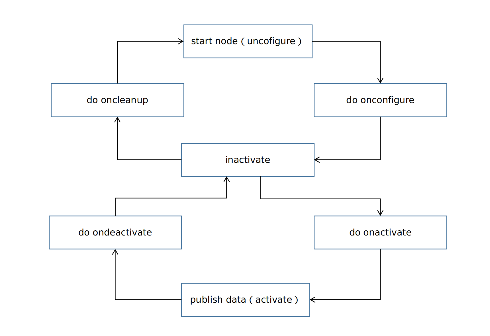

# realsense_camera Intel® RealSense™设备的ros2软件包

## 概述
``realsense-ros`` 将D430i的图像数据和IMU数据通过ros2以话题的形式进行发布
目前支持的librealsense版本为：v2.50.0 (参照[realsense2_camera release notes](https://github.com/IntelRealSense/realsense-ros/releases))。
在realsense-ros源码的基础上增加了开机自检、交替打结构光数据发布、深度图对齐到其他模组、ros2-lifecycle状态机等功能

## /camera/camera节点
 - 作用：为定位建图提供双目和IMU数据，为导航避障功能提供深度数据
 - 发布数据内容
   - 发布左右目数据
   - 发布深度数据
   - 发布IMU数据

### 工作流程



### 节点调用指令
```bash
ros2 launch realsense2_camera on_dog.py
```
### 设置lifecycle状态机
初始化
```bash
ros2 lifecycle set /camera/camera configure
```
数据发布
```bash
ros2 lifecycle set /camera/camera activate
```
停止数据发布
```bash
ros2 lifecycle set /camera/camera deactivate
```
释放内存
```bash
ros2 lifecycle set /camera/camera cleanup
```

### 发布的话题
- ``/camera/depth/camera_info``：深度图默认标定值
- ``/camera/depth/image_rect_raw``：深度图数据
- ``/camera/depth/metadata``：深度图元数据
- ``/camera/imu``：imu数据
- ``/camera/infra1/camera_info``：左目默认标定值
- ``/camera/infra1/image_rect_raw ``：左目数据
- ``/camera/infra1/metadata``：左目元数据
- ``/camera/infra2/camera_info``：右目默认标定值
- ``/camera/infra2/image_rect_raw``：右目数据
- ``/camera/infra2/metadata``：右目元数据

### 启动文件说明
- 启动文件位置： ``/opt/ros2/cyberdog/share/realsense2_camera/launch/on_dog.py``
- 重要参数说明：
  - ``serial_no``：启动给定设备号的RealSense设备，如果没有赋值，默认为检测到的的一个RealSense设备
  - ``usb_port_id``：启动给定的USB端口号的设备，默认情况下忽略设备端口号
  - ``device_type``：启动给定device_type模式的设备。
  - ``depth_module.profile``：深度图的尺寸和帧率
  - ``enable_depth``：是否生成深度图
  - ``enable_infra1``：是否发布左目图像
  - ``enable_infra1``：是否发布右目图像
  - ``gyro_fps``：陀螺仪发布频率
  - ``accel_fps``：加速度计发布频率
  - ``enable_gyro``：陀螺仪信息是否发布
  - ``enable_accel``：加速度计信息是否发布
  - ``enable_sync``：数据是否同步，默认开启
  - ``depth_module.emitter_enabled``：是否开启结构光，``1``开启，``0``关闭
  - ``depth_module.emitter_on_off``：是否开启交替打结构光模式
  - ``rosbag_filename``：通过ros2 bag发布话题
  - ``initial_reset``：有时设备未被正确关闭，由于固件问题需要重置。
  - ``wait_for_device_timeout``：当没有检测到指定的设备时，需要等待的时间
  - ``reconnect_timeout``：当驱动检测不到USB设备时，需要等待多久后重新连接


## /camera/camera_align节点
 - 作用：将realsense的深度信息对齐到AI相机模组，为视觉跟随功能提供深度信息
 - 发布数据内容
   - 发布左右目数据（可选）
   - 发布深度数据
   - 发布IMU数据
   - 发布对齐到AI相机的深度数据

### align算法框架


align算法输入为realsense的深度图和AI相机的彩色图，输出为对齐到AI相机的深度图


### 工作流程


### 节点调用指令
```bash
ros2 launch realsense2_camera realsense_align_node.launch.py
```
### 设置lifecycle状态机
初始化
```bash
ros2 lifecycle set /camera/camera_align configure
```
数据发布
```bash
ros2 lifecycle set /camera/camera_align activate
```
停止数据发布
```bash
ros2 lifecycle set /camera/camera_align deactivate
```
释放内存
```bash
ros2 lifecycle set /camera/camera_align cleanup
```

### 发布的话题
- ``/camera/depth/camera_info``：深度图默认标定值
- ``/camera/depth/image_rect_raw``：深度图数据
- ``/camera/aligned_depth_to_extcolor/image_raw``：align后的深度图
- ``/camera/depth/metadata``：深度图元数据
- ``/camera/imu``：imu数据
- ``/camera/infra1/camera_info``：左目默认标定值
- ``/camera/infra1/image_rect_raw ``：左目数据
- ``/camera/infra1/metadata``：左目元数据
- ``/camera/infra2/camera_info``：右目默认标定值
- ``/camera/infra2/image_rect_raw``：右目数据
- ``/camera/infra2/metadata``：右目元数据

### 启动文件说明
- 启动文件位置： ``opt/ros2/cyberdog/share/realsense2_camera/launch/realsense_align_node.launch.py``
- 重要参数说明：
  - ``align_config_file_path``：align算法的相关参数
  - ``serial_no``：启动给定设备号的RealSense设备，如果没有赋值，默认为检测到的的一个RealSense设备
  - ``usb_port_id``：启动给定的USB端口号的设备，默认情况下忽略设备端口号
  - ``device_type``：启动给定device_type模式的设备。
  - ``depth_module.profile``：深度图的尺寸和帧率
  - ``enable_depth``：是否生成深度图
  - ``enable_infra1``：是否发布左目图像
  - ``enable_infra1``：是否发布右目图像
  - ``gyro_fps``：陀螺仪发布频率
  - ``accel_fps``：加速度计发布频率
  - ``enable_gyro``：陀螺仪信息是否发布
  - ``enable_accel``：加速度计信息是否发布
  - ``pointcloud.enable``点云数据是否发布
  - ``enable_sync``：数据是否同步，默认开启
  - ``align_depth.enable``：是否开启align算法将深度图投影到其他模组
  - ``depth_module.emitter_enabled``：是否开启结构光，``1``开启，``0``关闭
  - ``rosbag_filename``：通过ros2 bag发布话题
  - ``initial_reset``：有时设备未被正确关闭，由于固件问题需要重置。
  - ``wait_for_device_timeout``：当没有检测到指定的设备时，需要等待的时间
  - ``reconnect_timeout``：当驱动检测不到USB设备时，需要等待多久后重新连接

## RealSenseActuator节点
- 负责RealSense的开机自检，检测开机状态下RealSense设备是否可用