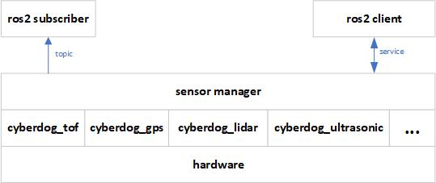

# sensor_manager 

##  概述

``sensor_manager`` 是``cyberdog_tof``、``cyberdog_ultrasonic``、``cyberdog_lidar``等功能模块的管理模块;为各模块提供状态机管理、服务回调、消息发布的能力。

##  软件设计

 

##  功能设计

- 状态机管控各外设模块，如:控制``cyberdog_tof``等模块的“低功耗”和“激活”状态切换；
- 为ros2平台客户端提供与各外设模块的通信和控制的消息通道；如：client可以通过``protocol::srv::SensorOperation``服务控制``cyberdog_tof``的打开和关闭，subscriber通过订阅``sensor_msgs::msg::Range``消息，获取超声传感器状态信息。
