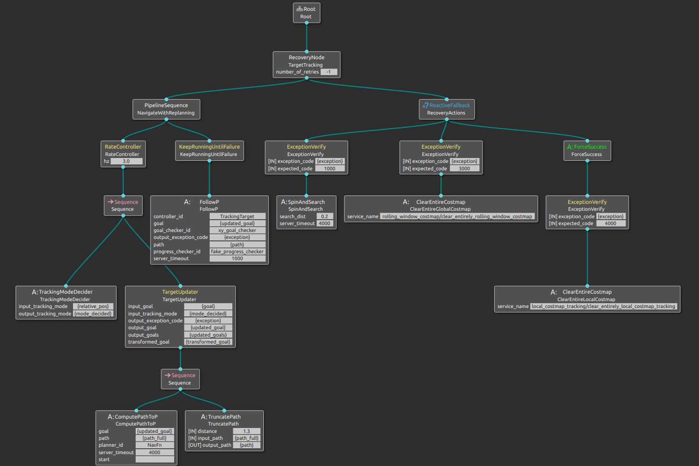

# cyberdog tracking base

## 功能设计

跟随功能的实现主要依托于navigation2已有的资源和设计思想，采用behavior-tree的架构形式进行设计，环境感知方面不需要静态地图输入，以一大一小两个rolling_window方式的costmap配合使用，不存在map坐标系需求，以odom系为根参考系。
当前主体设计如下：


其中包括了navigation2已有的节点，和部分新增节点，来实现上图的功能。所涉及到的节点及设计要点会在下面分别展开；

### BtNavigator

- 目前nav2_bt_navigator实现了两个navigator插件,分别用于导航到指定点,和导航经过指定的点序列,增加一个专用与跟随的navigator插件TargetTrackingNavigator,方便后期前后端的需求改动与调整.
- 定义action类型TargetTracking.action，用作跟随任务的启停及反馈

```
uint8 AUTO = 0 # 自主选择跟随位置
uint8 BEHIND = 1 # 在目标后侧跟随
uint8 LEFT = 2 # 在目标的左侧跟随
uint8 RIGHT = 3 # 在目标的右侧跟随
uint8 relative_pos # 相对方位，以上方定义的枚举值指定
float32 keep_distance # 与跟随目标所保持的距离
string behavior_tree # 行为树的名字（预留）
---
std_msgs/Empty result # 结果（预留)
---
float32 current_distance # 当前与目标之间的实际距离
builtin_interfaces/Duration tracking_time # 跟随当前目标总计时间
int16 number_of_recoveries # 经历过异常自恢复的次数
int16 exception_code # 异常码(预留)
```

### TrackingModeDecider

- 输入为当前任务中的跟随相对位置字段：自动,后方,左侧,右侧.
- 若输入跟随模式为自动模式时,需要以一定的算法进行决策具体后,左,右哪个方位更加合适
- 输出，若后,左,右明确,则直接透传输出,若为自动,则按照模式决策算法决策得出输出方位

### TargetUpdater

- 输入是外部检测得到的目标点坐标(tracking_pose),其参考系为base_link
名字：   /tracking_pose
类型：   geometry_msgs::msg::PoseStamped
频率：   > 5Hz
- 输入是跟随模式,该模式决定了如何将tracking_pose进行坐标变换（左侧，后放，右侧）
- 输出是tracking_pose转换到odom坐标系得到(tracking_pose_odom_based)
- 负责目标管理：
  - 需要判定转换后的坐标是否合法,非法应该抛出对应的异常,并进入到异常恢复逻辑中
  - 过滤无效点位,防止原地自旋时,反复画弧的现象
  - 增加一个CostmapTopicCollisionChecker用于合法点位过滤  

### Planner

根据当前目标的位置，及时调整参考路线，引导机器人运动到目标附近指定位置

### Controller

2D环境采用DWB算法作为跟随任务的控制器。

### Costmap

实现代价图抠图功能，其负责将机器人感知到的目标障碍不再标记为障碍物，最大化的保留前行路径上的环境干净无噪声。
costmap属性采用rolling window方式，面积依据运动速度合理设置，只需要障碍物层和膨胀层

### Recovery

通过RecoveryNode节点，增加了一路恢复行为逻辑，并在black board中提供了一个exception code，同时增加ExceptionVerify节点来过滤有效的Exception code，做到异常码与恢复行为相对应，减少无效恢复逻辑。目前测试阶段配置的恢复行为有SpinAndSearch， Clear Global Costmap, Clear Local Costmap

### ExceptionVerify

- 输入为black board中的Exception code，并与自身所配置的code进行比较。
- 匹配一致，则执行该分支下的恢复行为，否则返回失败，继续验证下一个恢复逻辑。

### SpinAndSearch

- 按照目标丢失位置,进行决策丢失方向，然后指定角度方向进行旋转。
- 自旋过程中会关注是否有新的目标消息被接受。
- 若旋转距离完成或者搜索到目标,则完成当次恢复逻辑。

## 接口说明


### 目标位姿
跟随的目标检测有两种模式，一种是视觉识别并融合深度数据所给出的目标位姿，另一种是UWB模块直接给出的相对位置信息。两种方式在前端处理时所采用的数据格式及流转方式各有不同，本着统一跟随接口的目的，所以跟随功能在目标数据输入的格式上，统一要求为topic:
方式：                  topic
类型:                     geometry_msgs/msg/PoseStamped
名字:                    /tracking_pose
频率:                    不低于5hz
如下为geometry_msgs/msg/PoseStamped类型的展开，为ROS标准格式，所以省略不必要的字段解释。

```
# A Pose with reference coordinate frame and timestamp

std_msgs/Header header
        builtin_interfaces/Time stamp
                int32 sec
                uint32 nanosec
        string frame_id
Pose pose
        Point position
                float64 x
                float64 y
                float64 z
        Quaternion orientation
                float64 x 0
                float64 y 0
                float64 z 0
                float64 w 1
```

### 任务下发
跟随任务的启停以action server的方式进行管理，在跟随功能内部集成一个action server，对外提供任务的开启，停止，状态反馈等接口，其中开启任务使用action的send_goal接口，停止跟随使用action的cancel_goal接口，状态获取可通过feed_back接口。
具体描述如下：
方式：    action
类型：    mcr_msgs/action/TargetTracking
名字：   /tracking_target
如下为mcr_msgs/action/TargetTracking类型的展开，为mcr_msgs包内的自定义类型，具体字段及其释义为：
```
uint8 AUTO = 0 # 自主选择跟随位置
uint8 BEHIND = 1 # 在目标后侧跟随
uint8 LEFT = 2 # 在目标的左侧跟随
uint8 RIGHT = 3 # 在目标的右侧跟随
uint8 relative_pos # 相对方位，以上方定义的枚举值指定
float32 keep_distance # 与跟随目标所保持的距离
string behavior_tree # 行为树的名字（预留）
---
std_msgs/Empty result # 结果（预留)
---
float32 current_distance # 当前与目标之间的实际距离
builtin_interfaces/Duration tracking_time # 跟随当前目标总计时间
int16 number_of_recoveries # 经历过异常自恢复的次数
int16 exception_code # 异常码,具体代码含义会在下面进行展开

```


命令行触发跟随方式:

```
ros2 action send_goal /tracking_target mcr_msgs/action/TargetTracking "{relative_pos: 1}" --feedback
```

### 运动指令

/cmd_vel, 标准ros数据格式geometry_msgs/msg/Twist，为下游执行机构的输入，以驱动机器人移动。
该指令格式，与运动控制的消息有所区别，所以在该指令与运控具体执行的指令之间会有一层隔离翻译（velocity_adapter），用以翻译成运控所能接受的数据格式。

### 里程计

/odom_out，标准的ros数据格式nav_msgs/msg/Odometry，用于控制规划器的数据源及状态反馈。
