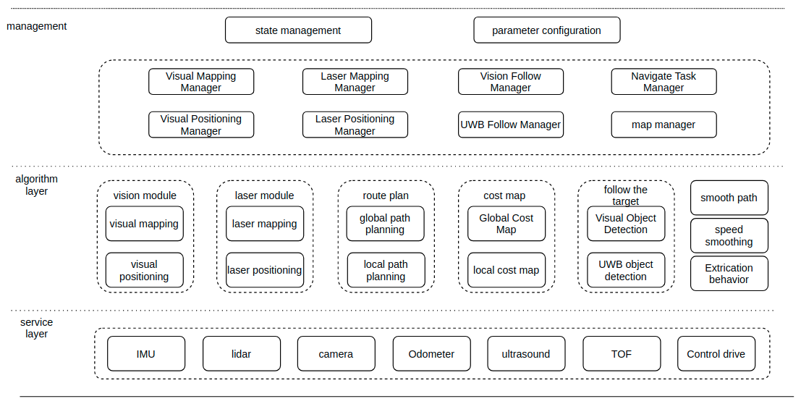
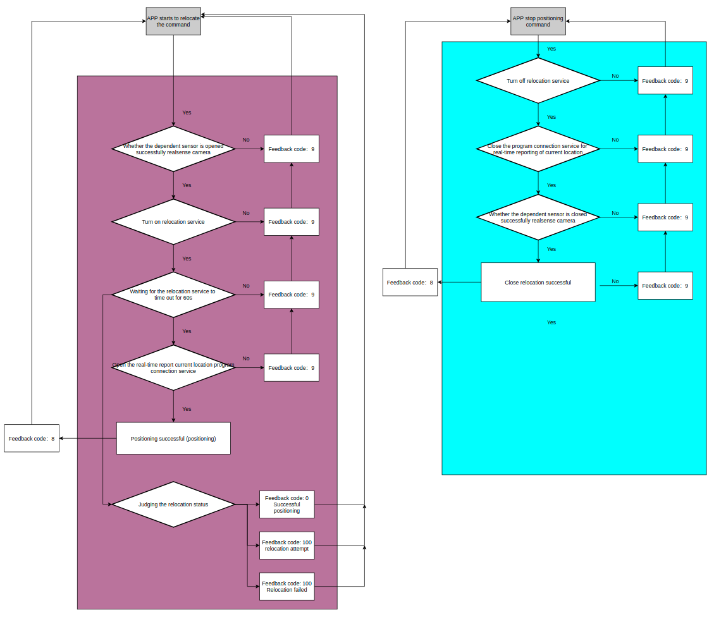
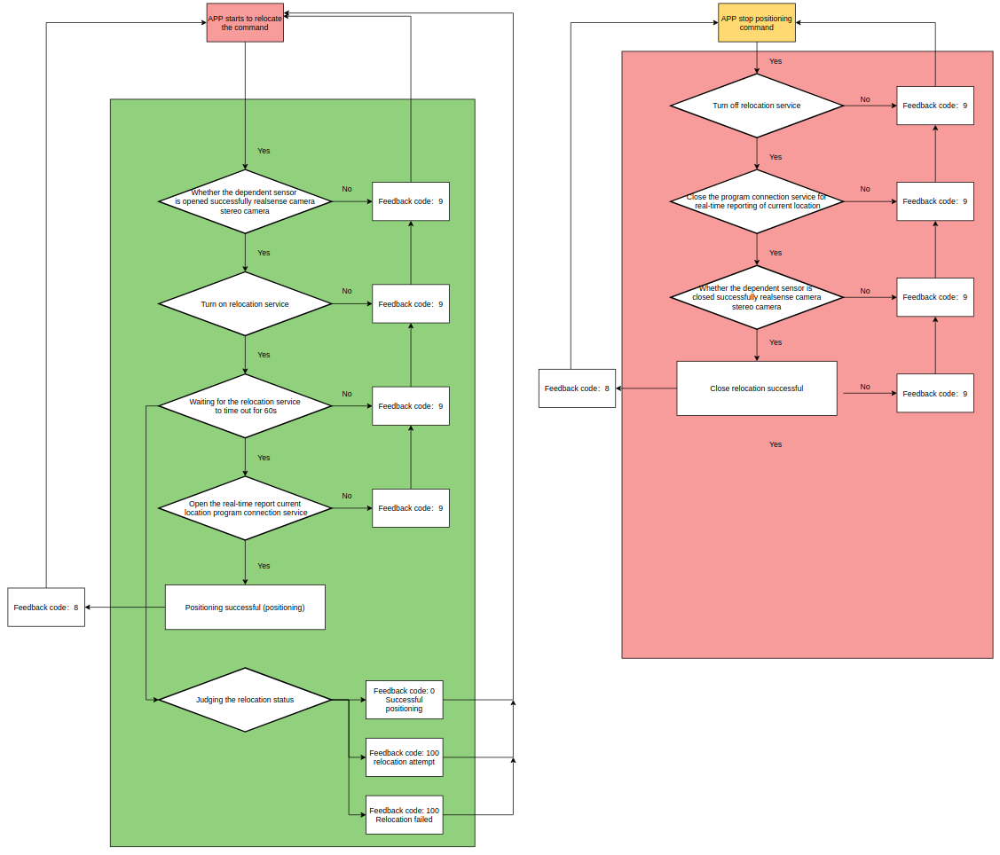
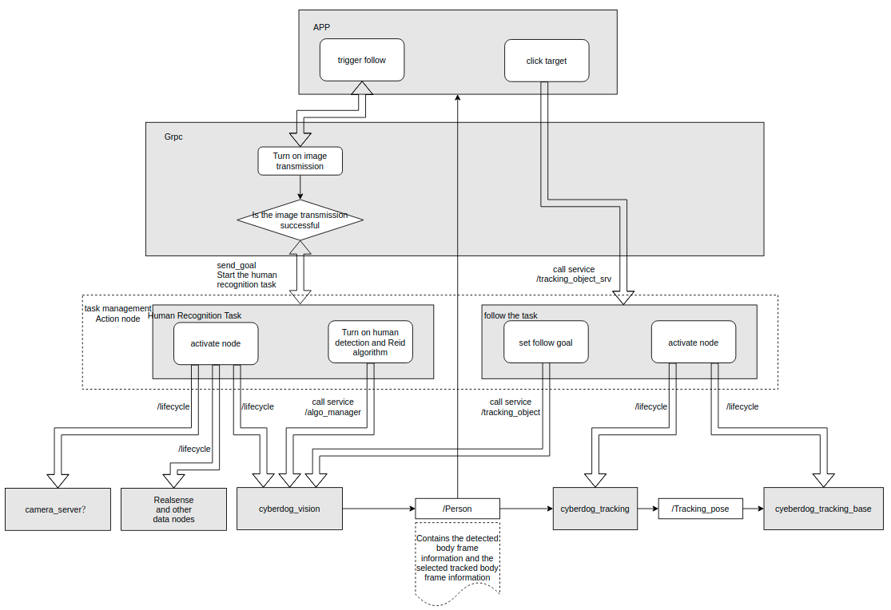
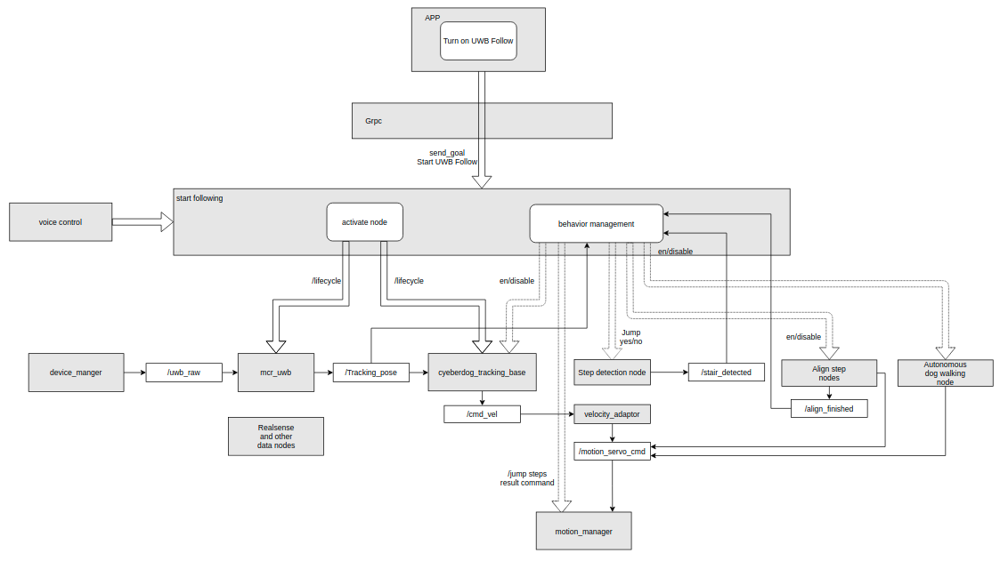

# Algorithm Task Management Design Document
## Overview
The algorithm task management module is a centralized management module for task instructions related to autonomous walking capabilities in the system. It includes algorithm tasks such as mapping, localization, navigation, and tracking. This module makes decisions on user task instructions based on the system's overall state machine, task execution status, and manages hardware and software resources in the system according to the determined task type.
## Module architecture

### Description of the structure

- The interface is provided in the form of ros action.

- The task state is managed on an exclusive basis, i.e. if there is a task currently being executed, a new task instruction will return the reject state. Also a stop task instruction must correspond to the current task state, otherwise it will return a stop failure, e.g. if the caller issues a stop navigation instruction when executing a map building task, it will return a failure state. 

- The algorithm tasks contain visual build, visual localisation, laser build, laser localisation, AB point navigation, visual follow, and UWB follow tasks. The algorithm management is responsible for starting the relevant dependency nodes, requesting the relevant services and closing the relevant dependency nodes and shutting down the relevant services at the same time as the task is stopped.

## Task management process

### 1 Laser mapping

step:

- step 1： Judging the build mode

- step 2： Turn on the realsense sensor

- step 3： Notify the build process to start building a map

- step 4： Determine if the robot's current position is reported in real time

- step 5： Start building a map

### 2 Visual mapping

step:

- step 1： Judging the build mode

- step 2： Turn on realsense sensors, binocular sensors

- step 3： Notify the build process to start building a map

- step 4： Determine if the robot's current position is reported in real time

- step 5： Start building a map

### 3 Laser repositioning

step:

- step 1： Judging to open the realsense sensor

- step 2： Notify the relocation server to start the relocation function

- step 3： Whether the waiting result is timed out, exit the positioning directly after timeout, otherwise wait for the positioning result

- step 4： Judge relocation status, 0 success, 100 retry and 1200 failure

- step 5： Successful positioning

### 4 Visual repositioning

step:

- step 1： Judging to open the realsense sensor and binocular sensor

- step 2： Notify the relocation server to start the relocation function

- step 3： Whether the waiting result is timed out, exit the positioning directly after timeout, otherwise wait for the positioning result

- step 4： Judge relocation status, 0 success, 100 retry and 1200 failure

- step 5： Successful positioning

### 5 AB point navigation

step:

- step 1： Judgment to open bt_navigator

- step 2： Accept the position of navigation point B and judge the validity of the navigation point

- step 3： send start ab navigation

- step 4： Report navigation status in real time

- step 5： Navigate successfully

### 6 Visual Following

Visual Flow Chart

- The visual follow function consists of two stages: the first stage is the activation of the visual follow function and the start of human recognition; the second stage consists of the user selecting the target to be followed and the robot starting to follow automatically.

- In the first phase the interface to the top is an action server, where the GRPC issues a visual follow start command; when a request is received to start visual follow, the management module manages the lifecycle of the realsense and cyberdog_vision modules, configures and activates the corresponding modules; the human recognition algorithm is then activated (by a service client request).

- Then wait for the user to select the target to be followed.

- The second stage of the interface is a service server, which sends the roi of the following target via GRPC; the service server transmits the roi information and forwards it directly to the visual following module (through a service client request to start the service); afterwards the cyberdog_tracking and cyberdog_tracking_base modules are managed for the lifecycle, configured and activated respectively; the automatic following is realised.

### 7 UWB following

uwb follow flow chart

- The uwb follow function first requires the user to have paired the Bluetooth remote control (which sends uwb data) in the APP, otherwise it will prompt an uwb data exception at startup.

- The start-up process is similar to the visual following process, including the opening of resources and the activation of dependent nodes associated with the start-up, with the difference that the user is not required to tap the target to follow.

- In uwb following, the dog can exhibit autonomous behaviour when following a target at rest, and the relevant behavioural manifestations include the execution of specified actions, the broadcast of speech, and changes in the light band effect.

- Steps on the following path can be detected in following, and upon detection of a step, the dog can achieve a step-jumping action and resume the following gait after jumping on the step.