# <center>connector design document</center>

## 1. Overview
The bionic robot quickly connects to the network and the target device (hereinafter referred to as fast connection) mainly has the following characteristics:
1. The bionic robot is in a WiFi environment;
    * WiFi can be a third-party routed WiFi;
    * WiFi can also be a hotspot placed outside the device where the APP is located.
2. The device where the App is located has been connected to the target WiFi;
3. The app initiates the bionic robot to connect to the target WiFi;
4. After the bionic robot successfully connects to the target WiFi, it connects to the device where the target APP is located;
5. Finally, quickly establish a connection with the target WiFi and device.

## 2. Design
### 2.1. Feature design

There are two main quick connection functions:
1. Distribution network function: realize the switch by long pressing the touch;
2. Automatic connection: realized through the system's own reconnection mechanism.

### 2.2 Technology architecture

<center>



</center>

As shown in the figure above, the composition of the bionic robot fast connection network and target device architecture and the main functions of each component are as follows:
1. touch: Provide the robot head touch signal.
2. LED: Provides the function of displaying the lighting effects on the robot's head and body.
3. audio: Provide robot voice broadcast function.
4. camera: Provide image data within the field of view.
5. QRreader: Provides QR code recognition function.
6. WiFi: Provides the target WiFi connection function of the linux system.
7. App: Provides the function of generating QR codes carrying WiFi information.

## 3. Manual networking
### 3.1 Internet and APP
```
ros2 service call /`ros2 node list | grep "mi_" | head -n 1 | cut -f 2 -d "/"`/connect protocol/srv/Connector "{wifi_name: 'wifi_name',wifi_password: 'wifi_password',provider_ip: 'app_ip'}"
```
### 3.2 Internet only
```
sudo nmcli dev wifi connect <wifi_name> password <wifi_password> ifname wlan0
```
### 3.3 other operations
```
# View the list of connected WiFi
nmcli connection | grep wifi
# Delete the specified WiFi connection in the connected WiFi list
sudo nmcli connection delete 'ssid' 或者 'uuid'
```
