# Audio Design Document

## Version

| Author | change                                           | version | date       |
| ------ | ------------------------------------------------ | ------- | ---------- |
| KaiLiu | Sort out the overall framework of cyberdog_audio | 1.0     | 2023.05.21 |

## Overview

cyberdog_audio is voice service transfer station between nx and r329. For example, specific requests for playing offline or online voices can be forwarded through cyberdog_audio.

## Design

### Frames

### Business Data Flow



### Module Function

Design of the cyberdog_audio module

1. Implementation of bidirectional service and topic encapsulation based on LCM communication, involving four classes：LcmAtocTopic、LcmCtoaTopic、LcmCtoaService、LcmAtocService。
   - LcmAtoCTopic is an encapsulation class for handling LCM messages sent from R329 to NX.
   - LcmCtoaTopic is an encapsulation class for handling LCM messages sent from NX to R329.
   - LcmCtoAService encapsulates the LCM wrapper class for NX's request to R329 service. NX acts as the client, while R329 acts as the server.
   - LcmAtocService encapsulates the LCM wrapper class for R329's request to NX service. R329 acts as the client, while NX acts as the server.
2. Implementation of Business Functions
   - Heartbeat Maintenance
   - ```Bash
     The NX sends a heartbeat request to R329 at a rate of 1 time per second to confirm its status. If the heartbeat is abnormal, an exception log will be printed.
     ```

   - Synchronization of Authentication Information
   - ```Bash
     (1) When the App connects to the dog, it will pass the account's token information to the NX side, which will then synchronize it to the R329 side.
     (2) The App initiates the transmission of the token to the NX side's GRPC node. The GRPC node invokes the service of cyberdog_audio to internally synchronize the token to the R329 side.
     (3) Upon receiving the token information, the R329 side caches it locally. It uses this token to access the Xiaoai cloud services.
     ```

   - Offline/Online Voice Playback
   - ```Bash
     (1) The voice node provides two methods for offline/online voice playback: topic and service.
     (2) Offline voice refers to pre-stored voice files on the NX or R329 side, identified by an ID to specify the specific offline voice file to play. You can refer to the constants for offline voice IDs defined in 'bridge/protocol/ros/msg/AudioPlay.msg' and the associated playback text content of the offline voice file.
     (3) Online voice, also known as TTS (text to speech), involves converting text into speech for playback. It requires the NX side to have internet access capabilities.
     ```

   - Implementation of Control Domain Actions
   - ```Bash
     (1) Control domain specifically refers to the capability configured on the Xiaoi service side to return control commands.
     (2) After receiving the token, R329 registers the ability to access Xiaoi cloud services. This allows it to receive message notifications for controlling the control domain from the Xiaoi cloud.
     (3) After waking up the dog by saying 'Tiedan Tiedan', you can command it to perform various actions such as 'Step back X steps', 'Spin in place', 'Give me a paw', 'Come here', 'Shake hands', 'Sit down', 'Jump', 'Wag its tail', 'Nod its head', 'Shake its head', 'Bow', 'Ballet dance', and 'Moonwalk'. The dog will respond by performing the corresponding action.
     ```

   - Volume Setting Retrieval and Microphone Enable/Disable
   - ```Bash
     (1) Provides a volume setting service. For example, to set the volume to 50, use the command: ros2 service call /ros2 node list | grep "mi_" | head -n 1 | cut -f 2 -d "/"/audio_volume_set protocol/srv/AudioVolumeSet "{volume: 50}"
     (2) Provides a volume retrieval service. For example, to retrieve the current volume value, use the command: ros2 service call /ros2 node list | grep "mi_" | head -n 1 | cut -f 2 -d "/"/audio_volume_get protocol/srv/AudioVolumeGet
     (3) Provides a microphone enable/disable service. When the microphone is disabled, it stops capturing audio, and the Tiedan wake-up command will not work.
     ```

   - Nickname Setting, Voiceprint Recording, and Voiceprint Recognition
   - ```Bash
     (1) The default nickname for the dog is 'Tiedan'. In the App, you can set a new nickname for the dog, for example, 'Wangcai'. The new nickname should be three characters or less. When waking up the dog, you need to say the nickname twice to activate the wake-up. If the new nickname is longer than three characters, saying the nickname once is enough to wake up the dog. However, please note that changing the dog's nickname may increase the chance of false wake-ups.
     (2) The App provides an entry to record voiceprints, which are associated with specific owner information. When recording a voiceprint, it triggers the voiceprint recording process. After successfully recording the voiceprint, when you say 'Tiedan Tiedan' to wake up the dog, it will perform voiceprint recognition. Then you can ask it, 'Who am I?' and it will answer with your name.
     ```

   - Dog Information Reporting
   - ```Bash
     (1) Dog information primarily includes the dog's nickname, activation date, and weight.
     (2) After the dog is first activated, it will report its information to the cloud. As the dog grows, if you ask it how old it is, it will provide a specific answer.
     ```