# Cyerdog_bluetooth Design

## Overview

Cyberdog_bluetooth is a ROS node through which you can control BLE peripherals. It uses bluepy library to create a BLE central, connect to BLE peripherals, write data to specified characteristics, etc. As a ROS node, it provides interfaces such as scanning, connecting to remote controller, acquiring device info, publishing joystick data, activating UWB tracking tasks, etc.

## System Structure

### Overall Structure

1. cyberdog_bluetooth: Connects BLE peripherals, publishes data and subscribes commands to init, activate and stop UWB device.

2. cyberdog_uwb: Is called by device_manager, to generate UWB session_id for both master and slave devices, and to produce UWB data of distance and angle.

3. cyberdog_grpc: Transmits commands from APP to cyberdog_bluetooth node.

4. APP: Sending bluetooth commands to cyberdog.

5. remote controller: Containing a BLE periferal and a UWB tag, is used for remote controlling and UWB tag tracking.

6. UWB device for charging docker: For localization.

### Cyberdog_bluetooth Structure

1. Bluetooth Core: Operates BLE devices through bluepy library.

2. DFU modual: Uses Bluetooth Core to make a firmware update process.

3. UWB tracking modual: Uses ROS interfaces to activate and stop UWB tracking task. Provides activation, termination and checking interface.

4. ROS interface: Uses Bluetooth Core operating BLE devices to impletemt provided ROS interfaces.

## Operation Process

### Scan Process

1. APP sends scan command through gRPC.

2. cyberdog_grpc receives command and calls "scan_bluetooth_device" ROS service.

3. cyberdog_bluetooth receives request and uses bluepy to scan BLE peripherals and sends result list as service response.

4. cyberdog_grpc receives response and sends it to APP.

5. APP receives BLE peripheral list and diaplays them.

### Connection Process

1. APP sends connection command with peripheral mac through gRPC.

2. cyberdog_grpc receives command and calls "connect_bluetooth_devices" ROS service.

3. cyberdog_bluetooth receives request and uses bluepy to connect specified BLE peripheral.

4. cyberdog_bluetooth reads device type and firmware version info from the BLE peripheral connected.

5. According to the device type, cyberdog_bluetooth turns on notification and registers callback functions for uart, battery level and joystick data.

6. cyberdog_bluetooth calls "get_uwb_mac_session_id" ROS service.

7. cyberdog_uwb receives request and generates session id and mac for UWB connection and sends response.

8. cyberdog_bluetooth receives service response, sends session id and mac to BLE peripheral connected and waits for its response.

9. BLE peripheral activates UWB device and sends response back to cyberdog_bluetooth.

10. cyberdog_bluetooth completes the process and sends service response to cyberdog_grpc.

11. cyberdog_grpc receives response and sends it to APP.

12. APP receives response and updates the connection status.

### Disconnection Process

1. APP sends connection command without peripheral mac through gRPC.

2. cyberdog_grpc receives command and calls "connect_bluetooth_devices" ROS service.

3. cyberdog_bluetooth receives request and using bluepy to send disconnect UWB command to current connected BLE peripheral.

4. BLE peripheral deactivate UWB device and sends response back to cyberdog_bluetooth.

5. cyberdog_bluetooth remove callback functions and disconnect BLE peripheral.

6. cyberdog_bluetooth completes the process and sends service response to cyberdog_grpc.

7. cyberdog_grpc receives response and sends it to APP.

8. APP receives response and updates the connection status.