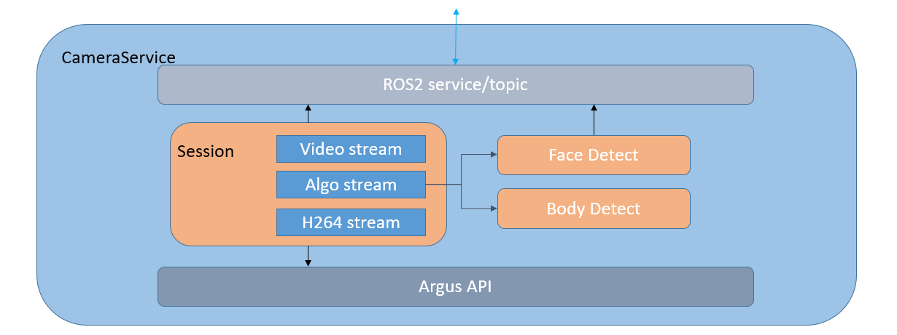

# Introduction
This is a camera program running on Xiaomi CyberDog, based on Nvidia [Argus](https://docs.nvidia.com/jetson/l4t-multimedia/group__LibargusAPI.html) and [Ros2](https://www.ros.org/) camera API.

The program uses the interfaces provided by the Argus API to control the MIPI camera hardware and capture images in real-time, and uses the interfaces provided by ROS2 to manage the camera node and provide interaction interfaces for external modules.

The overall architecture of the module is shown below:


The internal description of the module is shown below:


# Compilation
To compile this module, you need to install several external software packages as follows:

## Dependencies
### 1. nvidia-l4t-jetson-multimedia-api
```console
sudo apt-get install nvidia-l4t-jetson-multimedia-api
```
### 2. cuda-toolkit
```console
sudo apt-get install cuda-toolkit-10-2
```
### 3. libavformat-dev
```console                                                                                           
sudo apt-get install libavformat-dev
```
# Test Program
This is a camera test program based on the camera API, which can be used to test whether the camera is working properly, and can also be used as a reference for using the camera API.

## Compilation
```console
colcon build --merge-install --packages-up-to camera_test
```

## Running

### Test program, used to test whether the camera is capturing images properly
```console
./build/camera_test/camera_test cam_id width height rgb/bgr
```
For example, to test camera 0 with a resolution of 640x480 and RGB output, use the following command:
./build/camera_test/camera_test 0 640 480 rgb

### Main camera service program, which can perform commands such as taking pictures and recording videos.
```console
ros2 run camera_test camera_server
```
Command for taking pictures:
```console
ros2 service call /camera_service protocol/srv/CameraService "{command: 1, args: ''}"
```

Command for recording videos:
```console
//Start
$ ros2 service call /camera_service protocol/srv/CameraService "{command: 2, args: ''}"
//Stop
$ ros2 service call /camera_service protocol/srv/CameraService "{command: 3, args: ''}"
```

### ROS2 program for stereo/RGB cameras
```console
ros2 run camera_test stereo_camera
//configure
ros2 lifecycle set /stereo_camera configure
//activate
ros2 lifecycle set /stereo_camera activate

ros2 lifecycle set /stereo_camera deactivate

ros2 lifecycle set /camera/camera cleanup
```
After running, the stereo camera and RGB camera will publish images through the /image_left, /image_right, and /image_rgb topics.
