# cyberdog_common Design Document

## Version

| Author | change                             | version | date       |
| ------ | ---------------------------------- | ------- | ---------- |
| KaiLiu | Sort out cyberdog_common functions | 1.0     | 2023.05.22 |

## Overview

cyberdog_common encapsulates log, json, toml, lcm, fds, message queue, and semaphore, which can be referenced in other businesses.

## Design

### Frames

### Function

- CyberdogLogger encapsulates ros rcl logger, simplifies and enriches the macro definition of log output interface

- CyberdogToml encapsulates toml operations and also includes file storage

- CyberdogJson encapsulates json operations, including string conversion and file storage

- LcmClient、LcmServer are cs packages for the sending and receiving of lcm

- CyberdogFDS is an encapsulation of fds functions, mainly to pull files from fds servers

- Semaphore is a condition_variable semaphore encapsulation class

- MsgDeque is a two-way column encapsulation, and the message is blocked out of the queue