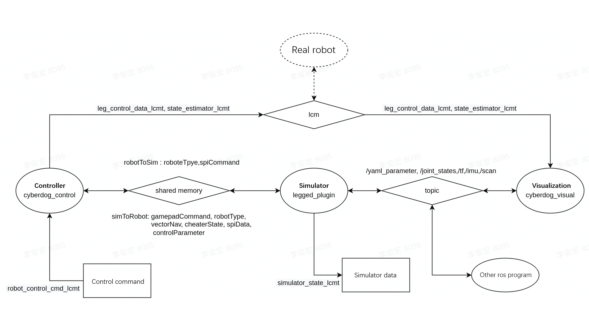
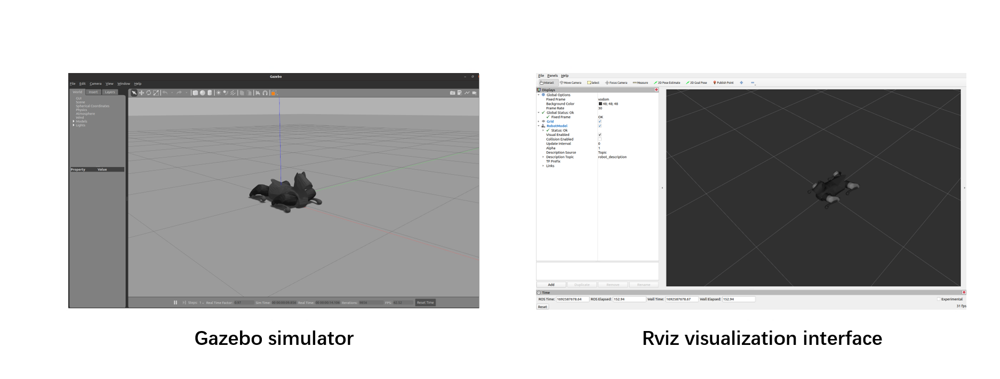
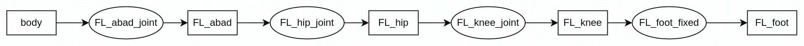
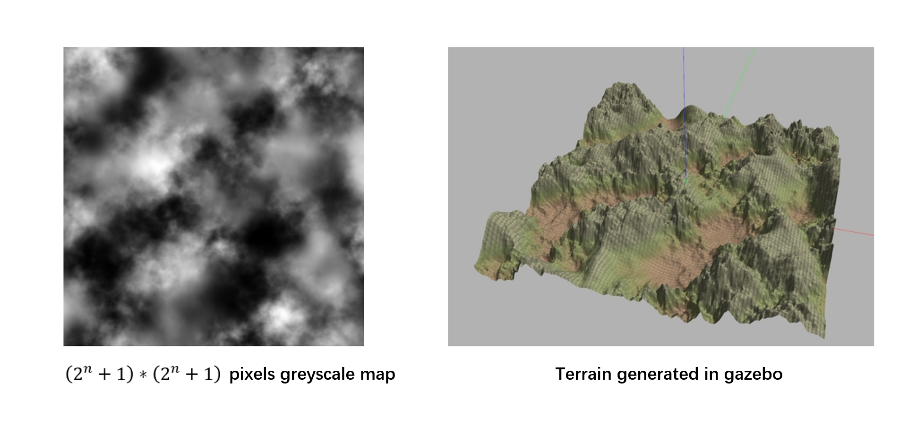

## Gazebo simulation platform
### 1. Introduction
Gazebo simulation platform provide an environment for the communication of two main programs, gazebo simulator and cyberdog controller. Data of all the joints and sensors is converted and sent as ros2 topic.
#### 1.1 Comunication frames
The simulation platform contains of three program: cyberdog controller “cyberdog_control”, gazebo simulator “legged_plugins” and ros2 visualization interface “cyberdog_visual”. The communication of each program are shown in the graphic below. 
 
 
- The cyberdog controller and gazebo simulator communicate through shared memory. The host shared memory created by gazebo simulator, and the control program communicates with it by attaching to the host memory. The content of communication is robotToSim/simToRobot.
- The visualization interface accepts motor and odometer signals from the controller through lcm and publish them as ros2 topic “/joint_states” and “/tf”.
  - The value of the robotparamter and userparameter in the yaml file can be changed by sending topic /yaml_parameter to gazebo simulator, and simulator forward it to controller.
- The gazebo simulator will send the imu and lidar data in the form of ros2 topic, whose topic names are /imu and /scan.
#### 1.2 Install
Recommand environment： Ubuntu 20.04 + ROS2 Galactic
##### 1.2.1 Dependencies install
The dependencies below should be install: 
**ros2_Galactic**  
```
$ sudo apt update && sudo apt install curl gnupg lsb-release
$ sudo curl -sSL https://raw.githubusercontent.com/ros/rosdistro/master/ros.key -o /usr/share/keyrings/ros-archive-keyring.gpg
$ echo "deb [arch=$(dpkg --print-architecture) signed-by=/usr/share/keyrings/ros-archive-keyring.gpg] http://packages.ros.org/ros2/ubuntu $(source /etc/os-release && echo $UBUNTU_CODENAME) main" | sudo tee /etc/apt/sources.list.d/ros2.list > /dev/null
$ sudo apt update
$ sudo apt install ros-galactic-desktop
```
**Gazebo**
```
$ curl -sSL http://get.gazebosim.org | sh
$ sudo apt install ros-galactic-gazebo-ros
$ sudo apt install ros-galactic-gazebo-msgs
```
**LCM**
```
$ git clone https://github.com/lcm-proj/lcm.git
$ cd lcm
$ mkdir build
$ cd build
$ cmake -DLCM_ENABLE_JAVA=ON ..
$ make
$ sudo make install
```
**Eigen**
```
$ git clone https://github.com/eigenteam/eigen-git-mirror
$ cd eigen-git-mirror
$ mkdir build
$ cd build
$ cmake ..
$ sudo make install
```
**xacro**
```
$ sudo apt install ros-galactic-xacro
```
Notice: Check that there are no yaml-cpp of other version which may conflict to the yaml-cpp of ros galactic. Yaml-cpp with different version may cause simulator cannot reading Yaml file.

##### 1.2.2 Install simulator
After installing all the dependencies, down all the program by  cyberdog_sim.repos.
```
$ vcs import < cyberdog_sim.repos
```
##### 1.2.3 build
BUILD_ROSshould be set to ON in src/cyberdog locomotion/CMakeLists.txt，which is shown in the picture below  
 

Build all the packages in the directory cyberdog_sim/
```
$ source /opt/ros/galactic/setup.bash 
$ colcon build --merge-install --symlink-install --packages-up-to cyberdog_locomotion cyberdog_simulatior
```

#### 1.3 Run
##### 1.3.1 Run all program by script
run all program by script at directory cyberdog_sim/.
```
$ python3 src/cyberdog_simulator/cyberdog_gazebo/script/launchsim.py
```
  
 

##### 1.3.2 Run all program respectively

**Gazebo simulator**  
Run gazebo simulator at first at directory cyberdog_sim/：
```
$ source /opt/ros/galactic/setup.bash
$ source install/setup.bash
$ ros2 launch cyberdog_gazebo gazebo.launch.py
```
The simulator with lidar can also be run at directory cyberdog_sim/:
```
$ source /opt/ros/galactic/setup.bash
$ source install/setup.bash
$ ros2 launch cyberdog_gazebo gazebo.launch.py use_lidar:=true
```
For the problem that the gazebo process cannot be completely killed by ctrl+C, you can use the following script to run gazebo, and the script will automatically kill all gazebo processes after detecting ctrl+C during runtime：
```
$ source /opt/ros/galactic/setup.bash
$ source install/setup.bash
$ chmod +x src/cyberdog_simulator/cyberdog_gazebo/script/gazebolauncher.py
$ python3 src/cyberdog_simulator/cyberdog_gazebo/script/gazebolauncher.py ros2 launch cyberdog_gazebo gazebo.launch.py
```
**Cyberdog controller**  
Then run the cyberdog controller at directory cyberdog_sim/：
```
$ source /opt/ros/galactic/setup.bash
$ source install/setup.bash
$ ros2 launch cyberdog_gazebo cyberdog_control_launch.py
```
**Rviz visualization interface**  
At last run the rviz visualization interface  at directory cyberdog_sim/ ：
```
$ source /opt/ros/galactic/setup.bash
$ source install/setup.bash
$ ros2 launch cyberdog_visual cyberdog_visual.launch.py
```
### 2. Commucation interface
In the simulator, the robot can be controlled by performing lcm communication to the controller. In the simulator, the ros2 topic interface is also provided to control the robot and can send various data of the robot in the simulation through lcm or ROS2 topic.
#### 2.1 controller interface
In the simulator, the high-level interface of the controller can also be used, and commands can be sent to the control program through lcm to control the robot in the simulator. For specific functions and implementation methods, please refer to the content in the motion control module 2. High-level interface of the cyberdog loco document.
#### 2.2 simulator interface
The simulator provides an interface for sending basic control commands through lcm and an interface for modifying robot control program parameters in real time through ROS2 topic. It also provides an interface for applying external force to the robot through ros2 topic. This interface can only be used in simulator. At the same time, various data of the robot in the simulation will be sent in the form of lcm and ROS2 topic.
##### 2.2.1 control robot
The simulator provides the lcm method of gamepad_lcmt to send some basic control commands to the control program. This lcm type imitates the two joysticks in the APP that control the direction of the robot. Its structure is as follows：
```
/** lcm channel information
- url: "udpm://239.255.76.67:7667?ttl=255"
- channel: "gamepad_lcmt"
*/

/** lcm data struct */
struct gamepad_lcmt {
    int32_t leftBumper, 
    int32_t rightBumper,
    int32_t leftTriggerButton,
    int32_t rightTriggerButton,
    int32_t back,
    int32_t start,
    int32_t a, //switch to pure damp mode
    int32_t b, //switch to recoverystand mode
    int32_t x, //switch to QP stand mode (with small kp kd)
    int32_t y, //switch to locomotion mode
    int32_t leftStickButton,
    int32_t rightStickButton,
    float leftTriggerAnalog,
    float rightTriggerAnalog,
    float leftStickAnalog[2], //control speed at x,y direction of robot
    float rightStickAnalog[2]， //control speed at pitch, yaw direction of robot
}
```

ROS2 topic /yaml_parameter is provided in the simulator to control the robot in the simulation. The topic structure is as follows
YamlParam.msg
```
uint64 DOUBLE = 1
uint64 S64 = 2
uint64 VEC_X_DOUBLE = 3

string name
uint64 kind
int64 s64_value
float64 double_value
float64[12] vecxd_value
int64 is_user
```
This topic can perform real-time debugging on any parameters in the cyberdog2-ctrl-user-parameters.yaml and cyberdog2-defaults.yaml files in the control program directory cyberdog_locomotion/common/config  
where name is the name of parameters，kind is the type of parameters' value，include 'double'，'int64_t'，and 'vector&lt;double&gt;'。s64_value, double_value, vecxd_value corresponding to the value to be modified for each type. is_user is set to selcet yaml file of parameters. When is_user is 0, program will find the parameter in cyberdog2-defaults.yaml ，otherwise program find the parameter in file cyberdog-mini-ctrl-user-parameters.yaml.

##### 2.2.2 Apply external force
Through ROS2 topic /apply_force, any force can be applied to any position of any component of the robot in the simulation and lasts for any time. Its structure is as follows:
ApplyForce.msg
```
string link_name
float64 time
float64[3] force
float64[3] rel_pos
```
Where，link_name is the name of the link which force apply to; time is the last time of force; force is a [x,y,z] vector of force in world cooradinate; relative pos is the applying position relative to the link local coordinates. 

##### 2.2.3 Log robot data
In the simulator, the robot data will be sent externally in the form of lcm and ROS2 topic, and you can choose the way to capture data according to your own needs.  
  
**Log lcm data**  
For lcm data, you can use the lcm-logger that comes with lcm to capture data, and then thrid part library log2smat can be use to convert the captured data into a mat file of matlab. The specific usage method is as follows：
```
$ cd cyberdog_locomotion/script
$ ./make_types.sh      #run this script to genrate the lcm type file before first time use
$ lcm-logger           #qiut the logger by Crtl+C, the log file will be genrated automatically.
$ ./launch_lcm_spy.sh  #this script can be run to display lcm data in the real time
```
The struct of lcm data 'simulator_state' is  as follow:
simulator_lcmt.lcm  
```cpp
struct simulator_lcmt {
   double vb[3];     //speed at xyz direction in body coordinate
   double rpy[3];    //roll pitch yaw of body

   int64_t timesteps;  //real time stamp of lcm
   double  time;       //
   double quat[4];     //quaternion of body orientation 
   double R[9];        //rotation matrix of body orientation
   double omegab[3];   //angular velocity in body coordinate system
   double omega[3];    //angular velocity of body
   double p[3];        //body position
   double v[3];        //body velocity
   double vbd[3];      //body acceleration
   double q[12];       //joint position
   double qd[12];      //joint velocity
   double qdd[12];     //joint acceleration
   double tau[12];     //joint output torque
   double tauAct[12];  
   double f_foot[12];  //xyz direction component of foot reaction force 
   double p_foot[12];  //xyz coordinate of foot position
}
```
The data not mentioned about coordinates are all in the world coordinate.  
Order of joint related data is FR-abad joint FR-hip joint FR-knee joint FL-abad joint FL-hip joint FL-knee joint RR-abad joint RR-hip joint RR-knee joint RL-abad joint RL-hip joint RL-knee joint.  
Order of foot related data is FR FL RR RL. 

**ROS2 topic data**  
The simulator will send the standard ROS2 topic /tf2 /joint_states /imu.  
more detail：  
[**sensor_msgs**](http://docs.ros.org/en/melodic/api/sensor_msgs/html/index-msg.html)  
[**tf2**](https://docs.ros.org/en/foxy/Tutorials/Intermediate/Tf2/Introduction-To-Tf2.html)

##### 2.2.4 Example
The simulation routine package, cyberdog_example, is provided, which contains two routines : keybroad_commander and cyberdogmsg_sender.  
keybroad_commander demonstrates how to use gampad_lcmt to send basic control commands to the control
keybroad_commander can be run in cyberdog_sim directory as follow：
```
$ source /opt/ros/galactic/setup.bash
$ source install/setup.bash
$ ./build/cyberdog_example/keybroad_commander
```
After running program, robot in simulator can be control by input the command as follow in the terminal.
|Key|Command|Key|Command|
| ------ | ------ | ------ | ------ |
|w|The speed in the x direction is increased by 0.1 times the maximum speed|i|The speed in the pitch direction is increased by 0.1 times the maximum speed|
|s|The speed in the x direction is decreased by 0.1 times the maximum speed|k|The speed in the pitch direction is decreased by 0.1 times the maximum speed|
|d|The speed in the y direction is increased by 0.1 times the maximum speed|l|The speed in the yaw direction is increased by 0.1 times the maximum speed|
|a|The speed in the y direction is decreased by 0.1 times the maximum speed|j|The speed in the yaw direction is decreased by 0.1 times the maximum speed|
|e|Siwtch to QP stand mode (with small kp kd)|t|Switch pure damp mode|
|r|Siwtch to QP locomotion mode|y|switch recovery stand mode|

Cyberdogmsg_sender demonstrates the use of /yaml_parameter to modify the control parameters in the yaml file in real time, and /apply_force to apply external forces to the robot in the simulation.
Cyberdogmsg_sender can be run in cyberdog_sim directory as follow:
```
$ source /opt/ros/galactic/setup.bash
$ source install/setup.bash
$ ./build/cyberdog_example/cyberdogmsg_sender
```
This routine first sets the parameter use_rc to 0 (when the parameter is 1, it is the remote control mode, otherwise, it can be controlled by the simulation program);  
Then set the control_mode parameter to make the robot stand up and switch to the locomotion mode (the control_mode parameter can refer to the control_flag.h file in the controller program);  
Then apply external force to the left front knee of the robot;
Finally, by modifying the des_roll_pitch_height parameter, the roll angle of the robot becomes 0.2 radians when stepping.

### 3. Simulator Parameter
The parameters that can be adjusted in the use of some simulation platforms will be described below.
#### 3.1 Simulator Parameter
The solver parameters of Gazebo's ode physics engine can be set in the simple.world file under the world folder of the cyberdog_gazebo package.
simple.world
```xml
<?xml version="1.0" ?>
<sdf version="1.5">
    <world name="earth">

        <physics type="ode">
            <max_step_size>0.001</max_step_size>
            <real_time_factor>1</real_time_factor>
            <real_time_update_rate>1000</real_time_update_rate>
            <gravity>0 0 -9.81</gravity>
            <ode>
                <solver>
                <type>world</type>
                <min_step_size>0.0001</min_step_size>   
                <iters>50</iters> 
                <sor>1.3</sor>
                </solver>  
                <constraints>
                <cfm>0.0</cfm>
                <erp>0.2</erp>
                </constraints>  
            </ode>
        </physics>

        <scene>
            
        </scene>

        <!-- A global light source -->
        <include>
            <uri>model://sun</uri>
        </include>

        <!-- A ground plane -->
        <include>
            <uri>model://ground_plane</uri>
        </include>
        
    </world>
</sdf>
```
Important parameter description:
max_step_size: This parameter is the calculation time of simgle simulation step of ode, which affects the accuracy of simulation results, and it is not recommended to modify it.
real_time_update_rate: This parameter is the frequency of the ode, which is set to 1000Hz here.
type: This parameter can be set to "world" or "quick". In the "world" mode, the ode solution is more accurate but the calculation speed is slower, which will affect the real-time rate; while the "quick" mode will iterate a certain number of steps to approach the solution, and the accuracy is relatively Lower but faster to compute.

#### 3.2 Robot model
The robot model  are stored in the cyberdog_robot package, the mesh model is stored in the mesh folder, and the dynamics model file of the robot is stored in the xacro folder. The xacro file will be read by gazebo as urdf at ros2 launch, and the robot model will be generated in the simulator.
For urdf related documents, please refer to [**Official urdf documentation**](https://docs.ros.org/en/foxy/Tutorials/Intermediate/URDF/URDF-Main.html)  
The joint coordinate system and zero position of the robot model are shown in the figure below.  
 


In the simulation, the four legs of the robot are named FR, FL, RR, and RL respectively. The following is the name of each joint and component of the left front leg as an example.(squares are link name, circles are joint name)  
 


#### 3.3 terrain settings
The terrain of gazebo can be generated through heightmap, and the heightmap can be drawn by generating a grayscale image with a pixel size of (2^n+1)X(2^n+1). The grayscale image shown below
 
It should be noted that the size of the grayscale image must be (2^n+1)X(2^n+1) (such as 513X513), otherwise gazebo cannot read it.

**Description of terrain generation method**
Place the terrain image file in the directory media/materials/textures to generate terrain, and change the address in the hightmap.world file in the world/ folder to the address of the corresponding file in the red box in the figure below. You can also modify the surface material of the terrain by modifying the address in the blue box.  
 

After saving, gazebo simulator with generated terrain can be run as follow:
```
$ source /opt/ros/galactic/setup.bash
$ source install/setup.bash
$ ros2 launch cyberdog_gazebo heightmap_gazebo.launch.py
```

