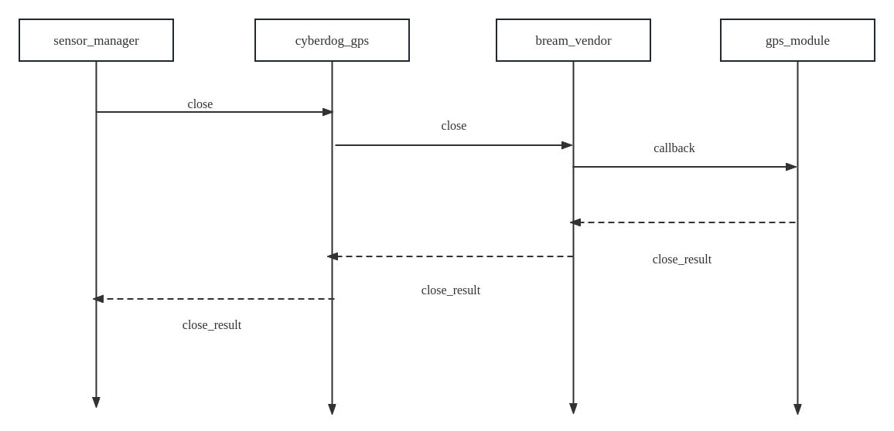

# Cyberdog_gps Design

##  Functional Overview

``cyberdog_gps`` Provide gps data service to the client as a ros2 plugin, responsible for controlling the start and stop of the gps module, and organize the gps data into ros msg format and publish it through sensor_manage.

## Architecture Design

### Soft Architecture

 

#### open gps 

 
 

#### close gps

 

## Feature Design

 - Through the configuration file, you can configure parameters related to the gps function
 - Provide basic capability interfaces such as sensor open, close, self-test, simulation.

## Configuration File

- Src path：``bridges/params/toml_config/sensors``
- Install path：``/opt/ros2/cyberdog/share/params/toml_config/sensors``
- Config path：：
  - ``bcmgps_config.toml``:gps params config 
  - params：
    - ``spi`` spi port
    - ``patch_path`` patch path
    - ``MsgRate`` gps data fps

## API Interface
  - ``Init(bool simulator)``：init 
    - ``simulator = true``:simulator
  - ``Open()``：open gps
  - ``Start()``：enable gps to publish gps data
  - ``Stop()``：stop to publish gps data
  - ``Close()``：close gps 
  - ``SelfCheck()``：gps self check
  - ``LowPowerOn()``：lowpower 
  - ``BCMGPS_Payload_callback(std::shared_ptr<GPS_Payload> payload)``topic callback function
