# Cyberdog_grpc Design

## Overview

cyberdog_grpc is a ROS node that converts ROS topics, services, actions into gRPC services, which implements communication between ROS and APP.

## Basic Information about GRPC

gRPC is a modern open source high performance Remote Procedure Call (RPC) framework that can run in any environment. It can efficiently connect services in and across data centers with pluggable support for load balancing, tracing, health checking and authentication. It is also applicable in last mile of distributed computing to connect devices, mobile applications and browsers to backend services.

gRPC can use protocol buffers as both its Interface Definition Language (IDL) and as its underlying message interchange format. Protocol buffers provide a language-neutral, platform-neutral, extensible mechanism for serializing structured data in a forward-compatible and backward-compatible way. It’s like JSON, except it’s smaller and faster, and it generates native language bindings.

### Opensource Repository

https://github.com/grpc/grpc

#### Version

Version 1.44.0 is used in this product, but other versions are probably available to communicate with it.

#### Installation

C++: https://github.com/grpc/grpc/blob/master/BUILDING.md

Python: `pip install grpcio grpcio_tools`

To install other launguages, you can refer to https://github.com/grpc/grpc/blob/master/README.md

### Test

Compile the test example:

```Shell
cd grpc/examples/cpp/helloworld
mkdir -p cmake/build
cd cmake/build
cmake ../..
make
```

Run server:

```Shell
./greeter_server
```

It will display on the screen: Server listening on 0.0.0.0:50051

Run clieint:

```Shell
./greeter_client
```

It will display on the screen: Greeter received: Hello world

## Interface Design

We use an interface in the form of `nameCode + content`to make RPC requests.



### NameCode

Command code, corresponds to a unique function and it's corresponding ROS interface.

Type: fixed32 in protobuf, uint32 in cpp

### Serialized Content

Most of RPC commands have parameters and response data. These contents are uniformly transmitted in a JSON format string. We use [RapidJSON](https://github.com/Tencent/rapidjson) to implement serialization and deserialization.

Type: string in protobuf, std::string in cpp

#### Params

Corresponds to input info of the function.

#### Data

Corresponds to output info of the function.

[protocol doc](/cn/grpc_protocol.md)
