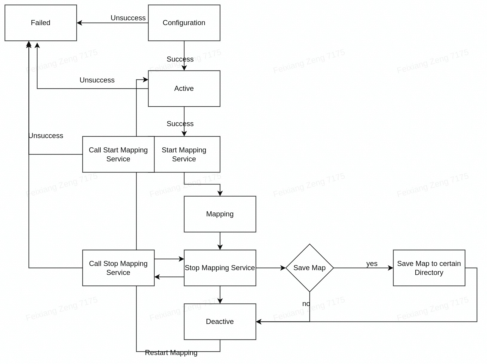

# cyberdog_laserslam

## Module Introduction

cyberdog_laserslam is a module developed based on open source project Cartographer, which capable to build map and localization in real time. The SubModule include pose extrapolator, laser scan matching, pose graph etc.

## Module Architecture

data entry: Provide data LaserSlam required

pose_extrapolator: According to the position and posture obtained by the laser front-end matching, the angle information of the imu, and the speed information of the leg odometer to infer the current position and posture

Scan Matching: Get the current moment pose estimation from the pose reasoner through the new laser data, convert the laser data to the world coordinate system and occupy the corrected pose after grid matching

Pose Graph: Build a pose graph by organizing the nodes and SubMap obtained from the front-end matching, and optimize the average error of the graph to smooth the pose

## Workflow

