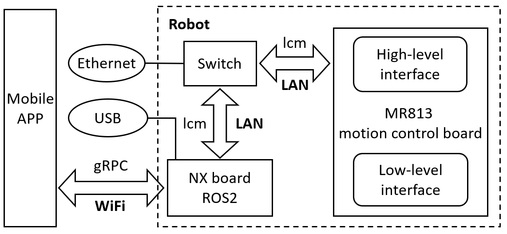
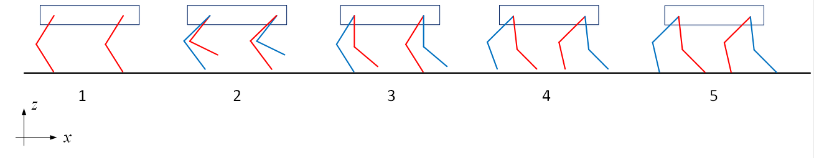
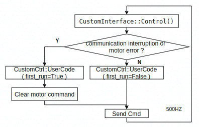
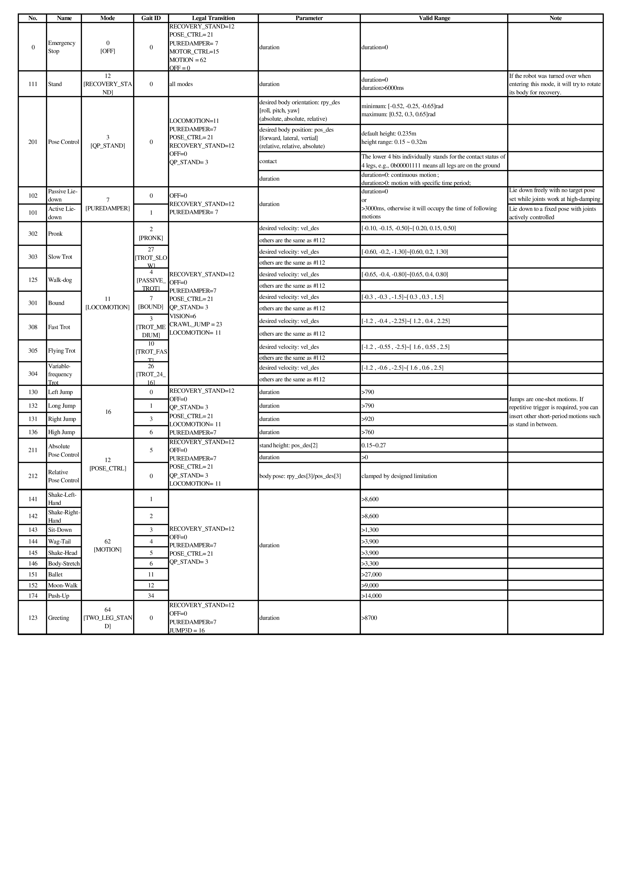

# User Interface of Locomotion Module

## 1. Introduction

The motion control (MC) module is similar to the human cerebellum, and is responsible for coordinating various joints to complete specific motions, such as walking, backflips, dancing, and so on. The MC module provides both a high-level interface, allowing developers to directly call pre-defined basic motions, as well as a low-level interface for joint motor control, enabling developers to develop their own controllers. The MC interface is based on **LCM (Lightweight Communications and Marshalling)** communication, and the ROS2 modules deployed on the NX application board is also built on this interface.

### 1.1 Communication Framework

The overall communication framework of the robot is shown in the following figure:

 


The motion control program is deployed on the M813 motion control board, which provides high-level and low-level interfaces based on LCM communication for developers to call. The developer's user program can be deployed on the robot's built-in NX application board, or on an external developer's PC. In the latter case, the external PC needs to be connected to the robot via Ethernet or USB. For detailed connection instructions, please refer to the section on connecting the robot (section 1.4).

### 1.2 Introduction to LCM

LCM is an open source library dedicated to real-time communication with high bandwidth and low latency, supporting multiple programming languages. If you want to use the secondary development interface on your computer, you can install LCM as follows:

```shell
# Method 1: install via pip
$ pip install lcm

# Method 2: source code installation
$ git clone https://github.com/lcm-proj/lcm.git
$ cd lcm
$ mkdir build && cd build
$ cmake .. && make
$ sudo make install
```

In addition, the LCM library comes with a command-line tool, lcm-gen, which can generate data type definition files corresponding to various programming languages. The usage is shown in the table below:

| Programming language | Usage | Programming language | Usage |
| ------ | ------ | ------ | ------ |
| C    | lcm-gen -c example_t.lcm  | Python | lcm-gen -p example_t.lcm |
| C++  | lcm-gen -x example_t.lcm  | C#     | lcm-gen --csharp example_t.lcm |
| Java | lcm-gen -j example_t.lcm  | MATLAB | Generate Java code |
| Lua  | lcm-gen -l example_t.lcm  | Go     | lcm-gen -g example_t.lcm |

Here is an example of `example_t.lcm`:

```cpp
struct example_t
{
    int64_t  timestamp;
    double   position[3];
    double   orientation[4]; 
    int32_t  num_ranges;
    int16_t  ranges[num_ranges];
    string   name;
    boolean  enabled;
}
```

For more details on usage, please refer to the [official documentation](https://lcm-proj.github.io/).

### 1.3 Coordinate System and Joints

The robot coordinate system is shown in the figure (a) below, following the right-hand rule, where the x-axis points forward, the y-axis points to the left, and the z-axis points upward. The four legs are named FR (Front-right), FL (Front-left), RR (Rear-right), and RL (Rear-left), and are numbered in this order. Each leg contains three joints: the abad joint, the hip joint, and the knee joint. The definition of the joint zero position is shown in the figure (b) below. The abad joint is horizontal, and the hip joint and knee joint constitute the electrical zero position when the leg is vertically downward (which cannot be actually achieved due to mechanical limitations of the links).


The positive rotation direction of the joints follows the right-hand rule around the rotation axis. The joint range, maximum speed and torque are shown in the table below.

| Joint name | Joint range[rad] | Maximum speed[m/s] | Maximum torque[Nm] | Joint name | Joint range[rad] | Maximum speed[m/s] | Maximum torque[Nm] |
| ------- | -------------- | ----- | -- | ------- | -------------- | ----- | -- |
| FR-abad | [-0.68, 0.68]  | 38.19 | 12 | FL-abad | [-0.68, 0.68]  | 38.19 | 12 |
| FR-hip  | [2.79, -1.33]  | 38.19 | 12 | FL-hip  | [2.79, -1.33]  | 38.19 | 12 |
| FR-knee | [-0.52, -2.53] | 38.19 | 12 | FL-knee | [-0.52, -2.53] | 38.19 | 12 |
| RR-abad | [-0.68, 0.68]  | 38.19 | 12 | RL-abad | [-0.68, 0.68]  | 38.19 | 12 |
| RR-hip  | [3.14, -0.98]  | 38.19 | 12 | RL-hip  | [3.14, -0.98]  | 38.19 | 12 |
| RR-knee | [-0.52, -2.53] | 38.19 | 12 | RL-knee | [-0.52, -2.53] | 38.19 | 12 |

### 1.4 Connect Robot

To use the secondary development interface, you first need to apply for developer permissions. Otherwise, the relevant ports will be blocked and developers will not be able to enter or connect to the robot control board. Secondly, at usage of the motion control high-level or low-level interface, you need to disconnect the APP connection to avoid control signal conflicts. In addition, if the low-power mode is enabled (disabled by default, see APP settings for details), the robot will enter sleep mode after lying down for more than 30 seconds and the motion control interface will also be unavailable. After confirming the correct authority and mode, remove the debugging cover on the robot back. And then, the developer's computer can be connected to the robot control board in two ways:

**Method 1 (recommended)**: Connect the robot's Ethernet port to the developer's computer using a network cable, and set the developer's computer IP address to `192.168.44.100/255.255.255.0`.

```shell
$ ping 192.168.44.100      # IP address assigned to the developer's computer
$ ssh mi@192.168.44.1      # Login to the NX application board with password 123
$ ssh root@192.168.44.233  # Can directly login to the motion control board from the developer's computer
```

**Method 2**: Connect the developer's computer to the robot's USB Type-C port (located on the right side of the middle charging port), and wait for the "L4T-README" pop-up window to appear. The developer's computer IP address will be automatically assigned.

```shell
$ ping 192.168.55.100      # IP address assigned to the developer's computer
$ ssh mi@192.168.55.1      # Login to the NX application board with password 123
$ ssh root@192.168.44.233  # After logging into the NX application board, login to the motion control board (192.168.44 network segment)
```

> **_Note_**: In method 2, although the developer can log in to the NX application board and the motion control board to check the robot's status, the developer cannot use the motion control interface based on LCM communication for development, since the developer's computer and the robot's motion control board are not on the same network segment.

If you want to use this motion control interface on your own computer, then please connect to the robot's Ethernet port as suggested in Method 1 and run the following script to configure the routing table of your computer:
```shell
$ git clone loco_hl_example.git # Download the repository of high-level example code
$ cd loco_hl_example/scripts
$ ./auto_lcm_init.sh # script to configure routing table 
```

## 2. High-level Interface
The high-level interface aims to achieve the basic control of the robot, define customized gait and receive status feedback. It can not only call various motions and gaits which are not limited to the ones dispalyed on the APP, but also check the current robot status and get error reports, etc.

### 2.1 Basic Control
Basic control interface is implemented for developers to realize predefined basic motions and gaits such as sit-down, walking etc. and set corresponding parameters. The used LCM channel and data structure are as follows:
```c++
/** LCM channel information
- url: "udpm://239.255.76.67:7671?ttl=255"
- channel: "robot_control_cmd"
- frequncy: 2~500HZ, the get-down protection will be triggered once the timeout reaches 500ms.
*/

/** lcm data structure **/
struct robot_control_cmd_lcmt {
    int8_t   mode;
    int8_t   gait_id;
    int8_t   contact;           // Whether the four feet touch the ground
    int8_t   life_count;        // Life count, command takes effect when count incremented
    float    vel_des[ 3 ];      // x y(1.6) yaw speed(2.5)  m/s 
    float    rpy_des[ 3 ];      // roll pitch yaw(0.45)  rad
    float    pos_des[ 3 ];      // x y z(0.1-0.32)  m
    float    acc_des[ 6 ];      // acc for jump m^2/s
    float    ctrl_point[ 3 ];   // pose ctrl point  m
    float    foot_pose[ 6 ];    // front/back foot pose x,y,z  m
    float    step_height[ 2 ];  // step height when trot 0~0.08m
    int32_t  value;             // bit0: dance mode or not，use_mpc_traj: whether to use MPC trajectory
                                // bit1: "0" means energy-saving "pigeon toe" gait   "1" means vertical-leg  gait
    int32_t  duration;          // Time of command execution
}
```
> **_Notes_**: 
>1. **mode**：A state or mode defined by the state machine of locomotion control. All the available modes are listed in Table 1 of Appendix.
>2. **gait_id**：The sub-state or sub-mode under "mode". All the available gait_id are listed in Table 1 of Appendix.
>3. **contact**：The lower four bits are used to define the foot contact status in the pose control mode (mode|gait_id:21|0). The default value is 0x0F, which means that all four legs are on the ground. If you need to lift a leg, you can set like this: 0b1110 lift the right front leg, 0b1101 lift the left front leg, 0b1011 lift the right rear leg, and 0b0111 lift the left rear leg.
>4. **life_count**：Incremental heartbeat signal (0~255), used to determine whether the communication is okay, avoid timeout, and ensure that the one-shot motions are only triggered once. If its value is the same as the previous command, the content of the current command will be ignored to avoid repeatedly adding to the task stack.
>5. **vel_des/rpy_des**：desired forward speed, lateral speed, steering speed, roll angle, pitch angle, and yaw angle respectively.
>6. **pos_des**：In the pose control mode (mode|gait_id:21|0), it refers to the body offset and pos_des[2] indicates the body height in other modes.
>7. **acc_des**：Used for jump motion control (mode:22).
>8. **ctrl_point**：define the rotation centre of body pitch angle in the pose control mode (mode|gait_id:21|0).
>9. **foot_pose**：In the pose control mode (mode|gait_id:21|0), define the coordinate offset of the lifted foot end for tasks like shaking hands, etc.
>10. **step_height**：The ground clearness of the front and rear swing legs at walking, the range is 0~0.06m
>11. **value(bit0~bit31)** : Other parameters related to specific modes, such as:
>   - Normal gait:
>       - bit2: 0: Normal mode; 1: Speed offset calibration mode for factory production.
>       - bit1: 0: Energy-saving "pigeon toe" gait; 1: Vertical-leg gait.
>   - Customized gait:
>       uint32_t indicates whether self-defined gait use MPC trajectory (use_mpc_traj).
>12. **duration**：Expected action duration corresponding to the command block, the unit is ms, resolution ratio is 2ms:
>   - When equal to 0:<br>
>       it indicates the execution time of the motion is infinite and the motion will not stop until receiving a new command. Usage scenario: For example, walking commands (robot can keep walking until the desired speed changes or the desired motion is switched), and motions that have an uncertain actual execution time like recovery standing (e.g. when the robot's initial pose is close to the target one, the recovery standing can quickly complete. Nevertheless, if a fall is detected, the robot needs to turn over first and then stand)
>   - When greater than 0:<br>
>       it indicates the specified dwell time of the action in the operation control command sequence stack, indirectly controlling the expected execution time of the action. Usage scenario: For example, incremental position control actions (this variable can assign how long the body takes to move towards the target posture which indirectly specifies the movement speed); Or, to achieve an open-loop posture adjustment and lift a leg for a handshake action, the expected execution time of each motion in this action series can be specified by this value as well, thereby multiple commands referring to a series of motions can be sent out together instead of waiting for the preceding one to finish.
>
>   - In summary, duration=0 is preferred for real-time control. In this case, the high-level module is able to check the current robot status and command execution resutls and update the commands accordingly. For detailed usage, please refer to Section 2.4.1 for the introduction of basic actions. On the other hand, duration>0 is mainly designed for open-loop sequence control, such as a dance action, specifying the execution time of each motion. Please refer to Section 2.4.2 for more details.
>
>       It is worth noting that if the specified time is not long enough to fully execute the motion, the program will try to switch to the next motion when the specified time vanishes. But it will ends up with failure which results in taking up the time of next action task. If the motion completes earlier than the time assigned, the robot will remain stationary until the specified time is exausted. In addition, motions with duration=0 is considered to hold a higher priority for execution, which will overwrite its previous motion command.

### 2.2 Self-Defined Gait
Gait represents the relationship between the support and swing phase of each leg of the robot over time. Periodic gait means that the support phase and swing phase of each leg switch periodically. For example, the diagonal trot of quadruped robots is a typical periodic gait. Periodic gait can realize periodic movements, such as walking, running, etc., but dance movements are not periodic in general, so it's necessary to design a method of defining non-periodic gaits and editing gait parameters. The defined gait cooperates with the corresponding parameters can represent different motions. Gait parameters  contains the trajectory of the trunk, the position of the foothold, the height of the foot, etc. In short, it is "gait definition + gait parameters = motion".
#### 2.2.1 Gait Definition
The gait represents the relationship between the support and swing phase of each leg over time. In order to facilitate modification, we store the gait definition in the form of a file. Taking the definition of moonwalk as an example, each section represents a gait unit, and each gait unit includes the contact state and duration. For the contact state, 1 means support, 0 means swing, and the four numbers represent the contact state of  four legs that order is right-front(FR), left-front(FL), rear-right(RR), and rear-left(RL). The duration means that the contact state lasts for N unit times, and the unit time is 30 milliseconds (ms). Ti=Ni*30ms (i=1...8), represents duration of each gait unit, and the example is as follows:
```
# Gait Def
[[section]]
contact  = [1, 1, 1, 1]
duration = N1
 
[[section]]
contact  = [0, 0, 0, 0]
duration = N2
 
[[section]]
contact  = [0, 1, 1, 0]
duration = N3
 
[[section]]
contact  = [0, 0, 0, 0]
duration = N4
 
[[section]]
contact  = [1, 1, 1, 1]
duration = N5
 
[[section]]
contact  = [0, 0, 0, 0]
duration = N6
 
[[section]]
contact  = [1, 0, 0, 1]
duration = N7
 
[[section]]
contact  = [0, 0, 0, 0]
duration = N8

[[section]]
contact  = [1, 1, 1, 1]
duration = N1
```
> **_NOTE:_** The keyword in the header of the file, namely "# Gait Def", is essential for format verification.

As shown in Figure 2, the contact state of the top five sections of the moonwalk is described. Red line represents the left legs and blue line represents the right legs. 

For section 1, the robot is in a standing state, and the foothold offset of all legs is zero. For section 2, all legs are in a swing state, the right front leg swing forward, and the left front leg swings in situ. For section 3, the left front leg is in a contact state, and the right front leg continues to swing forward. And then take off again to reach section 4, all legs are in a swing state. For section 5, all legs are in a contact state, the foothold offset of the right front leg is positive lx (lx>0), and the foothold offset of the left front leg is negative lx, and one glissade is completed. 

During this process, the left front leg moves backward, and set small swing height to look like it's sliding on the ground. And right front leg moves forward, set large swing height to achieve striding on the ground.

<center>Fig. 2: schematic diagram of moonwalk</center>

#### 2.2.2 Gait Parameters
The gait parameters file is used to storge all parameters used to control movements, and each "step" represents a parameter block that contains eleven parameters described as follows.
- Parameter "type", set to be "usergait", indicates that this gait is used for a nonperiodic gait.
- Parameter "body_vel_des", represents desired velocity of the robot body(unit: m/s or rad/s),  and the order is x, y, yaw.
- Parameter "body_pos_des", represents desired attitude (unit: rad) and position (unit: m) of the robot body, and the order is roll, pitch, yaw, x, y, z.
- Parameter "landing_pos_des", contains a total of twelve variables, which respectively represent the landing position(unit: m)  of each leg in the x, y, and z directions on body frame. For example, [0.0, 0.0, 0.0] means that the landing position is directly below the corresponding hip joint.
- Parameter "step_height", represents desired swing height (unit: m) of the swing legs, and the four numbers represent the height of the four legs of FR, FL, RR, and RL respectively.
- Parameter "weight", represents the tracking weight of the torso on wohle body control (WBC), and the order of six dimensions are same to the parameter "body_pos_des".
- Parameter "use_mpc_traj", only contains two values of 0 and 1, "1" means that the torso trajectory is optimized by model predictive control (MPC), "0" means it is integrated using the desired velocity trajectory.
- Parameter "mu", indicates the friction coefficient between the foothold and the ground, generally in the range of 0.1 to 1.0.
- Parameter "landing_gain", indicates the adjustment range of the landing position. In order to ensure its own stability, the robot will adjust the landing position according to the desired and actual velocity.
- Parameter "gait_id", set to be "110" for user self-defined gaits.
- Parameter "duration", represents duration of this step.

The following example represents the gait parameters of the moonwalk:
```
# Gait Params
[[step]]
type            = "usergait"
body_vel_des    = [vx, 0.0, 0.0]
body_pos_des    = [0.0, 0.0, 0.0, 0.0, 0.0, 0.0]
landing_pos_des = [lx, 0.0, 0.0,  0.0, 0.0, 0.0,  0.0, 0.0, 0.0,  lx, 0.00, 0.0]
step_height     = [h_max, h_min, h_min, h_max]
weight          = [w1, w2, w3, w4, w5, w6]
use_mpc_traj    = 1/0
mu              = 0.1~1.0
landing_gain    = 1.0~2.0 
gait_id         = 110
duration        = T1 + T2
 
[[step]]
type            = "usergait"
body_vel_des    = [vx, 0.0, 0.0]
body_pos_des    = [0.0, 0.0, 0.0, 0.0, 0.0, 0.0]
landing_pos_des = [lx, 0.0, 0.0,  -lx, 0.0, 0.0,  -lx, 0.0, 0.0,  lx, 0.0, 0.0]
step_height     = [h_max, h_min, h_min, h_max]
weight          = [w1, w2, w3, w4, w5, w6]
use_mpc_traj    = 1/0
mu              = 0.0~1.0
landing_gain    = 1.0~2.0 
gait_id         = 110
duration        = T3 + T4
 
[[step]]
type            = "usergait"
body_vel_des    = [vx, 0.0, 0.0]
body_pos_des    = [0.0, 0.0, 0.0, 0.0, 0.0, 0.0]
landing_pos_des = [0.0, 0.0, 0.0,  lx, 0.0, 0.0,  lx, 0.0, 0.0,  0.0, 0.0, 0.0]
step_height     = [h_min, h_max, h_max, h_min]
weight          = [w1, w2, w3, w4, w5, w6]
use_mpc_traj    = 1/0
mu              = 0.0~1.0
landing_gain    = 1.0~2.0 
gait_id         = 110
duration        = T5 + T6
 
[[step]]
type            = "usergait"
body_vel_des    = [vx, 0.0, 0.0]
body_pos_des    = [0.0, 0.0, 0.0, 0.0, 0.0, 0.0]
landing_pos_des = [-lx, 0.0, 0.0,  lx, 0.0, 0.0,  lx, 0.0, 0.0,  -lx, 0.0, 0.0]
step_height     = [h_min, h_max, h_max, h_min]
weight          = [w1, w2, w3, w4, w5, w6]
use_mpc_traj    = 1/0
mu              = 0.0~1.0
landing_gain    = 1.0~2.0 
gait_id         = 110
duration        = T7 + T8
```
>**_NOTE_:** The keyword in the header of the file, namely "# Gait Params", is essential for format verification.

It should be noted that the duration of gait definitions and gait parameters are related, but not one-to-one correspondence. Taking the moonwalk as an example, it can be seen from the first three sections of the gait definition that FL lifts up in the second section and lands in the third section. Therefore, the duration of the first parameter block of gait parameters is T1+T2, which set the desired step height and landing position for the FL leg. Similarly,  the FR and FL legs will land in the fifth section of gait definition, so the duration of the second parameter block of the gait parameter is T3+T4. The landing_pos_des and step_height are used to control the swing legs, and the two parameter will have an effect when the corresponding leg is in the swing phase. The gait definition and gait parameters as mentioned above can also describe the periodic gaits, so it is a generalized method of gait definition and parameter editing.
>**_NOTE_:** The motion controller can only accept commands of specific structure that defined as "robot_control_cmd_lcmt". Therefore it's necessary to convert the gait parameters into the specific structure. We provide a script to realize automatic conversion, please see the sample code in section 2.4.3.
#### 2.2.3 Execution of Motions
After completing the gait definition and gait parameters, the execution of the motion begins. It is necessary to convert the gait definition and gait parameters to calculate all the desired states of the robot at each moment.

For the torso, the desired states include position, attitude, linear velocity and angular velocity. In the gait parameters file, if there is a desired velocity, then the desired position in this direction is obtained by the integral of the velocity. The defined desired position in the file will be deprecated unless there is not defined desired velocity.

For the swing leg, it is necessary to calculate the swing trajectory. We use a third-order Bezier curve to calculate the desired position at each moment, that only need to specify the initial the end position velocity of the curve. The starting point of the swinging state is the end point of the support state, which does not need to be specified by the user. The user only needs to specify the swinging end point of each leg, that is the landing position. Since the velocity of the swinging leg relative to the ground is zero when it is lifted and landed, the swing trajectory can be calculated by giving the landing position and the raising height of feet.

The robot will check whether the execution of the motion is completed at every moment. The motion is executed completely when the execution time reaches the total time defined by the user. If the execution is completed, the robot will enter the standing state and wait for the next command; otherwise, it will continue to execute the motion.
### 2.3 Status Feedback
Feedback information includes: motion status (50Hz), motor temperature (1Hz), customized gait file sending results, odometer information (50Hz), etc.

#### 2.3.1 Motion Status
The data structure of the robot feedback is as follows:
```c++
/** lcm channel information
- url: "udpm://239.255.76.67:7670?ttl=255"
- channel: "robot_control_response"
- frequncy: 50HZ
*/

/** lcm data structure */
struct robot_control_response_lcmt {
    int8_t  mode;
    int8_t  gait_id;
    int8_t  contact;
    int8_t  order_process_bar;  // order process, 1 == 1 %
    int8_t  switch_status;      // 0:Done, 1:TRANSITIONING, 2:ESTOP, 3:EDAMP, 4:LIFTED 5:BAN_TRANS 6:OVER_HEAT 7:LOW_BAT
    int8_t  ori_error;
    int16_t  footpos_error;
    int32_t  motor_error[12];
}
```
1. **mode**：actual mode of operation and control.
2. **gait_id**：sub-mode in the current mode.
3. **contact**：estimated contact status of four feet for possible extensions.
4. **order_process_bar**：The execution percentage of uninterruptible actions such as greeting and backflip. Always 100 while walking.
5. **switch_status**：execution result when switching to new commands.

| Value | String | Definition |
| ---- | -------------- | --------------------------------------------------------- |
| 0 | Done | Switch successfully. |
| 1 | TRANSITIONING | In transition where uninterruptible motions are not completed. |
| 2 | ESTOP | Emergency stop (no power protection mode) where something abnomral happens during transition. |
| 3 | EDAMP | High damping protection mode. The robot will enter this mode when the battery is low or walking is unstable.
| 4 | LIFTED | Robot is lifted up during transition.
| 5 | BAN_TRANS | Mode switching cannot be performed, and stays in the old mode (it is recommended to follow the switch strategy implemented in the NX application layer). |
| 6 | OVER_HEAT | Motor temperature warning for flip motions, currently set at 74 degrees. Forbidden to switch to flips after overheat.
| 7 | LOW_BAT | Low battery warning for flips, minimum battery level required by front flip is 50% while 20% for backflip. Lower than that, the robot will ben banned to switch. |

> **_NOTE:_** After switching to status 2 or 3, only stand motion requst should be sent to the robot for safety consideration, although locomotion interface does allow some other mode switching).

6. **ori_error**：When the value is true, it means that the inclination angle of the robot exceeds the safe range, and the high damping protection mode will be triggered, and the protection can be exited only by recovery stand.
7. **footpos_error**：The lower 12 bits respectively indicate that the 4 legs exceed the working space limits and report an error. The high damping protection mode will be triggered under the walking gait, and the protection can be exited only after recovery stand. The specific definitions are as follows:

| RL vertical | RL lateral | RL forward  | RR vertical | RR lateral | RR forward  | FL vertical | FL lateral | FL forward  | FR vertical | FR lateral | FR forward  |
| ----- | ----- | ----- | ----- | ----- | ----- | ----- | ----- | ----- | ----- | ----- | ----- |
| bit11 | bit10 | bit9 | bit8 | bit7 | bit6 | bit5 | bit4 | bit3 | bit2 | bit1 | bit0 |

1. **motor_error[12]**：Warning and error states for 12 joint motors, motors with problems will self-protect and enter a disabled state. For motor errors, the built-in protection strategy of the motion control is: regardless of motor warning or error feedback, it first enters the high damping protection mode, the robot will slowly get down, and then enter the emergency stop mode after 3 seconds. The error will be automatically cleared if certain conditions are met. Before the motor errors are cleared, the robot will not respond to any motion commands

```markdown
# ERROR
BIT(0)      motor disconnected 
BIT(1)      Motor coil overheat                Coil Thermal-Shutdown（87 degrees）
BIT(2)      Driver chip failure                Motor driver chip error
BIT(3)      low voltage failure                   Motor bus under voltage
BIT(4)      high voltage failure                   Motor bus over voltage 
BIT(5)      Phase B current sampling overcurrent             B phase sample overcurrent
BIT(6)      Phase C current sampling overcurrent             C phase sample overcurrent
BIT(8)      Encoder not calibrated                Encoder not calibrate
BIT(9~16)   Overload fault (xxA current for xx seconds)   Overload error
BIT(17)     Phase A current sampling overcurrent             A phase sample overcurrent
BIT(18~23)  null

# WARNING
BIT(24)     Motor coil temperature is high           Coil Thermal too high（82 degrees）
BIT(25)     null
BIT(26)     null
BIT(27)     null

# MODE
BIT(30~31)  00: RESET_MODE   
            01: CALIBRATION_MODE  
            02: MOTOR_MODE  
            03: BRAKE_MODE
```

> **_NOTE:_** Basic programming mainly checks whether the mode/gait_id meets the request, and the feedback of new commands needs to be delayed by 1 control cycle.

#### 2.3.2 Motor Temperature
Report the temperature of each motor, the data structure is as follows:
```c
/** lcm channel information
- url: "udpm://239.255.76.67:7670?ttl=255"
- channel: "motor_temperature"
- frequncy: 1HZ
*/

/** lcm data structure */
struct danger_states_lcmt
{       
    float motor_temperature[12]; // Unit (degrees), 0 is right front leg swings hip joint sideways, 1 is right front leg swings hip joint forward, 2 is right front leg knee joint, and so on, 3~5 is left front leg, 6~8 is rear right leg, 9~11 is rear left leg
}
```

#### 2.3.3 Customized Gait
Report the sending result of the customizde gait file, the data structure is as follows:
```c
/** lcm channel information
- url: "udpm://239.255.76.67:7671?ttl=255"
- channel: "user_gait_result"
*/

/** lcm data structure */
struct file_recv_lcmt {
    int8_t  result; // Send and check the action file, 0: successful, 1: abnormal; no format check for now
}
```
#### 2.3.4 Odometer information
Report the result of leg odometer, the data structure is as follows:
```c
/** lcm channel information
- url: "udpm://239.255.76.67:7667?ttl=255"
- channel: "global_to_robot"
- frequncy: 50HZ
*/

/** lcm data structure */
struct localization_lcmt {
  float xyz[3];       // the fuselage position in the legged odometry coordinate system
  float vxyz[3];      // the linear velocity of the fuselage in the legged odometer coordinate system
  float rpy[3];       // the Euler angles of the fuselage in the legged odometry coordinate system
  float omegaBody[3]; // the angular velocity of the fuselage in the fuselage coordinate system
  float vBody[3];     // the linear velocity of the fuselage in the fuselage coordinate system
  int64_t timestamp;  // timestamp, unit: nanoseconds
}
```
### 2.4 Interface Example
In this section, three example codes of the high-level interface are introduced for reference, and the code can be deployed on the user's computer or NX application board to run. If deployed on the user's computer, it is necessary to install the LCM communication library according to the steps described in Section 1.2.
> Example Code repository: waiting to be public

#### 2.4.1 Basic Motion
This example code is a Python script, which controls the robot to complete the actions of standing, shaking hands, bowing, raising the head, bowing the head, stepping and rotating, and getting down in sequence.
```python
'''
This demo show the communication interface of MR813 motion control board based on Lcm.
Dependency: 
- robot_control_cmd_lcmt.py
- robot_control_response_lcmt.py
'''
import lcm
import sys
import os
import time
from threading import Thread, Lock

from robot_control_cmd_lcmt import robot_control_cmd_lcmt
from robot_control_response_lcmt import robot_control_response_lcmt

def main():
    Ctrl = Robot_Ctrl()
    Ctrl.run()
    msg = robot_control_cmd_lcmt()
    try:
        msg.mode = 12 # Recovery stand
        msg.gait_id = 0
        msg.life_count += 1 # Command will take effect when life_count update
        Ctrl.Send_cmd(msg)
        Ctrl.Wait_finish(12, 0)

        msg.mode = 62 # Shake hand, based on position interpolation control
        msg.gait_id = 2
        msg.life_count += 1
        Ctrl.Send_cmd(msg)
        Ctrl.Wait_finish(62, 2)

        msg.mode = 64 # Twoleg Stand
        msg.gait_id = 0
        msg.life_count += 1
        Ctrl.Send_cmd(msg)
        Ctrl.Wait_finish(64, 0)

        msg.mode = 21 # Position interpolation control
        msg.gait_id = 0
        msg.rpy_des = [0, 0.3, 0] # Head up
        msg.duration = 500 # Expected execution time, 0.5s 
        msg.life_count += 1
        Ctrl.Send_cmd(msg)
        time.sleep( 0.5 )

        msg.mode = 21 # Position interpolation control
        msg.gait_id = 0
        msg.rpy_des = [0, -0.3, 0] # Head down
        msg.duration = 300 
        msg.life_count += 1
        Ctrl.Send_cmd(msg)
        time.sleep( 0.3 )

        msg.mode = 21 # Position interpolation control
        msg.gait_id = 5
        msg.rpy_des = [0, 0, 0]
        msg.pos_des = [0, 0, 0.22] # Set body height
        msg.duration = 400 
        msg.life_count += 1
        Ctrl.Send_cmd(msg)
        time.sleep( 1 )

        msg.mode = 11 # Locomotion
        msg.gait_id = 26 # TROT_FAST:10; TROT_MEDIUM:3; TROT_SLOW:27; Self-conversion frequency: 26
        msg.vel_des = [0, 0, 0.5] # steering
        msg.duration = 0 # Zero duration means continuous motion until a new command is used.
                         # Continuous motion can interrupt non-zero duration interpolation motion
        msg.step_height = [0.06, 0.06] # ground clearness of swing leg
        msg.life_count += 1
        Ctrl.Send_cmd(msg)
        time.sleep( 5 )

        msg.mode = 7    # PureDamper
        msg.gait_id = 0
        msg.life_count += 1
        Ctrl.Send_cmd(msg)
        Ctrl.Wait_finish(7, 0)

    except KeyboardInterrupt:
        pass
    Ctrl.quit()
    sys.exit()


class Robot_Ctrl(object):
    def __init__(self):
        self.rec_thread = Thread(target=self.rec_responce)
        self.send_thread = Thread(target=self.send_publish)
        self.lc_r = lcm.LCM("udpm://239.255.76.67:7670?ttl=255")
        self.lc_s = lcm.LCM("udpm://239.255.76.67:7671?ttl=255")
        self.cmd_msg = robot_control_cmd_lcmt()
        self.rec_msg = robot_control_response_lcmt()
        self.send_lock = Lock()
        self.delay_cnt = 0
        self.mode_ok = 0
        self.gait_ok = 0
        self.runing = 1

    def run(self):
        self.lc_r.subscribe("robot_control_response", self.msg_handler)
        self.send_thread.start()
        self.rec_thread.start()

    def msg_handler(self, channel, data):
        self.rec_msg = robot_control_response_lcmt().decode(data)
        if(self.rec_msg.order_process_bar >= 95):
            self.mode_ok = self.rec_msg.mode
        else:
            self.mode_ok = 0

    def rec_responce(self):
        while self.runing:
            self.lc_r.handle()
            time.sleep( 0.002 )

    def Wait_finish(self, mode, gait_id):
        count = 0
        while self.runing and count < 2000: #10s
            if self.mode_ok == mode and self.gait_ok == gait_id:
                return True
            else:
                time.sleep(0.005)
                count += 1

    def send_publish(self):
        while self.runing:
            self.send_lock.acquire()
            if self.delay_cnt > 20: # Heartbeat signal 10HZ, It is used to maintain the heartbeat when life count is not updated
                self.lc_s.publish("robot_control_cmd",self.cmd_msg.encode())
                self.delay_cnt = 0
            self.delay_cnt += 1
            self.send_lock.release()
            time.sleep( 0.005 )

    def Send_cmd(self, msg):
        self.send_lock.acquire()
        self.delay_cnt = 50
        self.cmd_msg = msg
        self.send_lock.release()

    def quit(self):
        self.runing = 0
        self.rec_thread.join()
        self.send_thread.join()

# Main function
if __name__ == '__main__':
    main()
```
> **_NOTE:_** The example code relies on the lcm data type files to run: **[robot_control_cmd_lcmt.py** & **robot_control_response_lcmt.py**.

#### 2.4.2 Sequential Motion
This example code is a Python script. By reading the definition file of the sequential motion, the robot can be controlled to complete the following motions in sequence: stand, adjust the height, lift the right hind leg, step and rotate on the spot, and get down.
```python
'''
This demo show the communication interface of MR813 motion control board based on Lcm
Dependency: 
- robot_control_cmd_lcmt.py
- cyberdog2_ctrl.py
'''
import lcm
import toml
import sys
import os
import time

from robot_control_cmd_lcmt import robot_control_cmd_lcmt

def findAllFile(base):
    for root, ds, fs in os.walk(base):
        for f in fs:
            yield f

def main():
    base='./'
    num=0
    filelist=[]
    for i in findAllFile(base):
        filelist.append(i)
        print(str(num)+","+str(filelist[num]))
        num=num+1
    print('Input a toml ctrl file number:')
    numInput=int(input())

    lc=lcm.LCM("udpm://239.255.76.67:7671?ttl=255")
    msg=robot_control_cmd_lcmt()
    file = os.path.join(base,filelist[numInput])
    print("Load file=%s\n" % file)
    try:
        steps = toml.load(file)
        for step in steps['step']:
            msg.mode = step['mode']
            msg.value = step['value']
            msg.contact = step['contact']
            msg.gait_id = step['gait_id']
            msg.duration = step['duration']
            msg.life_count += 1
            for i in range(3):
                msg.vel_des[i] = step['vel_des'][i]
                msg.rpy_des[i] = step['rpy_des'][i]
                msg.pos_des[i] = step['pos_des'][i]
                msg.acc_des[i] = step['acc_des'][i]
                msg.acc_des[i+3] = step['acc_des'][i+3]
                msg.foot_pose[i] = step['foot_pose'][i]
                msg.ctrl_point[i] = step['ctrl_point'][i]
            for i in range(2):
                msg.step_height[i] = step['step_height'][i]

            lc.publish("robot_control_cmd",msg.encode())
            print('robot_control_cmd lcm publish mode :',msg.mode , "gait_id :",msg.gait_id , "msg.duration=" , msg.duration)
            time.sleep( 0.1 )
        for i in range(300): #60s Heat beat, maintain the heartbeat when life count is not updated
            lc.publish("robot_control_cmd",msg.encode())
            time.sleep( 0.2 )
    except KeyboardInterrupt:
        msg.mode = 7 #PureDamper before KeyboardInterrupt:
        msg.gait_id = 0
        msg.duration = 0
        msg.life_count += 1
        lc.publish("robot_control_cmd",msg.encode())
        pass
    sys.exit()

# Main function
if __name__ == '__main__':
    main()
```
> **_NOTE:_** The example code relies on the lcm data type file **robot_control_cmd_lcmt.py** and the sequential motion definition file **cyberdog2_ctrl.toml** to run.

#### 2.4.3 Customized Gait
This example code is a Python script. By reading the definition files of customized gait and sequential motion, the robot can be controlled to stand, moonwalk and get down in sequence. The _Gait_Params_moonwalk.toml_ file used in the example code contains customized-gait-related parameters introduced in Section 2.2.2, which will be converted first according to the robot_control_cmd_lcmt data structure (Gait_Params_moonwalk_full.toml) before sending.
```python
'''
This demo show the communication interface of MR813 motion control board based on Lcm
Dependency: 
- robot_control_cmd_lcmt.py
- file_send_lcmt.py
- Gait_Def_moonwalk.toml
- Gait_Params_moonwalk.toml
- Usergait_List.toml
'''
import lcm
import sys
import time
import toml
import copy
import math
from robot_control_cmd_lcmt import robot_control_cmd_lcmt
from file_send_lcmt import file_send_lcmt

robot_cmd = {
    'mode':0, 'gait_id':0, 'contact':0, 'life_count':0,
    'vel_des':[0.0, 0.0, 0.0],
    'rpy_des':[0.0, 0.0, 0.0],
    'pos_des':[0.0, 0.0, 0.0],
    'acc_des':[0.0, 0.0, 0.0, 0.0, 0.0, 0.0],
    'ctrl_point':[0.0, 0.0, 0.0],
    'foot_pose':[0.0, 0.0, 0.0, 0.0, 0.0, 0.0],
    'step_height':[0.0, 0.0],
    'value':0,  'duration':0
    }

def main():
    lcm_cmd = lcm.LCM("udpm://239.255.76.67:7671?ttl=255")
    lcm_usergait = lcm.LCM("udpm://239.255.76.67:7671?ttl=255")
    usergait_msg = file_send_lcmt()
    cmd_msg = robot_control_cmd_lcmt()
    try:
        steps = toml.load("Gait_Params_moonwalk.toml")
        full_steps = {'step':[robot_cmd]}
        k =0
        for i in steps['step']:
            cmd = copy.deepcopy(robot_cmd)
            cmd['duration'] = i['duration']
            if i['type'] == 'usergait':                
                cmd['mode'] = 11 # LOCOMOTION
                cmd['gait_id'] = 110 # USERGAIT
                cmd['vel_des'] = i['body_vel_des']
                cmd['rpy_des'] = i['body_pos_des'][0:3]
                cmd['pos_des'] = i['body_pos_des'][3:6]
                cmd['foot_pose'][0:2] = i['landing_pos_des'][0:2]
                cmd['foot_pose'][2:4] = i['landing_pos_des'][3:5]
                cmd['foot_pose'][4:6] = i['landing_pos_des'][6:8]
                cmd['ctrl_point'][0:2] = i['landing_pos_des'][9:11]
                cmd['step_height'][0] = math.ceil(i['step_height'][0] * 1e3) + math.ceil(i['step_height'][1] * 1e3) * 1e3
                cmd['step_height'][1] = math.ceil(i['step_height'][2] * 1e3) + math.ceil(i['step_height'][3] * 1e3) * 1e3
                cmd['acc_des'] = i['weight']
                cmd['value'] = i['use_mpc_traj']
                cmd['contact'] = math.floor(i['landing_gain'] * 1e1)
                cmd['ctrl_point'][2] = i['mu']
            if k == 0:
                full_steps['step'] = [cmd]
            else:
                full_steps['step'].append(cmd)
            k=k+1
        f = open("Gait_Params_moonwalk_full.toml", 'w')
        f.write("# Gait Params\n")
        f.writelines(toml.dumps(full_steps))
        f.close()

        file_obj_gait_def = open("Gait_Def_moonwalk.toml",'r')
        file_obj_gait_params = open("Gait_Params_moonwalk_full.toml",'r')
        usergait_msg.data = file_obj_gait_def.read()
        lcm_usergait.publish("user_gait_file",usergait_msg.encode())
        time.sleep(0.5)
        usergait_msg.data = file_obj_gait_params.read()
        lcm_usergait.publish("user_gait_file",usergait_msg.encode())
        time.sleep(0.1)
        file_obj_gait_def.close()
        file_obj_gait_params.close()

        user_gait_list = open("Usergait_List.toml",'r')
        steps = toml.load(user_gait_list)
        for step in steps['step']:
            cmd_msg.mode = step['mode']
            cmd_msg.value = step['value']
            cmd_msg.contact = step['contact']
            cmd_msg.gait_id = step['gait_id']
            cmd_msg.duration = step['duration']
            cmd_msg.life_count += 1
            for i in range(3):
                cmd_msg.vel_des[i] = step['vel_des'][i]
                cmd_msg.rpy_des[i] = step['rpy_des'][i]
                cmd_msg.pos_des[i] = step['pos_des'][i]
                cmd_msg.acc_des[i] = step['acc_des'][i]
                cmd_msg.acc_des[i+3] = step['acc_des'][i+3]
                cmd_msg.foot_pose[i] = step['foot_pose'][i]
                cmd_msg.ctrl_point[i] = step['ctrl_point'][i]
            for i in range(2):
                cmd_msg.step_height[i] = step['step_height'][i]
            lcm_cmd.publish("robot_control_cmd",cmd_msg.encode())
            time.sleep( 0.1 )
        for i in range(75): #15s Heat beat, used to maintain the heartbeat when life count is not updated
            cmd_msg.life_count += 1
            lcm_cmd.publish("robot_control_cmd",cmd_msg.encode())
            time.sleep( 0.2 )
    except KeyboardInterrupt:
        cmd_msg.mode = 7 #PureDamper before KeyboardInterrupt:
        cmd_msg.gait_id = 0
        cmd_msg.duration = 0
        cmd_msg.life_count += 1
        lcm_cmd.publish("robot_control_cmd",cmd_msg.encode())
        pass
    sys.exit()

if __name__ == '__main__':
    main()
```
> **_NOTE:_** The example depends on the lcm data type files **robot_control_cmd_lcmt.py** and **file_send_lcmt.py**, the customized gait files **Gait_Def_moonwalk.toml** and **Gait_Params_moonwalk.toml**, and the sequential motion file **Usergait_List.toml** to run.


## 3. Low-level Interface
Low-level(Motor Level) interface allows users to develop their own controller by directly interacting with motor level control messages and IMU sensory feedback messages.
See `cyberdog2` branch in [cyberdog_motor_sdk](https://github.com/MiRoboticsLab/cyberdog_motor_sdk) for source code.

### 3.1 Introduction to Low-level Interface
The CustomInterface class realizes the sending of low-level control command and the acquisition of encoders and IMU sensory feedback. The interface contains two struct:
```c++
/** Sensory Feedback Struct **/
struct RobotData {
    float    q[ 12 ];              // joint angles in rad
    float    qd[ 12 ];             // joint angular velocities in rad/s
    float    tau[ 12 ];            // motor torque in Nm
    float    quat[ 4 ];            // quaternion of robot in xyzw
    float    rpy[ 3 ];             // roll pitch yaw in rad
    float    acc[ 3 ];             // IMU acceleration output in m/s^2
    float    omega[ 3 ];           // IMU angular velocity output in rad/s
    float    ctrl_topic_interval;  // control topic interval
    uint32_t motor_flags[ 12 ];    // motor error flag，as motor_error in 2.3.1
    int16_t  err_flag;             // error flag
};

/** Motor Control Struct **/
struct MotorCmd {
    //tau = tau_des + (q_des - q)*kp_des + (qd_des - qd)*kd_des
    float q_des[ 12 ];    //desired joint angles in rad
    float qd_des[ 12 ];   //desired joint velocities in rad，-12~12rad/s
    float kp_des[ 12 ];   //position gain，0~200
    float kd_des[ 12 ];   //velocity gain，0~10
    float tau_des[ 12 ];  //desired feedforward torque，-12~12Nm
};
```
The meanings of each bit of error flag `RobotData->err_flag` are listed below:


- BIT(0) WARNING, the communication delay between user program and robot exceeds 10ms, the desired joint position and desired joint torque will decay with time to avoid danger
- BIT(1) ERROR, the communication delay between the user program and the robot exceeds 500ms, the robot will enter the high damping mode(kp=0, kd=10, tau=0) and lie down, waiting for all-zero frames to reset
- BIT(2) WARNING, the desired position of abad joint changes by more than 8 degrees, the change range will be clamped to 8 degrees to avoid danger
- BIT(3) WARNING, the desired position change of hip joint changes by more than 10 degrees, and the change range will be clamped to 10 degrees to avoid danger
- BIT(4) WARNING, the desired position change of knee joint changes by more than 12 degrees, and the change range will be clamped to 12 degrees to avoid danger


> **_NOTE:_** BIT(2)~ BIT(4) are **position jump warnings**, i.e. the desired joint positions of adjacent frames changes too much (e.g., the desired positions of the knee joint is 10 degrees in the previous frame and it is 30 degrees in current frame, then the actual position change will be clamped to 10 degrees, i.e. the actual current desired position is 20 deg). This mechanism is used to prevent violent leg movements and is by default **turned on**, to close it, you can ssh into the MC board and change the configuration bit `motor_sdk_position_mutation_limit` in `/robot/robot-software/common/config/cyberdog2-ctrl-user-parameters.yaml` from 1 to 0.

> **_NOTE:_** BIT(1) error can be cleared when user sends all-zero low-level commands after the robot lying down for 2s. In most cases, BIT(1) error is caused by communication breakdown,  if the control program is running from an external PC, user may need to reconfigure the route table after reconnection.

### 3.2 Control Mode Switching 
To switch control mode of MC board to **low-level control mode** , user need to send a few frames of all-zero low-level control command (as defined in Motor_Cmd struct) to the MC board through the LCM topic named "motor_ctrl" after successfully connecting the robot and verifying the login (see 1.4 Connecting the Robot for details).  The all-zero frames are used to activate the low-level control mode and clear the communication error bits, see the initialization step of CustomInterface class in the SDK for details.

To exit the low-level control mode, restart the robot. It will return to the normal APP control mode after the reboot.

It is recommended to disconnect the APP during the use of low-level interface to avoid control command conflicts.

### 3.3 Source Code Compilation and Deployment
#### 3.3.1 Deployment on External PC
If the robot controller is running on an external PC, it is hard to guarantee the realtime communication through LCM, the actual performance may be degenerated due to latency. It is recommended that users only do verification tests or simple joint control tasks when sending control commands from an external PC. 

1. Install LCM（following 1.2）
2. Connect the robot through ethernet cable and configure the routing table. 

```shell
$ ./auto_lcm_init.sh #configure routing table, the script is stored in the repository of high-level exampel code
```

3. Build the source code and run the example

```shell
$ git clone -b cyberdog2 https://github.com/MiRoboticsLab/cyberdog_motor_sdk #clone the motor sdk example code
$ cd cyberdog_motor_sdk
$ mkdir build && cd build
$ cmake .. #build the example code
$ make -j4
$ ./example_motor_ctrl #run the example
```

#### 3.3.2 Deployment on NX Board
The procedure is similar to Deployment on an external PC. Due to communication latency, it is recommended that users only do verification tests or simple joint control tasks when sending low-level control commands from NX boards. 


```shell
$ git clone -b cyberdog2 https://github.com/MiRoboticsLab/cyberdog_motor_sdk #clone the motor sdk example code
$ scp -r cyberdog_motor_sdk mi@192.168.44.1:/home/mi/ #copy the example code to NX board, default password is 123
$ ssh mi@192.168.44.1 #login to NX board
mi@lubuntu:~$ cd /home/mi/cyberdog_motor_sdk
mi@lubuntu:~$ mkdir build && cd build
mi@lubuntu:~$ cmake .. #build the example code
mi@lubuntu:~$ make -j2
mi@lubuntu:~$ ./example_motor_ctrl #run the example
```

#### 3.3.3 Cross-compilation and Deployment on MC Board 
The TinaLinux on MC board is tailored and does not contain the necessary compiling envrionment. Users need to cross-compile the source code in the  docker environment in order to run the compiled code on MC board. 

To cross-compile the source code from docker, follow the instruction below:
1. Install docker(https://docs.docker.com/engine/install/ubuntu/), then add **sudo** privileges to user 

```shell
$ sudo groupadd docker
$ sudo usermod -aG docker $USER
```

2. Download the docker image for cross-compilation

```shell
$ wget https://cdn.cnbj2m.fds.api.mi-img.com/os-temp/loco/loco_arm64_20220118.tar
$ docker load --input loco_arm64_20220118.tar
$ docker images
```

3. Use the docker image to cross build the source code

```shell
$ git clone -b cyberdog2 https://github.com/MiRoboticsLab/cyberdog_motor_sdk # clone the low-level interface example code
$ docker run -it --rm --name cyberdog_motor_sdk -v /home/xxx/{sdk_path}:/work/build_farm/workspace/cyberdog cr.d.xiaomi.net/athena/athena_cheetah_arm64:2.0 /bin/bash #run docker image，/home/xxx/{sdk_path} is the absolute path to the example code folder
[root:/work] # cd /work/build_farm/workspace/cyberdog/ 
[root:/work/build_farm/workspace/cyberdog] # mkdir onboard-build && cd onboard-build
[root:/work/build_farm/workspace/cyberdog] # cmake -DCMAKE_TOOLCHAIN_FILE=/usr/xcc/aarch64-openwrt-linux-gnu/Toolchain.cmake .. #specify toolchain for cross-compilation
[root:/work/build_farm/workspace/cyberdog] # make -j4 
[root:/work/build_farm/workspace/cyberdog] # exit 
```
4. Copy `libcyber_dog_sdk.so` and `example_motor_ctrl` to MC board under `/mnt/UDISK`.

```shell
$ cd /home/xxx/{sdk_path}/onboard-build
$ ssh root@192.168.44.233 "mkdir /mnt/UDISK/cyberdog_motor_sdk"
$ scp libcyber_dog_motor_sdk.so example_motor_ctrl root@192.168.44.233:/mnt/UDISK/cyberdog_motor_sdk 
$ ssh root@192.168.44.233
root@TinaLinux:~# cd /mnt/UDISK/cyberdog_motor_sdk
root@TinaLinux:~# export LD_LIBRARY_PATH=/mnt/UDISK/cyberdog_motor_sdk
root@TinaLinux:~# ./example_motor_ctrl #run the example or use “nohup ./example_motor_ctrl &” to run in the background
```

5. To run the task on startup, add the following line to `/robot/robot-software/common/config/fork_para_conf_lists.json` process management file(do not forget the ',' at the end)，then restart motion control process or reboot to make the configuration take effect.
```  
 "600003": {"fork_config":{"name": "example_motor_ctrl",  "object_path": "/cyberdog_motor_sdk/",  "log_path": "", "paraValues": ["", "", ""] }}  
```

```shell
# method1: restart the main motion control process:
$ ssh root@192.168.44.233 "ps | grep -E 'example_motor_ctrl' | grep -v grep | awk '{print \$1}' | xargs kill -9" #must be killed before main control progress to avoid sudden drop of robot.
$ ssh root@192.168.44.233 "ps | grep -E 'manager|ctrl|imu_online' | grep -v grep | awk '{print \$1}' | xargs kill -9"
$ ssh root@192.168.44.233 "export LD_LIBRARY_PATH=/robot/robot-software/build;/robot/robot-software/manager /robot/ >> /robot/manager.log 2>&1 &"

# method2: reboot the system:
$ ssh root@192.168.44.233 "reboot"
```


### 3.4 Low-level Interface Example

We provide an example `example_motor_ctrl.cpp` in the source code, in which we realize the basic standing up function by sending low-level control command, the positon of which is linearly interpolated from current joint position to default stand position.
The `first_run` flag is set to **True** when first run or when an error triggers. 



`target1_q` and `target2_q` correspond to default joint positon of sitting and standing, and the definition of positive direction follows the right-handed rule, as detailed in **1.3**. 

> **_NOTE:_** For position control development, it is recommended to suspend the robot, adjust the **kp_des** and **kd_des** from a small value, e.g. kp=5, kd=0.2, to avoid dangerous movement. Be careful during tests as the moving robot could cause harm.

```c++
#include <custom_interface.hpp>

class CustomCtrl : public CustomInterface {
public:
    CustomCtrl( const double& loop_rate ) : CustomInterface( loop_rate ){};
    ~CustomCtrl(){};

private:
    long long count_ = 0;
    float     init_q_[ 12 ];
    float     target1_q_[ 3 ] = { 0 / 57.3, 80 / 57.3, -135 / 57.3 }; // lying down
    float     target2_q_[ 3 ] = { 0 / 57.3, 45 / 57.3, -70 / 57.3 };  // stand up
    void      UserCode( bool first_run ) {

        float t = ( count_ / 1500.0 ) > 2 ? 2 : ( count_ / 1500.0 );
        if ( first_run == true ) { // waiting for reset
            for ( int i = 0; i < 12; i++ )
                init_q_[ i ] = robot_data_.q[ i ];
            if ( init_q_[ 2 ] < -0.1 && init_q_[ 5 ] < -0.1 && init_q_[ 8 ] < -0.1 && init_q_[ 11 ] < -0.1 ) {
                count_ = -1;
            }
        }
        else {
            for ( int i = 0; i < 12; i++ ) {
                if ( t < 1.0 )
                    motor_cmd_.q_des[ i ] = target1_q_[ i % 3 ] * t + init_q_[ i ] * ( 1 - t );
                else
                    motor_cmd_.q_des[ i ] = target2_q_[ i % 3 ] * ( t - 1 ) + target1_q_[ i % 3 ] * ( 2 - t );
                motor_cmd_.kp_des[ i ]  = 60;
                motor_cmd_.kd_des[ i ]  = 2;
                motor_cmd_.qd_des[ i ]  = 0;
                motor_cmd_.tau_des[ i ] = 0;
            }
        }
        if ( ( count_++ ) % 1000 == 0 )
            PrintData( robot_data_ );
    }
};

std::shared_ptr< CustomCtrl > io;
void signal_callback_handler( int signum ) {
    io->Stop();
    ( void )signum;
}

int main() {
    /* user code ctrl mode:1 for motor ctrl */
    signal( SIGINT, signal_callback_handler );
    io = std::make_shared< CustomCtrl >( 500 );
    io->Spin();
    return 0;
}
```

> **_NOTE:_**  The MC board will take control of the robot whenever the communication with motor SDK process times out，and the following error message will show up： `Err: 0x02 Communicate lost over 500ms`. Users need to send a few frames of all-zero low-level control commands to re-activate the low-level control mode and clear the error bits.
Communication timeout error bit is by default triggered after startup to prevent dangerous movement caused by unexpected commands from some unkilled previous control process.  


## 4. Q&A
1. Does the high-level interface provide the foot contact status?

   **A**:Yes, There are two methods to get the contact status of foot. One is that you could get the desired contact status predefined by contact schedule of each gait. Another is that you could calculate the ground reaction force via the estimated joint torque to
   determine whether the foot is touching the ground. Both methods may have big deviation from ground truth, therefore, developers should take second thought before using.

2. Does the safety strategy still work when the robot is controlled by low-level motor SDK?

   **A**:Yes, even if the robot is only controlled by low-level motor SDK, safety strategies including battery overcurrent, battery low-voltage, motor-fault protection, communication-lost protection and so on still work.

3. Do you have to set the robot in motor-SDK mode manually
every time the robot is turned on, or it can be set permanently?

   **A**:After the robot is turned on, you could send specific LCM command to make the robot switch to motor-SDK mode from normal mode. If something wrong (e.g. motor overheat or communication-lost) happens in the motor-SDK mode, you can send all-zero LCM
   frame to clear the error state. If you want to switch back to the normal mode from motor-SDK mode, just reboot the robot.


## Appendix
Table 1. Definition of Motion and Gait

