# cyberdog_manager design document

## 1 Overview
The cyberdog_manager serves as the top-level manager of the system, responsible for receiving commands to call upon robot capabilities and for managing the robot's state.
## 2 Architecture
## 2.1 Framework Design

## 2.2 Data Flow

## 3 Main Function Modules
### 3.1 Battery Management Module (BatteryCapacityInfo)
1. Displays specific LED effects based on current battery level.
2. Provides audio prompts for remaining battery when battery level reaches a specific value.
### 3.2 Power Consumption Module (PowerConsumptionInfo)
1. Implements shut down, restart, low-power mode enter/exit functions, all of which use interfaces provided by the system group.
2. Enters low-power mode according to changes in motion status.
3. Sets corresponding LED effects when entering and exiting low-power mode.   
**The order for entering low-power mode is:**
Switch state machine --> Enter low-power mode.
Low-power mode is not entered in charging or OTA status by default.  
**The order for exiting low-power mode is:**
Exit low-power mode --> Switch state machine.
Refuses to wake up when battery level is below 5% or during state machine switching.
### 3.3 State Machine Switching (MachineStateSwitchContext)
1. Entry point for state machine configuration management.
2. Switches the overall system state in real-time based on current battery level.
3. Implements enabling/disabling low-power mode.
4. Associates with CyberdogMachine and synchronizes the state switching of each module.
### 3.4 Touch module（TouchInfo）
1. Touch management 
### 3.5 Audio module（AudioInfo）
1. Audio initialization and self-check
2. CyberdogManager self-check status voice prompt
### 3.6 LED module (LedInfo)（LedInfo）
1. Update default lighting effects based on real-time battery level
### 3.7 Account management module（AccountInfo）
1. Handle family member account creation, deletion, and search
### 3.8 Error context module（ErrorContxt）
1. Record and publish node error status
### 3.9 Heart module （HeartContext）
1. Timely publish heartbeat data
### 3.10 Query module（QueryInfo）
1. Query and report device SN code, version, volume, battery level, motion, Wi-Fi and other data to the app.
### 3.11 Ready module（ReadyInfo）
1. Publish self-check status information to the app

