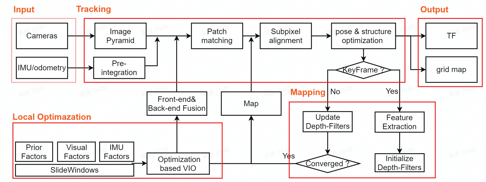

# cyberdog_mivins

## Module Introduction

cyberdog_mivins is used in functions such as visual mapping, visual localization, and visual following, providing real-time output of the pose TF service for quadruped robots. Developed based on open-source projects SVO and VINS-FUSION, it uses multi-sensor data fusion positioning, including cameras, IMUs, and quadruped odometry.

## Module Architecture

The cyberdog_mivins localization algorithm includes modules for data input, front-end tracking, front-end mapping, back-end optimization, and output.

## Service Process

### mapping service process

### localization service process

### following localization function process

