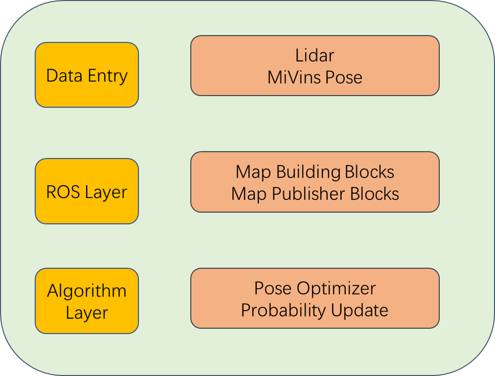

# cyberdog_occmap

## 1 Introduction
cyberdog_occmap is an online grid map reconstruction algorithm based on single-line lidar. It generates a corresponding grid map in real time based on the input pose and scanning point cloud. Based on table lookup update and Protobuf technology, it realizes very lightweight real-time grid reconstruction. Graph algorithm, our algorithm only occupies 10% of the CPU resources of a single core on the NX platform. In order to facilitate developers to carry out secondary development, this project separates the core algorithm from ROS2, and places the core algorithm in the `3rdparty/occmap` path Next, developers can refer to the ROS2 interface for secondary development and use.

## 2. Architecture

<center>



</center>

## 3. Use tutorial
This project provides a minimal routine to generate a raster map offline based on a single-line lidar scanning point cloud file and its corresponding pose file.
The source code is located in `3rdparty/occmap/example` and the data is located in `3rdparty/occmap/data`. Among them, `info.txt` stores the timestamp and the corresponding pose, the storage format is `timestamp x y z x y z w`, the `pointcloud` folder stores the point cloud file of each frame, named after the corresponding timestamp, `gridmap_node.yaml` is The parameter file used by this routine.
First, install the core algorithm dependencies based on **README** (no need to install ROS2 related dependencies).
```bash
# build source code
cd 3rdparty/occmap
mkdir build && cd build
cmake .. && make
make install
# build example
cd ../example
mkdir build && cd build
cmake .. make -j4
# run demo
./demo ../../data/
```
Follow the above tutorial to achieve the effect shown in the figure below.

## 4. Detailed code explanation
This section explains the api calls and implementation process in `demo.cc`.

3.1 Initialize the dataset path
```cpp
const std::string root_path = argv[1];
const std::string config_file = root_path + "/gridmap_node.yaml";
std::vector<PointCloudPose> vpointcloud_pose = readDataset(root_path);
```

3.2 Parse the parameters from the `gridmap_node.yaml` file. Before using it, you need to change `create_map_path` in `gridmap_node.yaml` to the available path of the current system.
```cpp
transform::Eigentf eigentf;
ProbabilityParam probability_param;
SubMapParam submap_param;
FilesSaveParam files_save_param;
FilterParam filter_param;
CeresScanMatchingParam ceres_param;
MapBeautiParam mapbeauti_param;
ParseParameters(config_file, eigentf, probability_param, submap_param, files_save_param, filter_param, ceres_param, mapbeauti_param);
if (boost::filesystem::exists(files_save_param. sub_range_data_path)) {
   std::cout << "remove path: " << files_save_param.sub_range_data_path << std::endl;
   boost::filesystem::remove_all(files_save_param.sub_range_data_path);
}
if(common::createFolder(files_save_param.sub_range_data_path)) {
   std::cout << "create path: " << files_save_param.sub_range_data_path << std::endl;
}
```

3.3 Instantiate the mapping entry object
```cpp
auto g_mapper_ = std::make_shared<mapping::GridMapper>(eigentf, probability_param, submap_param, files_save_param, filter_param, ceres_param, mapbeauti_param);
```

3.4 Insert point cloud data into the map
```cpp
for(auto& pointcloud_pose : vpointcloud_pose) {
std::unique_ptr<sensor::RangeDataCarto> range_data_ptr
   = g_mapper_->AddRangeData(pointcloud_pose.time, pointcloud_pose.pointcloud, pointcloud_pose.pose, eigentf.laser2baselink);
}
```

3.5 Generate the map, and the final map and binary submap files will be saved in `create_map_path`.
```cpp
g_mapper_->GenerateGrid("map");
```