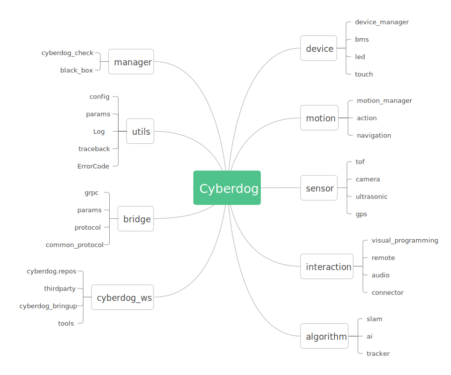

# Cyberdog Platform software architecture

## Overview

1. Application：Cyberdog2
1. Maintenance：Robot platform architecture Group
1. Iteration：Evolutionary route
1. Noun：Internal/external refers to the inside and outside of the NX board;

## Evolutionary route

| Version | Author | Date | Change | Remark | FutureMind |
| --- | --- | --- | --- | --- | --- |
| 1.0 | Platform architecture group | 2022.1.1 |1.New architecture release 2.Create git repository|Only framework and hierarchy conventions have been made, and implementation details need to be further refined according to requirements|22.1.30   1.Function module interface protocol (Part) 2.State machine base class  3.Robot state definition  4.Global code|
| 1.1 | dukun | 2022.1.27 |1.Function module interface protocol (LED, fast connection)  2. Globalcode  3.Communication design  4.Robot state|1.Robot state is not final state 2.The protocol contains only the currently implemented modules  3.Communication design for the first edition|22.3.30   1.Function Module Interface Protocol (All)  2.Design of all functional modules  3.Requirements document  4.Robot configuration design and application|
| 1.2 | Platform architecture group | 2022.4.1 |1.Functional module design & Interface||22.4.30 1.Performance test script 2.Unit testing|
| 1.3 | dukun | 2023.04 |1.Perfect module details 2.The algorithm manager module was added|The corresponding software version is V 1.1.0.3|Release version|

## V1.3

### Architecture

#### Architecture drawing

#### Architecture description

1. The whole system follows the ros development mode and adopts the reticular discrete module design；

1. In addition, it operates three layers (manager, core, and actuator) and encapsulates its functions through the principle of visibility during invocation；

1. Code form: manager and core are independent processes, and actuator is usually dynamic libraries；

#### Unit convention

##### Manager

1. Independent ROS nodes；

1. Manage the internal execution unit status and provide the ROS call interface for the execution unit externally；

1. All managers are internally visible globally, and any unit can be called；

1. All managers maintain heartbeats；

1. The manager is responsible for the final decision, but does not perform the specific logic function；

1. All managers follow the same set of robot state machines, and the robot manager is responsible for the switch；

1. Introduce execution units in the form of ROS plug-ins；

##### Core

1. Independent ROS nodes；

1. The control unit performs one or more logical functions (such as quick connection, navigation, follow, etc.) independently, through the execution unit interface provided by calling the manager；

1. Through the Bridge for external visibility, internal visibility according to the specific design, do not make conventions；

1. Does not provide capability support for other cores, that is, allows dynamic shutdown without associated effects, in addition to its own functionality；

1. Except for business dependencies (such as Navigation to Motion), the Core is partitioned and submitted to the Interaction repository；

##### Actuator

1. Pure execution units, no business logic, no decisions；

1. Strong coupling with hardware versions, different hardware solutions directly provide different versions of the code, do not do compatibility；

1. The callback function is used for external communication, and ros communication interface is not used internally；

1. The difference between a sensor and a device is that the former enforces the continuous release of status through manager, while the latter enforces the provision of an RPC service interface；

1. The execution unit itself has serial capability. When it is in 'busy' state, ErrorCode is directly returned and processed by manager；

1. The state machine of the execution unit is switched by the manager；

##### Bridge

1. The interface between the application board program and the external communication is composed of process and dynamic library；

1. Ros interface is provided internally；

1. External components include DDS, Can, and Uart；

1. Bridge only forwards messages and does not participate in any specific services；

### Module portrait

Hint

#### Robot

##### RobotManager（CyberdogManager）

1. Switch all manager state machines

1. Listens for global status and critical information

1. Provide service, and other modules actively report the status (emergency, such as low power, etc.)

##### Check

1. Robot self-test

1. Factory function test

##### BlackBox

1. Monitor critical information and store it

1. Upload by policy

1. Configurable

#### Motion

##### MotionManager

1. Management movement model

1. Receive motion control requests from other modules

1. Make decisions based on configuration and movement patterns

1. Call Action to complete the motion instruction and return the motion control result

##### Navigation

1. Monitor sensor data and make motion calculation with map；

1. Call Motion to achieve motion control；

1. Don't make the final decision；

1. Input detail：
   1. Navigation function：
      1. Global map, octree

      1. tf conversion (tf conversion per sensor to base\_link)

      1. Local map, point cloud

      1. Visual odometer

      1. Various sensor data (Single line Radar, realsense)

   1. Follow function
      1. Input required for navigation function

      1. Target point coordinates (ODOM coordinates or MAP coordinates）

##### Action

1. An interface that invokes motion control through bridge；

1. The communication mode is ROS -- DDS；

1. The Action interface is for Motion to call, and will eventually provide an open source interface；

#### AlgorithmTask

##### PerceptionManager

1. Management identification module, including ROS interface and CPU resource request；

1. Publish data to the system globally and receive setup instructions；

##### Slam

1. Global map（2D / 3D）

1. Local map

##### Tracker

1. Target point

##### AI

1. Face recognition

1. Bone point recognition

1. Gesture recognition

#### Sensor

##### SensorManager

1. Manage all sensors and provide a separate data distribution channel for each sensor

1. You can configure the sensor and version to be mounted

1. The sensor supports software - level hot swap if required

##### Camera

_Special __sensor__ ability_

1. photo Take pictures, video

1. slam

1. follow

1. emotion

##### Other

1. Implemented as a ros plug-in；

1. Follow the universal sensor base and its own interface base；

#### Device

##### DeviceManager

1. Manage all devices and provide a separate invocation interface for each device

1. The call result is parsed at one level. If an error occurs, it is reported to CyberdogManager

1. You can configure the device and version to be mounted

1. The device supports software - level hot swap if required

##### 其它

1. Implemented as a ros plug-in；

1. Follow the generic device base and its own interface base；

#### Interactive function

This series of modules depends on the detailed design of requirements, so the architecture level does not make too many conventions；

##### Audio

1. The client includes voice requests from other ros nodes and voice triggers from R329；

##### VisualProgram

1. Graphical programming engine；

1. Encapsulation robot capability interface, using cpp dynamic library implementation；

1. The call of dynamic library uses python script, which is used to communicate with app and call；

##### Connector

1. For networking module, ssid and password can be obtained by using two-dimensional code parsing；

1. Connect to app through IP and grpc ；

1. After the initial connection, the device will be automatically connected in the future；

### Warehouse management

Each secondary node is an independent git repository

Warehouse address：

[MiRoboticsLab/rop (robot operating platform)](https://github.com/MiRoboticsLab)

[Dockerfile Instructions](./dockerfile_instructions_en.md)