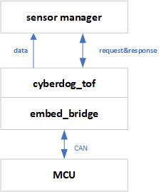
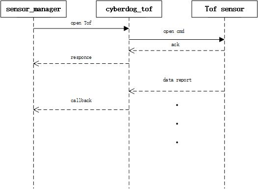
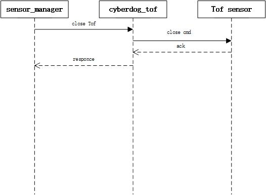

# cyberdog_tof Design

##  Overview

``cyberdog_tof`` provides tof data service to the client side in the form of ros2 plugin. This plug-in provides the necessary API interface for the control sensor, and converts the collected tof data into ros message format and publishes it through sensor_manager.

## Software Design

#### Software framework

 

<!--
Data stream on

 
 

Data stream closed

 

-->

## Functional design

- Flexible configuration of sensor number, message source, command id , etc. through configuration file
- Provide basic capability interfaces such as sensor enable, shutdown, and self-test

## Configuration files

- Source path: ``bridges/params/toml_config/sensors``
- Installed path：``/opt/ros2/cyberdog/share/params/toml_config/sensors``
- Configuration file:
  - ``tof_config.toml``: used to configure the number of sensors and the actual configuration file
  - ``tof_left_head.toml``: used to configure the left sensor of the head
  - ``tof_right_head.toml``: used to configure the right-hand sensor of the head
  - ``tof_left_rear.toml``: used to configure the tail left sensor
  - ``tof_right_rear.toml``: used to configure the rear right-hand sensor
- Main configuration description:
  - ``config_files``: the program gives the corresponding sensor entity according to the array member instance
  - ``Protocol``: communication protocol, default is ``CAN``.
  - ``can_interface``: message channel for CAN communication, configurable     ``can0``, ``can1``
  - ``Array``: data packet message reception configuration
    - ``array_name``: data packet name
    - ``can_package_num``: the number of CAN data frames in the data packet
    - ``can_id``: data packet, CAN data frame ``CAN ID``

  - ``cmd``: command packet message sending configuration
    - ``cmd_name``: instruction package name
    - ``can_id``: instruction package, CAN data frame ``CAN ID``
    - ``ctrl_len``: the data length of the instruction data frame in the CAN package
    - ``ctrl_data``: data default value of instruction data frame in CAN package

## ROS protocol
- Source path: "bridges/protocol/ros"
- Ros topic：``head_tof_payload``、``rear_tof_payload``
- Agreement introduction:
  - ``Protocol:: msg:: SingleTofPayload``: Single TOF data format
    - Protocol path: ``bridges/protocol/ros/msg/SingleTofPayload.msg``
  - ``Protocol:: msg:: HeadTofPayload``: Header TOF data format
    - Protocol path: ``bridges/protocol/ros/msg/HeadTofPayload.msg``
  - ``Protocol:: msg:: RearTofPayload``: Tail TOF data format
    - Protocol path: ``bridges/protocol/ros/msg/RearTofPayload.msg``

##  API interface
- ``Init (bool simulator)``: initialize configuration
  - ``Simulator = true``: configure to emulate mode
- ``Open () ``: turn on the sensor
- ``Start ()``: enable sensor
- ``Stop ()``: stop sensor
- ``Close ()``: turn off the sensor
- ``SelfCheck ()``: sensor self-check
- ``LowPowerOn ()``: enter low power mode
- ``LowPowerOff ()``: exit low power mode
- ``SetSinglePayloadCallback(std::function<void(std::shared_ptr<protocol::msg::SingleTofPayload> payload)> cb)``：set callback function for message.

## Debug command
  - Get Head of Tof topic：``ros2 topic list | grep head_tof_payload``
  - Get rear of Tof topic：``ros2 topic list | grep rear_tof_payload``