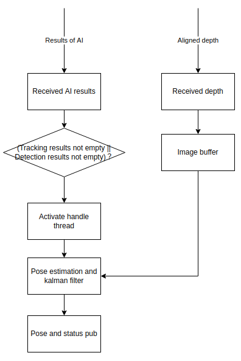

# cyberdog_tracking

## Module Introduction

This is a function package based on ROS2. Cyberdog_tracking mainly used to estimate the 3D position of the tracking target and provide target point for tracking_base module to plan the path and control the robot. The objects of position estimation include pedestrians and any regular and irregular targets selected by the user.

## Module Architecture

- camera_server: Module that provide images
- cyberdog_vision: Module for AI algorithm processing
- cyberdog_tracking: Module for position estimation
- tracking_base: Module for planner and controller

## Workflow

- module input: The results of AI algorithm and the aligned depth image
- module output: Tracking target location and tracking status
- status pub: far, near, edge
