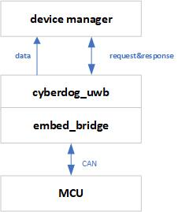

# Cyberdog_uwb Design

##  Overview

``cyberdog_uwb`` Provide uwb data service to the client side in the form of ros2 plugin. This plug-in provides the necessary API interface for the control sensor, and converts the collected uwb data into ros message format and feeds it back to the client side through the device manager. Cyberdog is configured with 2 or 4 UWBs by default.

## Software Design

#### Software framework

 

<!-- 
#### Data stream on

 

#### Data stream closed

 

-->

## Functional design

- Flexible configuration of sensor number, message source, command id , etc. through configuration file
- Provide basic capability interfaces such as sensor enable, shutdown, and self-test

## Configuration files

- Source path: ``bridges/params/toml_config/device``
- Installed path：``/opt/ros2/cyberdog/share/params/toml_config/device``
- Configuration file:
  - ``uwb_config.toml``: used to configure the number of sensors and the actual configuration file
  - ``uwb_config.toml``: used to configure the number of sensors and the actual configuration file
  - ``uwb_head_tof.toml``: used to configuring forward sensors
  - ``uwb_head_uwb.toml``: used to configure rear sensors
  - ``uwb_rear_uwb.toml``: used to configure the left sensor
  - ``uwb_head_tof.toml``: used to configure the right sensor
- Main configuration description:
  - ``simulate``:emulator setting switch
  - ``use_static_mac``:uwb static mac setting switch
  - ``uwb``:Configure the uwb device entity, and the program will instantiate the number of uwb according to the number of this field
    - ``com_file ``:uwb device subconfiguration file
  - ``Protocol``: communication protocol, default is ``CAN``.
  - ``can_interface``: Message channel for CAN communication, configurable     ``can0``, ``can1``
  - ``Array``: data packet message reception configuration
    - ``array_name``: data packet name
    - ``can_package_num``: the number of CAN data frames in the data packet
    - ``can_id``: data packet, CAN data frame ``CAN ID``

  - ``cmd``: command packet message sending configuration
    - ``cmd_name``: instruction package name
    - ``can_id``: instruction package, CAN data frame ``CAN ID``
    - ``ctrl_len``: the data length of the instruction data frame in the CAN package
    - ``ctrl_data``: data default value of instruction data frame in CAN package

## ROS protocol

- Source path: ``bridges/protocol/ros``
- Ros topic:``uwb_raw``
- Agreement introduction:
  - ``Protocol:: msg:: UwbRaw``: Single UWB data format
    - Protocol path: ``bridges/protocol/ros/msg/UwbRaw.msg``
  - ``Protocol:: msg:: UwbArray``: UWB data array
    - Protocol path: ``bridges/protocol/ros/msg/``

## API interface

- ``bool Init(std::function<void(UwbSignleStatusMsg)>function_callback, bool simulation)``：initialize configuration
  - ``simulator = true``:configure to emulate mode
  - ``function_callback``:set callback function for message.
- ``Open () ``: turn on the sensor
- ``Stop ()``: stop sensor
- ``SelfCheck ()``: sensor self-check
- ``LowPower ()``: enter low power mode
- ``SetConnectedState(bool connected)``：set UWB device connection statu
- ``void Play(const std::shared_ptr<protocol::srv::GetUWBMacSessionID::Request> info_request,std::shared_ptr<protocol::srv::GetUWBMacSessionID::Response> info_response)``：ros2 service,using for open uwb.

## Debug command

  - Get uwb topic：``ros2 topic list | grep uwb_raw``