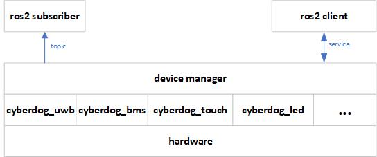

# device_manager 

## Overview

``device_manager`` is the management module of ``cyberdog_touch``, ``cyberdog_uwb``, ``cyberdog_bms`` and other functional modules; it provides the ability of find-state machine management, service callback, and message release for each module, and each module is loaded into ``device_manager`` in the form of ros plugin.

## Software design

 <center>

 

</center>

## Functional design

### Module loading

- [ROS plugin](https://github.com/ros2/ros2_documentation/blob/galactic/source/Tutorials/Beginner-Client-Libraries/Pluginlib.rst)

- ``device_manager`` Use ``pluginlib::ClassLoader`` to load ``cyberdog_uwb`` and other modules.
  ```
  //Refer to the ros sample for the loading process
  pluginlib::ClassLoader<polygon_base::RegularPolygon> poly_loader("polygon_base", "polygon_base::RegularPolygon");

  std::shared_ptr<polygon_base::RegularPolygon> triangle = poly_loader.createSharedInstance("polygon_plugins::Triangle");
  ```

### Finite-state machine management
- Finite-state machine controls various peripheral modules, such as: controlling "low power consumption" and " active " state switching of modules such as ``cyberdog_led``;

- ``device_manager`` inherits ``Cyberdog::machine::MachineActuator``, the client side can control ``device_manager`` state switching through the service interface provided by ``Cyberdog::machine::MachineActuator``. Inside the final-state machine, the loaded modules are controlled in turn for corresponding states.

- Finite-state machine detailed introduction reference: [Finite-state machine design](/en/cyberdog_machine_en.md )

### Topic&Service

- ``device_manager`` provides a ros message interface, the client side can subscribe to peripheral data topics to obtain peripheral data.
- ``device_manager`` provides a ros service interface, and the client side can control the peripheral state through the peripheral control service.
- ROS interface:
  - ``Protocol::msg::TouchStatus``: touch message
  - ``protocol::msg::BmsStatus``：bms message
  - ``Protocol::msg::UwbRaw``: uwb message
  - ``Protocol::srv::GetUWBMacSessionID``: get uwb  mac service
  - ``Protocol::srv::LedExecute``: led control service

### Module plugin

[Bluetooth Module](/en/cyberdog_bluetooth_en.md )
[bms module](/en/cyberdog_bms_en.md)
[led module](/en/cyberdog_led_en.md)
[touch module](/en/cyberdog_touch_en.md)
[Uwb module](/en/cyberdog_uwb_en.md )
[wifi module](/en/cyberdog_wifi_en.md)

## Debug command

- Get device_manager find-state machine service:
  
  ```
  ros2 topic list | grep device_manager
  ```

- Final-state machine toggle (toggle to "Active" state):

    ```
    ros2 service call /`ros2 node list | grep "mi_" | head -n 1 | cut -f 2 -d "/"`/device_managermachine_service  protocol/srv/FsMachine  "{target_state: "Active"}"
    ```
