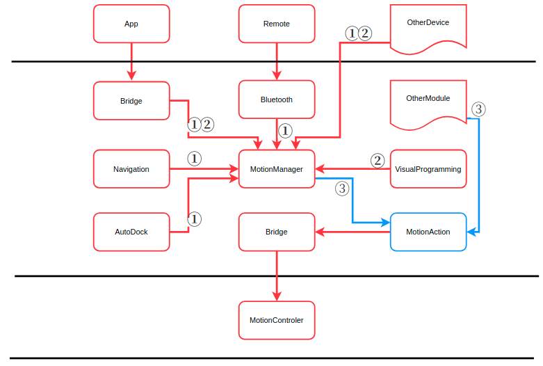

# Motion Management Design Documentation
## Overview
The motion management module is responsible for centralized management of motion control functions. All motion control calls are forwarded to the motion control layer by this module, and it receives status feedback from the motion control layer. In response to user instructions for motion control, this module makes centralized decisions and executes them based on the system's overall state machine, power status, and motion status.

## Modular architecture

### Software Architecture Diagram

<center>



</center>

### Architecture Description

#### Role description

 MotionManager

- The motion management interface of the Cyberdog software system,    Internally divided into three layers: MotionManagerk、MotionDecision、MotionHandler, Among them, MotionManager inherits the state machine of CyberdogManager, Different states such as self checking, low power consumption, low power consumption, shutdown, and OTA are implemented.MotionDecision makes decisions based on the machine's emergency stop status, command priority, etc.; MotionHandler determines the legality of the command, the machine's task status, the motor status, etc. to further manage the command.
- All operation and control calls that need to run in the Cyberdog framework can only pass through the interface of this module.
- The interface has its own business logic, that is, calling the interface will get a return, but there may not be a motion response, and all exceptions are uniformly defined in the return code.

 MotionAction

- As the only interface between the NX main control board and the operation control board, all motion commands are sent to the operation control board through the lcm communication protocol, and the real-time status of the operation control board is reported to the NX main control board.
- According to all the actions defined by the operation control, manage and maintain all the action attribute lists, including the mapping between the mode and gait_id attributes of each action defined by the operation control and the motion_id defined externally by MotionManger, the pre- and post-states and instructions allowed for each action.


## Interface Type Description

- All actions are encapsulated, and three interfaces are provided: result command, servo command, and custom action command. Among them, the custom action command is only open to visual programming, and other commands are open to all callers.
- Servo commands are mainly for the locomotion actions defined by the motion control board, that is, slow walking, fast walking, trotting, jumping and other actions. After such instructions are sent to the operation control, the operation control will maintain the state according to the relevant parameters of the last frame, such as speed and leg height. In APP and other scenarios that require grpc communication, in order to avoid the out-of-control state of the operation controller after the communication is disconnected, it is required that the interval between commands issued by the APP and other upper layers is not more than 200ms by default. The board issues a standing command to realize the stop state.
- Servo commands realize multi-party collaborative control, such as APP, Bluetooth handle, navigation tasks, etc. Different command priorities are defined internally, and control management is realized according to the priority. The smaller the value, the higher the priority. The following are the default priority definitions:

```C%2B%2B
App = 0 # Android APP
Audio = 1 # voice
Vis = 2 # visual programming
BluTele = 3 # bluetooth controller
Algo = 4 # Navigation and other tasks
```

## Motion Control Flow

<center>


</center>