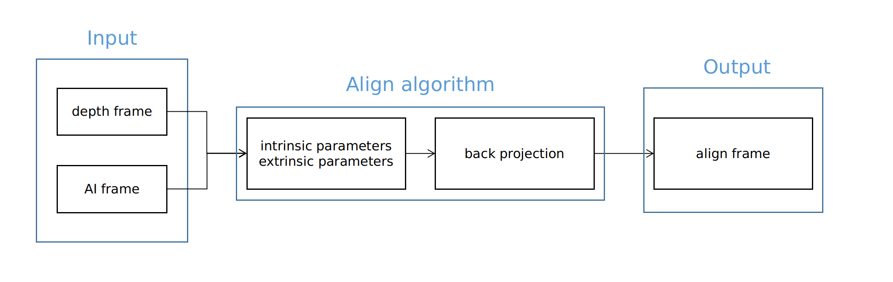

# ros2 software package for Intel® RealSense™ devices

## Overview
The ``realsense-ros`` publishes image data and IMU data of D430i as topics through ROS2.
The supported librealsense version currently is v2.50.0 (refer to the [realsense2_camera release notes](https://github.com/IntelRealSense/realsense-ros/releases))。
On the basis of the realsense-ros source code, functions such as power-on self-check, alternating pattern projection data publication, depth map alignment to other modules, and ROS2 lifecycle state machine have been added.

## /camera/camera node
 - Function: Provides binocular and IMU data for localization and mapping, and provides depth data for navigation and obstacle avoidance functions
 - Publishes data contents
   - Publish left and right image data
   - Publish depth data
   - Publish IMU data

### Workflow


### Node call command
```bash
ros2 launch realsense2_camera on_dog.py
```
### Set lifecycle state
Initialize
```bash
ros2 lifecycle set /camera/camera configure
```
Publish data
```bash
ros2 lifecycle set /camera/camera activate
```
Stop publishing data
```bash
ros2 lifecycle set /camera/camera deactivate
```
Release memory
```bash
ros2 lifecycle set /camera/camera cleanup
```

### Topics published
- ``/camera/depth/camera_info``：Default calibration values for depth map
- ``/camera/depth/image_rect_raw``：Depth map data
- ``/camera/depth/metadata``：Depth map metadata
- ``/camera/imu``：IMU data
- ``/camera/infra1/camera_info``：Default calibration values for left image
- ``/camera/infra1/image_rect_raw ``：Left image data
- ``/camera/infra1/metadata``：Left image metadata
- ``/camera/infra2/camera_info``：Default calibration values for right image
- ``/camera/infra2/image_rect_raw``：Right image data
- ``/camera/infra2/metadata``：Right image metadata

### Launch file description
- Launch file location： ``/opt/ros2/cyberdog/share/realsense2_camera/launch/on_dog.py``
- Important parameter description：
  - ``serial_no``：Start the RealSense device with the given device number. If not assigned, the default is one RealSense device detected.
  - ``usb_port_id``：Start the device with the given USB port number. By default, the device port number is ignored.
  - ``device_type``：Start the device in the given device_type mode.
  - ``depth_module.profile``：Depth map size and frame rate
  - ``enable_depth``：Whether to publish depth frame
  - ``enable_infra1``：Whether to publish left image
  - ``enable_infra1``：Whether to publish right image
  - ``gyro_fps``：Gyroscope publishing frequency
  - ``accel_fps``：Accelerometer publishing frequency
  - ``enable_gyro``：Whether to publish gyroscope information
  - ``enable_accel``：Whether to publish accelerometer information
  - ``enable_sync``：Whether the data is synchronized, enabled by default
  - ``depth_module.emitter_enabled``：Whether to enable structured light, 1 for enable, 0 for disable
  - ``depth_module.emitter_on_off``：Whether to enable the alternate structured light mode.
  - ``rosbag_filename``：Publishes topics through ros2 bag.
  - ``initial_reset``：Sometimes, the device may not have been properly closed and requires resetting due to firmware issues.
  - ``wait_for_device_timeout``：The time to wait when the specified device is not detected.
  - ``reconnect_timeout``：The time to wait before reconnecting when the driver cannot detect the USB device.


## /camera/camera_align node
 - Function: Aligns the depth information from Realsense to the AI camera module, providing depth information for visual tracking.
 - Published data contents:
   - Publishes left and right eye data (optional).
   - Publishes depth data.
   - Publishes IMU data.
   - Publishes depth data aligned to the AI camera.

### Align algorithm framework



The alignment algorithm takes Realsense's depth frame and the AI camera's color frame as input and outputs the aligned depth map to the AI camera.

### Workflow


### Node call command
```bash
ros2 launch realsense2_camera realsense_align_node.launch.py
```
### Set lifecycle state
Initialize
```bash
ros2 lifecycle set /camera/camera_align configure
```
Publish data
```bash
ros2 lifecycle set /camera/camera_align activate
```
Stop publishing data
```bash
ros2 lifecycle set /camera/camera_align deactivate
```
Release memory
```bash
ros2 lifecycle set /camera/camera_align cleanup
```

### Topics published
- ``/camera/depth/camera_info``：Default calibration values for depth image
- ``/camera/depth/image_rect_raw``：Depth image data
- ``/camera/aligned_depth_to_extcolor/image_raw``：Depth image aligned to AI camera
- ``/camera/depth/metadata``：Metadata for depth image
- ``/camera/imu``：IMU data
- ``/camera/infra1/camera_info``：Default calibration values for left camera
- ``/camera/infra1/image_rect_raw ``：Left camera image data
- ``/camera/infra1/metadata``：Metadata for left camera
- ``/camera/infra2/camera_info``：Default calibration values for right camera
- ``/camera/infra2/image_rect_raw``：Right camera image data
- ``/camera/infra2/metadata``：Metadata for right camera

### Launch file instructions
- Launch file location： ``opt/ros2/cyberdog/share/realsense2_camera/launch/realsense_align_node.launch.py``
- Important parameters:
  - ``align_config_file_path``：Parameters for the align algorithm
  - ``serial_no``：Start the RealSense device with the given serial number. If not assigned, the first detected RealSense device will be used by default.
  - ``usb_port_id``：Start the device with the given USB port number. By default, the device port number is ignored.
  - ``device_type``：Start the device in the given device_type mode.
  - ``depth_module.profile``：Depth image resolution and frame rate
  - ``enable_depth``：Enable depth image generation
  - ``enable_infra1``：Enable left camera image publishing
  - ``enable_infra1``：Enable right camera image publishing
  - ``gyro_fps``：Gyroscope publishing frequency
  - ``accel_fps``：Accelerometer publishing frequency
  - ``enable_gyro``：Enable gyroscope data publishing
  - ``enable_accel``：Enable accelerometer data publishing
  - ``pointcloud.enable``Enable point cloud data publishing
  - ``enable_sync``：Enable data synchronization. Enabled by default.
  - ``align_depth.enable``：Enable align algorithm to project the depth image to other modules
  - ``depth_module.emitter_enabled``：Enable structured light. 1 for enabled, 0 for disabled
  - ``rosbag_filename``：Publish topics through ros2 bag
  - ``initial_reset``：Reset device due to firmware issues when it was not correctly closed
  - ``wait_for_device_timeout``：Time to wait when the specified device is not detected
  - ``reconnect_timeout``：Time to wait before reconnecting when the driver cannot detect the USB device

## RealSenseActuator node
- Responsible for RealSense device startup self-check, checking if the device is available during startup