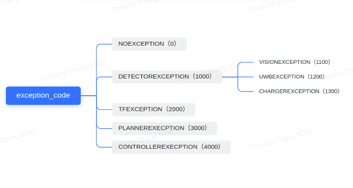

# cyberdog tracking base

## Functional Design

The implementation of the follow function mainly relies on the existing resources and design ideas of navigation 2, and adopts the behavioral-tree architecture for design. In terms of environmental awareness, static map input is not required, with two `rolling_window` costmap. and there is no need for a map coordinate system. The odom system is used as the root reference system.

The current main design is as follows:


It includes the existing nodes of navigation 2 and some new nodes to implement the functions shown in the above figure. The nodes and design points involved will be separately expanded below;

### BtNavigator

- Current nav2_ bt_ Navigator implements two navigator plug-ins, which are used to navigate to a specified point and navigate through a specified point sequence. A dedicated and following navigator plug-in, TargetTrackingNavigator, is added to facilitate changes and adjustments to the requirements of the front and rear ends in the future
- Define the action type `TargetTracking.action`, which is used for starting, stopping, and feedback of following tasks

```
uint8 AUTO = 0 # Autonomous relative position
uint8 BEHIND = 1 # behind the target
uint8 LEFT = 2 # left the target
uint8 RIGHT = 3 # right the target
uint8 relative_pos # Relative orientation, specified by the enumeration value defined above
float32 keep_distance # Distance to follow target
string behavior_tree # behavior tree's name
---
std_msgs/Empty result # result（not used)
---
float32 current_distance # Actual distance between current and target 
builtin_interfaces/Duration tracking_time # Total time following current target
int16 number_of_recoveries # Number of times abnormal self recovery has been experienced
int16 exception_code #
```

### TrackingModeDecider

- Enter as the following relative position field in the current task: Auto, Rear, Left, Right
- If the input follow mode is in automatic mode, it is necessary to use a certain algorithm to make a decision on which direction is more appropriate, left or right
- Output. If the rear, left, and right are clear, the output is directly transmitted through. If it is automatic, the output direction is determined according to the mode decision algorithm

### TargetUpdater

- The input is the target point coordinate (tracking_position) obtained from external detection, and its reference system is base_link
name：   /tracking_pose
type：   geometry_msgs::msg::PoseStamped
freq：   > 5Hz
- The input is a follow mode that determines how to track_ Position to perform coordinate transformation (left, back, right)
- The output is tracking_pose is converted to the odom coordinate system to obtain (tracking_pose_odom_based)
- objective management：
  - It is necessary to determine whether the converted coordinates are legal. If they are illegal, the corresponding exception should be thrown and entered into the exception recovery logic
  - Filter invalid points to prevent repeated arcing when spinning in place
  - Add a CostmapTopicCollisionChecker for legal point filtering

### Planner

Timely adjust the reference route based on the current target position to guide the robot to move to a designated location near the target

### Controller

The 2D environment uses the DWB algorithm as the controller for the following task.

### Costmap

Implement the cost map matting function, which is responsible for removing the target obstacles perceived by the robot from being labeled as obstacles, and maximizing the preservation of a clean and noiseless environment on the forward path.
Costmap attribute adopts rolling window mode, and the area is reasonably set based on the movement speed. Only obstacle layer and expansion layer are required

### Recovery

Through the RecoveryNode node, a one-way recovery behavior logic is added, and an exception code is provided in the black board. At the same time, an ExceptionVerify node is added to filter valid exception codes, so that exception codes correspond to recovery behavior and invalid recovery logic is reduced. The recovery behaviors configured in the current test phase include SpinAndSearch, Clear Global Costmap, and Clear Local Costmap

### ExceptionVerify

- Enter the Exception code in the black board and compare it with the code configured by yourself.
- If the match is consistent, the recovery behavior under the branch is executed. Otherwise, a failure is returned and the next recovery logic continues to be validated.

### SpinAndSearch

- According to the target loss position, make a decision on the loss direction, and then specify the angular direction for rotation.
- During the spin process, attention will be paid to whether any new target messages are accepted.
- If the rotation distance is completed or the target is searched, the current recovery logic is completed.

## Interface


### Target Pose
There are two modes for target detection followed: one is the visual recognition and fusion of the position and pose of the target given by depth data, and the other is the relative position information directly given by the UWB module. The data format and flow method used by the two methods for front-end processing are different. In order to unify the following interface, the following function has a unified requirement for the format of target data input:
topic:
type:                     geometry_msgs/msg/PoseStamped
name:                    /tracking_pose
freq:                    >=5hz
The following is a `geometry_msgs/msg/PoseStamped` The expansion of the msgs/msg/PoseStamped type is in the ROS standard format, so unnecessary field explanations are omitted.

```
# A Pose with reference coordinate frame and timestamp

std_msgs/Header header
        builtin_interfaces/Time stamp
                int32 sec
                uint32 nanosec
        string frame_id
Pose pose
        Point position
                float64 x
                float64 y
                float64 z
        Quaternion orientation
                float64 x 0
                float64 y 0
                float64 z 0
                float64 w 1
```

### Task
The start and stop of follow tasks are managed in the form of an action server. An action server is integrated within the follow function to provide external interfaces such as task start, stop, and status feedback. The start task uses the send of action_ Goal interface, stop following the cancel using action_ Goal interface, status can be obtained through the feed_back interface.
action
type：    mcr_msgs/action/TargetTracking
name：   /tracking_target

mcr_msgs/action/TargetTracking:
```
uint8 AUTO = 0 # Autonomous relative position
uint8 BEHIND = 1 # behind the target
uint8 LEFT = 2 # left the target
uint8 RIGHT = 3 # right the target
uint8 relative_pos # Relative orientation, specified by the enumeration value defined above
float32 keep_distance # Distance to follow target
string behavior_tree # behavior tree's name
---
std_msgs/Empty result # result（not used)
---
float32 current_distance # Actual distance between current and target 
builtin_interfaces/Duration tracking_time # Total time following current target
int16 number_of_recoveries # Number of times abnormal self recovery has been experienced
int16 exception_code #
```



Command line trigger:

```
ros2 action send_goal /tracking_target mcr_msgs/action/TargetTracking "{relative_pos: 1}" --feedback
```

### Motion command

Standard ros data format geometry_ Msgs/msg/Twist is the input from the downstream actuator to drive the robot to move.
The format of this command is different from that of motion control messages, so there will be a layer of velocity_adapter between this command and the specific instructions executed by the operation control to translate it into a data format acceptable to the operation control.

### Odometry

/odom_out; Standard ros data format nav_ Msgs/msg/Odometry, used to control the data source and status feedback of the planner.
